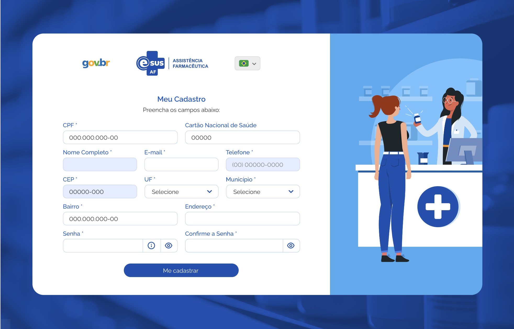

# Especificação Técnica 002 - Cadastrar Usuário do Sistema

## Descrição
Como usuário quero realizar meu cadastro para acessar o sistema e suas funcionalidades.

## Protótipo 001

### Acesso
Login > Quero me cadastrar

### Critérios de Aceite 
1. O sistema deve considerar o idioma “Português-Brasil” como padrão, permitido ao usuário alterá-lo a qualquer momento; 
2. Quando o usuário acionar opção “Idioma”, o sistema deve apresentar as alternativas de idiomas para utilização do sistema na língua desejada; [Protótipo 002](ETE002.md#prototipo-002) 
3. Quando o usuário informar o CEP, o sistema deve recuperar através da integração com o portal dos Correios e preencher automaticamente os campos “UF”, “Município”, “Bairro” e “Endereço” e desabilitá-los para edição; 
4. O sistema deve apresentar o ícone “Informação Senha” com o texto: 
      * Critérios para a nova senha: 
      * Mínimo de 8 caracteres 
      * Máximo de 30 caracteres 
      * Letras maiúsculas: pelo menos uma 
      * Letras minúsculas: pelo menos uma 
      * Número: pelo menos um 
      * Caracteres especiais: pelo menos um 
5. O sistema deve apresentar o ícone “Visualizar Senha” para permitir a visualização da senha informada; 
6. Quando o usuário acionar a opção “Me cadastrar” o sistema deve: 
      * Verificar se os campos obrigatórios estão preenchidos, caso não, realçar o campo e apresentar mensagem de alerta. [MSG053](DocumentoDeMensagensv2.md#msg053);
      * Verificar se os dados informados nos campos “Senha” e “Confirme a Senha” são idênticos, caso não, realçar o campo da confirmação da senha e apresentar mensagem de alerta. [MSG054](DocumentoDeMensagensv2.md#msg054);
      * Atendendo as validações, o sistema apresenta mensagem de confirmação ao usuário. [MSG055](DocumentoDeMensagensv2.md#msg055);
      * Caso confirme a ação, o sistema grava os dados do usuário, apresenta mensagem de sucesso, envia um e-mail de confirmação ao usuário e direciona para à tela de login do sistema. [MSG056](DocumentoDeMensagensv2.md#msg056)[MSG057](DocumentoDeMensagensv2.md#msg057);
      * Caso a ação não seja confirmada, permanece na tela de cadastro de usuário.  
7. Quando o usuário corrigir um alerta emitido pelo sistema o campo não deve permanecer realçado; 
8. Quando o usuário acionar a opção “Retornar ao Login” o sistema deve retornar à tela de “Login”. 