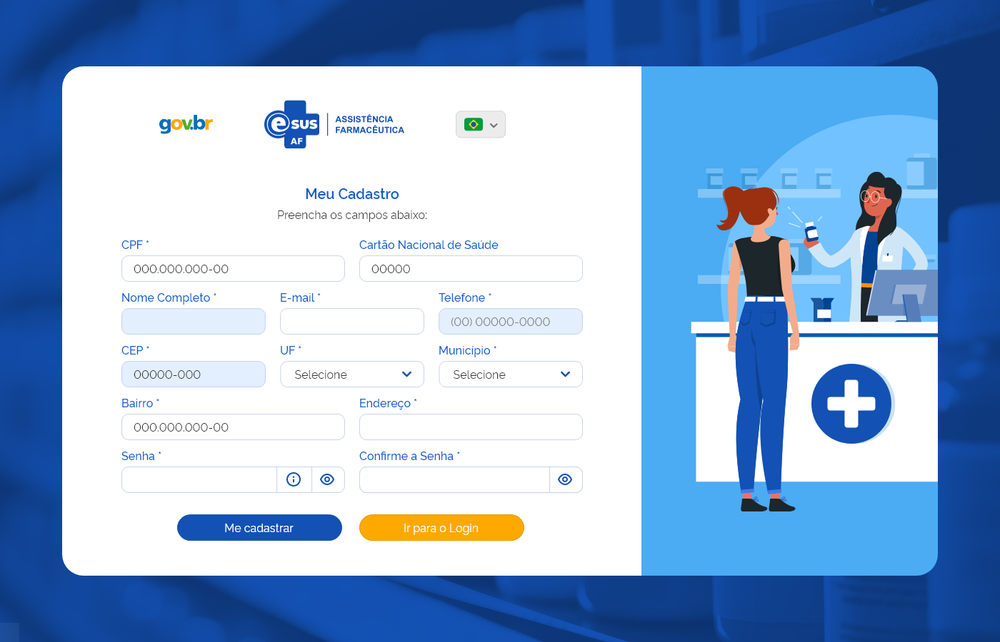

# Especificação Técnica 002 - Cadastrar Usuário do Sistema

## Descrição
Como usuário quero realizar meu cadastro para acessar o sistema e suas funcionalidades.

## Protótipo 001

### Elementos de Tela:
* Logotipo gov.br – M 
* Logotipo e-SUS AF – M 
* Idioma – SU 
* Título da página – “Meu Cadastro” 
* Subtítulo da página – “Preencha os campos abaixo:” 
* CPF* – N (11) 
* Cartão Nacional de Saúde – N (15) 
* Nome Completo* – A (100) 
* E-mail* – A (100) 
* Telefone* – N (10) 
* CEP* – N (8) 
* UF* – A (2) 
* Município* – A (100) 
* Bairro* – A (100) 
* Endereço* – A (100) 
* Senha* – A (30) 
* “Informação Senha” * – M  
* “Visualizar Senha” * – M 
* Confirme a Senha* – A (30) 
* “Visualizar Senha” * – M 
* “Me Cadastrar” – BT 
* “Retornar ao Login” – BT  

**Legenda**  
TIPO: A = Alfanumérico, N = Numérico, D = Data, M = Imagem, BT = Botão, LK = Link, SU = Seleção Única, SM = Seleção Múltipla, AC = Autocomplete, * = Obrigatório. 

### Critérios de aceite 
1. O acesso a funcionalidade é dado através da tela de “Login”, quando for acionada a opção “Quero me cadastrar”; 
2. O sistema deve considerar o idioma “Português-Brasil” como padrão, permitido ao usuário alterá-lo a qualquer momento; 
3. Quando o usuário acionar opção “Idioma”, o sistema deve apresentar as alternativas de idiomas para utilização do sistema na língua desejada; [Protótipo 002](ETE002.md#prototipo-002) 
4. Quando o usuário informar o CPF, o sistema deve verificar se existe um cadastro prévio, caso sim, deve preencher automaticamente o campo “Nome Completo” e permitir edição; 
5. Quando o usuário informar o CEP, o sistema deve recuperar através da integração com o portal dos Correios e preencher automaticamente os campos “UF”, “Município”, “Bairro” e “Endereço” e desabilitá-los para edição; 
6. O sistema deve apresentar o ícone “Informação Senha” com o texto: 
      * Critérios para a nova senha: 
      * Mínimo de 8 caracteres 
      * Máximo de 30 caracteres 
      * Letras maiúsculas: pelo menos uma 
      * Letras minúsculas: pelo menos uma 
      * Número: pelo menos um 
      * Caracteres especiais: pelo menos um 
7. O sistema deve apresentar o ícone “Visualizar Senha” para permitir a visualização da senha informada; 
8. Quando o usuário acionar a opção “Me cadastrar” o sistema deve: 
      * Verificar se os campos obrigatórios estão preenchidos, caso não, realçar o campo e apresentar mensagem de alerta; [MSG053](DocumentoDeMensagensv2.md#msg053)
      * Verificar se os dados informados nos campos “Senha” e “Confirme a Senha” são idênticos, caso não, realçar o campo da confirmação da senha e apresentar mensagem de alerta; [MSG054](DocumentoDeMensagensv2.md#msg054)
      * Atendendo as validações, o sistema apresenta mensagem de confirmação ao usuário; [MSG055](DocumentoDeMensagensv2.md#msg055)
      * Caso confirme a ação, o sistema grava os dados do usuário, apresenta mensagem de sucesso, envia um e-mail de confirmação ao usuário e direciona para à tela de login do sistema; [MSG056](DocumentoDeMensagensv2.md#msg056)[MSG057](DocumentoDeMensagensv2.md#msg057)
      * Caso a ação não seja confirmada, permanece na tela de cadastro de usuário.  
9. Quando o usuário corrigir um alerta emitido pelo sistema o campo não deve permanecer realçado; 
10. Quando o usuário acionar a opção “Retornar ao Login” o sistema deve retornar à tela de “Login”. 

## Protótipo 002

### Elementos de tela
* Título da página – “Selecione o idioma desejado:” 
* Bandeira Brasil - Português – M / SU 
* Bandeira Espanha - Espanhol – M / SU 
* Bandeira Inglaterra - Inglês – M / SU 
* “Alterar Idioma” – BT 
* “Sair” – BT  

**Legenda**  
TIPO: A = Alfanumérico, N = Numérico, D = Data, M = Imagem, BT = Botão, LK = Link, SU = Seleção Única, SM = Seleção Múltipla, AC = Autocomplete, * = Obrigatório. 

### Critérios de aceite
1. Quando o usuário selecionar o idioma para a utilização da aplicação, o sistema deve alterar automaticamente o texto da mensagem e dos botões para o idioma selecionado. 
2. Quando o usuário acionar opção “Alterar Idioma”, o sistema deve alterar o idioma da aplicação; 
3. Quando o usuário acionar opção “Sair”, o sistema deve retornar à tela de “Login”. 