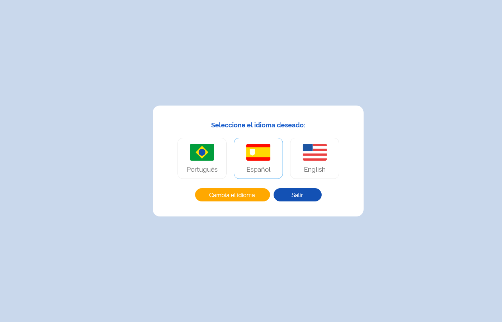
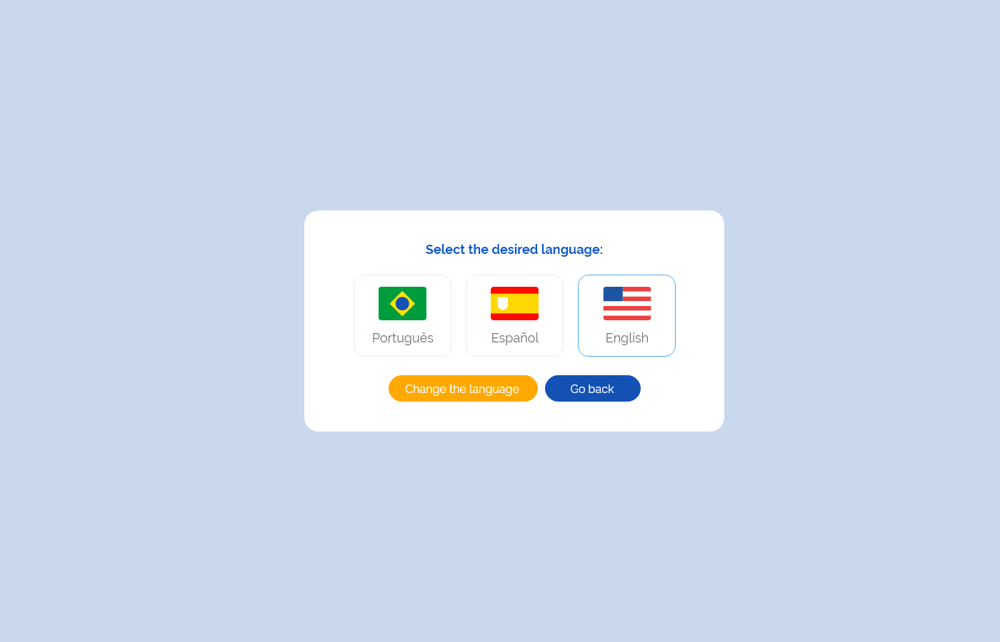

# Especificação Técnica 003 - Recuperar Senha

## Descrição
Como usuário quero realizar meu cadastro para acessar o sistema e suas funcionalidades.

## Protótipo 001

### Elementos de Tela:
* Logotipo gov.br – M 
* Idioma – SU 
* Logotipo e-SUS AF – M 
* Título da página – “Esqueci minha Senha” 
* Subtítulo da página – “Informe seu CPF para redefinir sua senha:” 
* CPF*– N (11) 
* “Solicitar Alteração” – BT 
* “Retornar ao Login” – BT  

**Legenda**  
TIPO: A = Alfanumérico, N = Numérico, D = Data, M = Imagem, BT = Botão, LK = Link, SU = Seleção Única, SM = Seleção Múltipla, AC = Autocomplete, * = Obrigatório. 

### Critérios de Aceite 
1. O acesso a funcionalidade é dado através da tela de “Login”, quando for acionada a opção “Esqueci minha senha”; 
2. O sistema deve considerar o idioma “Português-Brasil” como padrão, permitido ao usuário alterá-lo a qualquer momento; 
3. Quando o usuário acionar opção “Idioma”, o sistema deve apresentar as alternativas de idiomas para utilização do sistema na língua desejada; [Protótipo 003](ETE003.md#prototipo-003) 
4. O sistema deve permitir que o usuário informe o CPF para solicitar a alteração da senha;  
5. Quando o usuário acionar a opção “Solicitar alteração” o sistema deve: 
      * Verificar se os campos obrigatórios estão preenchidos, caso não, realçar o campo e apresentar mensagem de alerta; MSG053 
      * Verificar se o usuário informado tem cadastro, caso não, apresentar mensagem de alerta; [MSG058](DocumentoDeMensagensv2.md#msg058)  
Atendendo as validações, o sistema apresenta mensagem de sucesso, envia um e-mail de confirmação ao usuário e direciona para à tela de login do sistema; [MSG059](DocumentoDeMensagensv2.md#msg059) [MSG060](DocumentoDeMensagensv2.md#msg060) [RGN047](DocumentoDeRegrasv2.md#rgn047)
6. Quando o usuário corrigir um alerta emitido pelo sistema o campo não deve permanecer realçado. 
7. Quando o usuário acionar a opção “Retornar ao Login”, o sistema deve retornar à tela de “Login”. [ETE001](ETE001.md)

# Protótipo 002

### Elementos de tela
* Logotipo gov.br – M 
* Idioma – SU 
* Logotipo e-SUS AF – M 
* Título da página – “Redefinir Senha” 
* Subtítulo da página – “Informe a nova senha e confirme no campo abaixo:” 
* Senha* – A (30) 
* “Informação Senha” * – M  
* “Visualizar Senha” * – M 
* Confirme a Senha* – A (30) 
* “Visualizar Senha” * – M 
* “Alterar Senha” – BT 
* “Retornar ao Login” – BT 

**Legenda**  
TIPO: A = Alfanumérico, N = Numérico, D = Data, M = Imagem, BT = Botão, LK = Link, SU = Seleção Única, SM = Seleção Múltipla, AC = Autocomplete, * = Obrigatório. 

### Critérios de Aceite
1. O acesso a funcionalidade é dado através da mensagem encaminhada para o e-mail, quando for acionada a opção “Quero alterar minha senha”; 
2. O sistema deve considerar o idioma “Português-Brasil” como padrão, permitido ao usuário alterá-lo a qualquer momento; 
3. Quando o usuário acionar opção “Idioma”, o sistema deve apresentar as alternativas de idiomas para utilização do sistema na língua desejada; Protótipo 003 
4. O sistema deve permitir que o usuário informe a nova senha; 
5. O sistema deve apresentar o ícone “Informação Senha” com o texto: 
      * Critérios para a nova senha: 
          * Mínimo de 8 caracteres 
          * Máximo de 30 caracteres 
          * Letras maiúsculas: pelo menos uma 
          * Letras minúsculas: pelo menos uma 
          * Número: pelo menos um 
          * Caracteres especiais: pelo menos um 
6. O sistema deve apresentar o ícone “Visualizar Senha” para permitir a visualização da senha informada; 
7. Quando o usuário acionar a opção “Alterar senha”, o sistema deve: 
      * Verificar se os campos obrigatórios estão preenchidos, caso não, realçar o campo e apresentar mensagem de alerta; [MSG053](DocumentoDeMensagensv2.md#msg053)
      * Verificar se os dados informados nos campos “Senha” e “Confirme a Senha” são idênticos, caso não, realçar o campo e apresentar mensagem de alerta; [MSG054](DocumentoDeMensagensv2.md#msg054)  
      Atendendo as validações, o sistema apresenta mensagem de sucesso e direciona à tela de login do sistema; [MSG061](DocumentoDeMensagensv2.md#msg061)
8. Quando o usuário corrigir um alerta emitido pelo sistema o campo não deve permanecer realçado; 
9. Quando o usuário acionar a opção “Retornar ao Login”, o sistema deve retornar à tela de “Login”. [ETE001](ETE001.md) 

## Protótipo 003

### Elementos de tela
* Título da página – “Selecione o idioma desejado:” 
* Bandeira Brasil - Português – M / SU 
* Bandeira Espanha - Espanhol – M / SU 
* Bandeira Inglaterra - Inglês – M / SU 
* “Alterar Idioma” – BT 
* “Sair” – BT  

**Legenda**  
TIPO: A = Alfanumérico, N = Numérico, D = Data, M = Imagem, BT = Botão, LK = Link, SU = Seleção Única, SM = Seleção Múltipla, AC = Autocomplete, * = Obrigatório. 

### Critérios de Aceite
1. Quando o usuário selecionar o idioma para a utilização da aplicação, o sistema deve alterar automaticamente o texto da mensagem e dos botões para o idioma selecionado. 
2. Quando o usuário acionar opção “Alterar Idioma”, o sistema deve alterar o idioma da aplicação; 
3. Quando o usuário acionar opção “Sair”, o sistema deve retornar à tela de “Login”. [ETE001](ETE001.md) 