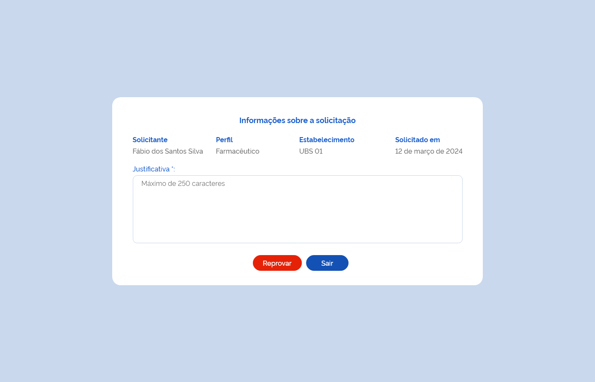

# Especificação Técnica 004 - Consultar Permissões de Acesso

## Funcionalidade
Como usuário quero consultar as permissões de acesso para moderá-las. 

## Protótipo 001
[inserir imagem]

### Acesso
Menu lateral > Controle de acesso > Moderar acesso

### Campos 
* Pesquisa por: Busca CPF

|CPF|Instância|Nome Completo|Perfil|Situação    |Ações|
|---|---------|-------------|------|------------|-----|
|   |         |             |      |&#8226; Solicitado|     |
|   |         |             |      |&#8226; Aprovado  |     |
|   |         |             |      |&#8226; Inativo   |     |
|   |         |             |      |&#8226; Reprovado |     |

### Critérios de aceite 
1. O usuário somente poderá acessar a funcionalidade caso tenha permissão; [RGN001](DocumentoDeRegrasv2.md#rgn001)
2. O acesso à funcionalidade é dado através do menu lateral no item “Controle de Acesso”, quando acionar o subitem “Moderar  acesso”;
3. O sistema deve recuperar e apresentar a relação das permissões de acesso por usuário ordenando os registros por status “Aguardando Aprovação” e data decrescente do registro. Caso algum campo retorne vazio, o sistema deve apresentar a descrição “-”; 
4. O sistema deve apresentar a relação das permissões de acesso por usuário com os dados: CPF,Instância, Nome Completo, Perfil, Estabelecimento, Situação e as ações desejáveis para cada registro.
5. As grids com resultados de consultas devem permitir a ordenação por coluna, paginação, seleção de registro por página e filtrar o resultado da consulta. [RGN004](DocumentoDeRegrasv2.md#rgn004)
6. O sistema deve apresentar as ações observando o perfil solicitado e a situação do registro conforme: 
      * Para perfil “Instalador” a opção “Detalhar” para todas as permissões de acesso, inclusive as dos perfis personalizados; 
      * Para perfil “Administrador”: 
          * A opção “Inativar” para permissões de acesso com perfil “Administrador” e “Gestor” atribuídos por ele; 
          * A opção “Detalhar” para todas as permissões de acesso, inclusive as dos perfis personalizados. 
      * Para perfil “Gestor”: 
          * As opções “Aprovar”, “Reprovar” e “Inativar” para todas as permissões de acesso exceto do perfil de “Administrador”; 
          * A opção “Detalhar” para todas as permissões de acesso, inclusive as dos perfis personalizados. 
      * Para perfil “Gestor Estabelecimento”: 
          * As opções “Aprovar”, “Reprovar” e “Inativar” para todas as permissões de acesso relacionadas ao seu estabelecimento; 
          * A opção “Detalhar” para todas as permissões de acesso, inclusive as dos perfis personalizados. 
      * Para registro com situação “Aguardando Aprovação”, as opções “Aprovar”, “Reprovar” e “Detalhar”;  
      * Para registro com situação “Aprovado”, as opções “Inativar” e “Detalhar”; 
      * Para registro com situação “Reprovado” ou “Inativo”, a opção “Detalhar”. [RGN052](DocumentoDeRegrasv2.md#rgn052)
7. Quando o usuário acionar a opção “Novo”, o sistema deve direcionar para a tela de atribuição de um perfil para um usuário específico; [ETE005](ETE005.md)
8. Quando o usuário acionar a opção “Aprovar”, o sistema deve apresentar mensagem de confirmação ao usuário. Caso confirme a ação, o sistema aprova o acesso ao sistema, grava o estado do registro como “Ativo” e a situação como “Aprovado”, envia um e-mail informativo ao solicitante, apresenta a mensagem de sucesso e permanece na tela de consultar permissões de acesso. Caso a ação não seja confirmada, permanece na tela de consultar permissões de acesso; [MSG080](DocumentoDeMensagensv2.md#msg080) [MSG081](DocumentoDeMensagensv2.md#msg081) [MSG082](DocumentoDeMensagensv2.md#msg082)
9. Quando o usuário acionar a opção “Reprovar”, o sistema apresenta a tela de inclusão de justificativa para reprovação; [Protótipo 002](ETE004.md#prototipo-002) 
10. Para inativar um perfil o usuário do sistema deverá clicar na ação de inativar, o sistema apresentará um pop-up com a mensagem “Deseja inativar o perfil?”, ao selecionar a resposta sim o perfil ficará inativado.
11. Para permissões de acesso com situação: 
    * “Solicitado” o sistema deve permitir aprovar ou reprovar; 
    * “Aprovado” o sistema deve permitir inativar; 
    * “Reprovado” ou “Inativo” o sistema não deve permitir aprovar ou reativar, sendo necessário realizar uma nova solicitação. [RGN013](DocumentoDeRegrasv2.md#rgn013)
12. O sistema deve gravar a data, hora e CPF e nome do usuário que a executou qualquer ação de alteração no estado do registro. [RGN005](DocumentoDeRegrasv2.md#rgn005)

## Protótipo 002

### Descrição resumida
Como usuário desejo redefinir minha senha para acesso ao sistema e suas funcionalidades.

### Acesso
Link para acesso ao sistema > Tela realizar login > “esqueci minha senha” 

### Campos: Elementos de tela
* Título da página – “Informações sobre a solicitação” 
* “Solicitante” – A (50) 
* “Solicitado em” – D (DD/MM/AAAA) 
* “Perfil” – A (50) 
* “Estabelecimento” – A (50) 
* “Justificativa*” – A (250) 
* “Reprovar” – BT 
* “Sair” – BT 

**Legenda**  
TIPO: A = Alfanumérico, N = Numérico, D = Data, M = Imagem, BT = Botão, LK = Link, SU = Seleção Única, SM = Seleção Múltipla, AC = Autocomplete, * = Obrigatório. 

### Critérios de aceite
1. O acesso à funcionalidade é dado através do menu lateral no item “Controle de Acesso”, subitem “Moderar Perfil”, na tela “Consultar Permissões de Acesso” quando acionar a opção “Reprovar”; 
2. O sistema deve recuperar e apresentar os dados da solicitação de permissão de acesso. Caso algum campo retorne vazio, o sistema deve apresentar a descrição “-”; 
3. O sistema deve apresentar a solicitação de permissão de acesso com os dados: Solicitante, Solicitado em, Perfil, Estabelecimento e o campo para inclusão da justificativa; 
4. O usuário ao reprovar uma solicitação de permissão de acesso ao sistema, deve informar uma justificativa; [RGN053](DocumentoDeRegrasv2.md#rgn053)
5. Quando o usuário acionar a opção “Reprovar”, o sistema deve reprovar a solicitação de permissão de acesso, alterar o estado do registro para “Inativo” e a situação para “Reprovado”, enviar um e-mail informativo ao solicitante, apresentar a mensagem de sucesso e permanecer na tela de consultar permissões de acesso; [MSG082](DocumentoDeMensagensv2.md#msg082) [MSG083](DocumentoDeMensagensv2.md#msg083) [RGN005](DocumentoDeRegrasv2.md#rgn005)
6. Quando o usuário acionar a opção “Sair”, o sistema retorna para a tela de consultar permissões de acesso; 
7. sistema deve gravar a data, hora e CPF e nome do usuário que a executou qualquer ação de alteração no estado do registro. [RGN005](DocumentoDeRegrasv2.md#rgn005)