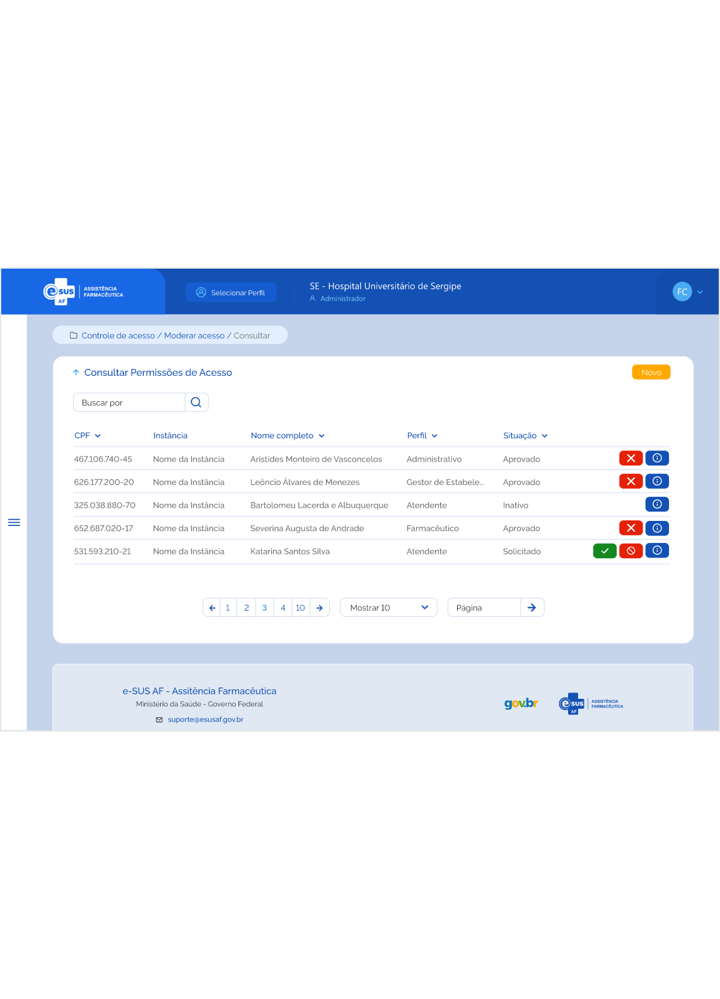

# Especificação Técnica 004 - Consultar Permissões de Acesso

## Descrição
Como usuário, desejo consultar as permissões de acesso para moderá-las. 

## Protótipo 001

### Acesso
Menu lateral > Controle de acesso > Moderar acesso

### Critérios de Aceite 
1. O usuário somente poderá acessar a funcionalidade caso tenha permissão. [RGN001](DocumentoDeRegrasv2.md#rgn001);
2. O sistema deve recuperar e apresentar a relação das permissões de acesso por usuário, ordenando os registros pelo status “Aguardando Aprovação” e pela data decrescente do registro. Caso algum campo retorne vazio, o sistema deve apresentar a descrição “-”; 
3. O sistema deve apresentar a relação das permissões de acesso por usuário com os dados: CPF, Instância, Nome Completo, Perfil, Situação e as ações desejáveis para cada registro; 
4. As grids com resultados de consultas devem permitir a ordenação por coluna, paginação, seleção de registro por página e filtrar o resultado da consulta. [RGN004](DocumentoDeRegrasv2.md#rgn004);
5. O sistema deve apresentar as ações observando o perfil solicitado e a situação do registro conforme: 
      * Para o perfil “Instalador”, a opção “Detalhar” para todas as permissões de acesso, inclusive as dos perfis personalizados;
      * Para o perfil “Administrador”, o sistema deve apresentar: 
          * A opção “Inativar” para permissões de acesso com perfil “Administrador” e “Gestor” atribuídos por ele;
          * A opção “Detalhar” para todas as permissões de acesso, inclusive as dos perfis personalizados. 
      * Para o perfil “Gestor”, o sistema deve apresentar: 
          * As opções “Aprovar”, “Reprovar” e “Inativar” para todas as permissões de acesso, exceto do perfil de “Administrador”; 
          * A opção “Detalhar” para todas as permissões de acesso, inclusive as dos perfis personalizados. 
      * Para o perfil “Gestor Estabelecimento”, o sistema deve apresentar: 
          * As opções “Aprovar”, “Reprovar” e “Inativar” para todas as permissões de acesso relacionadas ao seu estabelecimento; 
          * A opção “Detalhar” para todas as permissões de acesso, inclusive as dos perfis personalizados. 
      * Para o registro com situação “Aguardando Aprovação”, as opções “Aprovar”, “Reprovar” e “Detalhar”;  
      * Para o registro com situação “Aprovado”, as opções “Inativar” e “Detalhar”; 
      * Para o registro com situação “Reprovado” ou “Inativo”, a opção “Detalhar”. [RGN052](DocumentoDeRegrasv2.md#rgn052).
6. Quando o usuário acionar a opção “Novo”, o sistema deve direcionar para a tela de atribuição de um perfil para um usuário específico. [ETE005](ETE005.md);
7. Quando o usuário acionar a opção “Aprovar”, o sistema deve apresentar uma mensagem de confirmação ao usuário. Caso confirme a ação, o sistema aprova o acesso ao sistema, grava o estado do registro como “Ativo” e a situação como “Aprovado”, envia um e-mail informativo ao solicitante, apresenta uma mensagem de sucesso e permanece na tela de consultar permissões de acesso. Caso a ação não seja confirmada, o sistema permanece na tela de consultar permissões de acesso. [MSG080](DocumentoDeMensagensv2.md#msg080) [MSG081](DocumentoDeMensagensv2.md#msg081) [MSG082](DocumentoDeMensagensv2.md#msg082);
8. Quando o usuário acionar a opção “Reprovar”, o sistema deve apresentar uma tela de inclusão de justificativa para reprovação. [Protótipo 002](ETE004.md#prototipo-002);
9. Para inativar um perfil, o usuário do sistema deverá clicar na ação de "Inativar"; o sistema apresentará um pop-up com a mensagem “Deseja inativar o perfil?” e, ao selecionar a resposta "Sim", o perfil ficará inativado;
10. Para permissões de acesso com situação: 
    * “Solicitado” o sistema deve permitir aprovar ou reprovar;
    * “Aprovado” o sistema deve permitir inativar; 
    * “Reprovado” ou “Inativo” o sistema não deve permitir aprovar ou reativar, sendo necessário realizar uma nova solicitação. [RGN013](DocumentoDeRegrasv2.md#rgn013);
11. O sistema deve gravar a data, a hora, o CPF e o nome do usuário que executar qualquer ação de alteração no estado do registro. [RGN005](DocumentoDeRegrasv2.md#rgn005).
