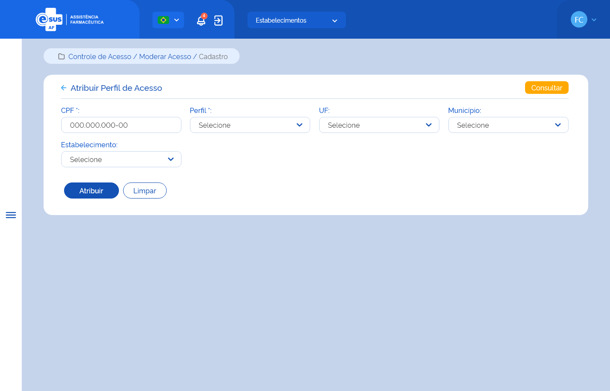

# Especificação Técnica 005 - Atribuir Perfil de Acesso

## Descrição
Como usuário quero atribuir um perfil de acesso às funcionalidades do sistema para outro usuário. 

## Protótipo 001

### Elementos de Tela:
* Bread Crumb – “Controle de Acesso / Moderar Acesso / Cadastro” 
* Título da página – “Atribuir Perfil de Acesso” 
* “Seta” – M - retorna para a Tela Consulta de Permissões de Acesso 
* “Consultar” – BT - retorna para a Consulta de Permissões de Acesso 
* CPF* – N (11) 
* Perfil* – A (50) 
* UF – A (50) 
* Município – A (50) 
* Estabelecimento – A (50) 
* “Atribuir” – BT 
* “Limpar” – BT 

**Legenda**  
TIPO: A = Alfanumérico, N = Numérico, D = Data, M = Imagem, BT = Botão, LK = Link, SU = Seleção Única, SM = Seleção Múltipla, AC = Autocomplete, * = Obrigatório. 

### Critérios de aceite 
1. O usuário somente poderá acessar a funcionalidade caso tenha permissão; [RGN001](DocumentoDeRegrasv2.md#rgn001)
2. O acesso à funcionalidade é dado através do menu lateral no item “Controle de Acesso”, subitem “Moderar Perfil”, na tela “Consultar Permissões de Acesso”, quando acionar a opção “Novo”; 
3. O sistema deve permitir a atribuição de perfis conforme: 
      * Usuário com perfil de “Instalador” atribui somente perfil de “Administrador”; 
      * Usuário com perfil de “Administrador” atribui perfil de “Administrador” e “Gestor”; 
      * Usuário com perfil de “Gestor” atribui qualquer perfil cadastrado e ativo, exceto perfil de “Administrador; 
      * Usuário com perfil de “Gestor Estabelecimento” atribui qualquer perfil de acesso para seu estabelecimento; 
      * Perfis de acesso iguais para o mesmo usuário em estabelecimentos diferentes;  
      * Vincular perfis de acesso somente a uma UF e/ou a um Município e/ou a um Estabelecimento;  
      * Para UF as quais o usuário já possua perfil de acesso no Município ou Estabelecimento desta UF; 
      * Para municípios distintos na mesma UF para o mesmo usuário; 
      * À um usuário que ainda não possui cadastro para acesso ao sistema. [RGN054](DocumentoDeRegrasv2.md#rgn054) 
4. O sistema não deve permitir atribuir mais de um perfil de acesso por estabelecimento; [RGN054](DocumentoDeRegrasv2.md#rgn054) [MSG085](DocumentoDeMensagensv2.md#msg085) 
5. Para atribuição de perfil de acesso é obrigatória a indicação de um estabelecimento exceto para os perfis de “Administrador” e “Gestor”; [RGN055](DocumentoDeRegrasv2.md#rgn055) 
6. No campo “UF” o sistema deve recuperar e apresentar as unidades federativas participantes da instância; 
7. No campo “Município” o sistema deve recuperar e apresentar a relação dos municípios vinculados à UF informada; 
8. No campo “Estabelecimento” o sistema deve recuperar e apresentar a relação dos estabelecimentos vinculados a UF ou Município informados; 
9. Quando o usuário acionar a opção “Atribuir”, o sistema deve atribuir o perfil de acesso ao sistema, gravar o estado do registro como “Ativo” e a situação como “Aprovado”, envia um e-mail informativo ao solicitante, apresentar a mensagem de sucesso e retornar para a tela de consultar permissões de acesso; [MSG082](DocumentoDeMensagensv2.md#msg082) [MSG086](DocumentoDeMensagensv2.md#msg086)
10. Quando o usuário acionar a opção de “Limpar”, o sistema deve limpar os dados informados e permanece na tela de atribuir perfil.
11. Quando o usuário acionar a opção de “Voltar” ou “Consultar”, o sistema deve apresentar a mensagem de alerta ao usuário. Caso confirme a ação, retorna à tela de consulta aos meus perfis e não salva os dados preenchidos. Caso a ação não seja confirmada, permanece na tela de solicitar perfil; [MSG006](DocumentoDeMensagensv2.md#msg006)
12. O sistema deve gravar a data, hora e CPF e nome do usuário que a executou qualquer ação de alteração no estado do registro. [RGN005](DocumentoDeRegrasv2.md#rgn005)
