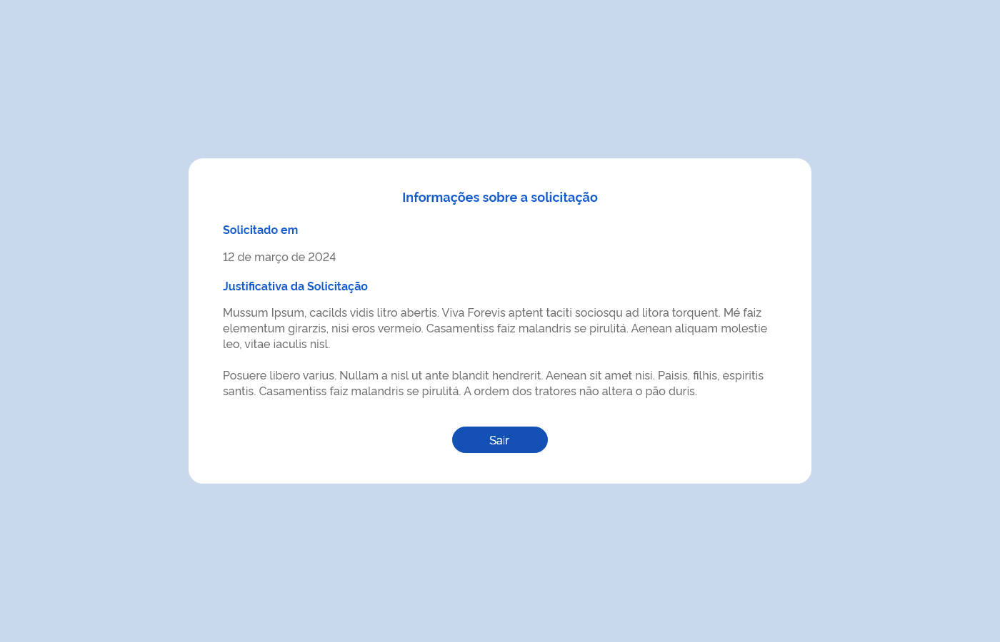
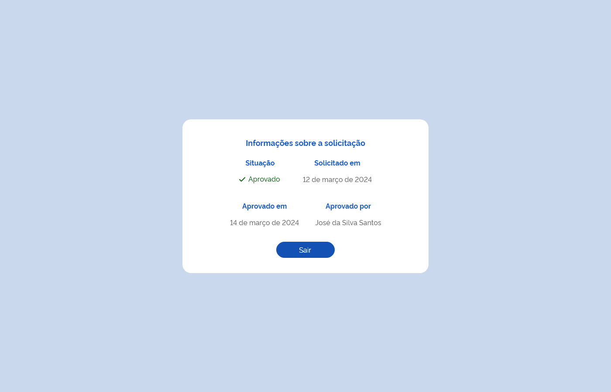
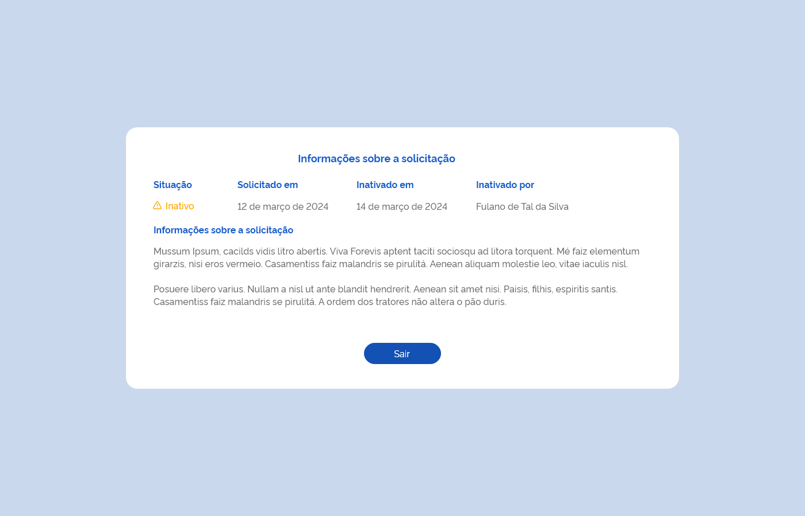
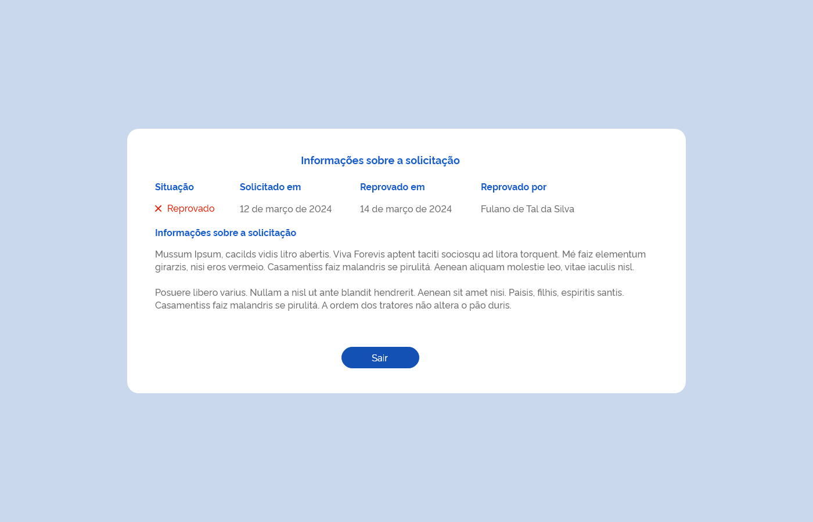

# Especificação Técnica 006 - Detalhar Permissão de Acesso

## Descrição
Como usuário quero detalhar os dados de uma permissão de acesso ao sistema. 

## Protótipo 001

### Elementos de Tela:
* Título da página – “Informações sobre a solicitação” 
* “Solicitado em” – D (dd/mm/aaaa) 
* “Justificativa da Solicitação” – A (4000) - contador regressivo 
* “Sair” – BT 

**Legenda**  
TIPO: A = Alfanumérico, N = Numérico, D = Data, M = Imagem, BT = Botão, LK = Link, SU = Seleção Única, SM = Seleção Múltipla, AC = Autocomplete, * = Obrigatório. 

### Critérios de aceite 
1. O usuário somente pode acessar a funcionalidade caso tenha permissão; [RGN001](DocumentoDeRegrasv2.md#rgn001)
2. O acesso à funcionalidade é dado através do menu lateral no item “Controle de Acesso”, subitem “Moderar Acesso”, na tela “Consultar Permissões de Acesso” quando acionar a opção “Detalhar”;   
3. O sistema deve recuperar e apresentar os dados relacionados a permissão de acesso que o usuário deseja detalhar; 
4. Quando o usuário acionar a opção “Sair”, o sistema deve finalizar o detalhamento e retornar à tela de “Consultar Permissões de Acesso”. [ETE004](ETE004.md)

## Protótipo 002

### Elementos de tela
* Título da página – “Informações sobre a solicitação” 
* “Situação” – A (20) 
* “Solicitado em” – D (dd/mm/aaaa) 
* “Aprovado em” – D (dd/mm/aaaa) 
* “Aprovado por” – A (50) 
* “Sair” – BT 

**Legenda**  
TIPO: A = Alfanumérico, N = Numérico, D = Data, M = Imagem, BT = Botão, LK = Link, SU = Seleção Única, SM = Seleção Múltipla, AC = Autocomplete, * = Obrigatório. 

### Critérios de aceite
1. O usuário somente pode acessar a funcionalidade caso tenha permissão; [RGN001](DocumentoDeRegrasv2.md#rgn001)
2. O acesso à funcionalidade é dado através do menu lateral no item “Controle de Acesso”, subitem “Moderar Acesso”, na tela “Consultar Permissões de Acesso” quando for acionada a opção “Detalhar”;   
3. O sistema deve recuperar e apresentar os dados relacionados a permissão de acesso que o usuário deseja detalhar; 
4. Quando o usuário acionar a opção “Sair”, o sistema deve finalizar o detalhamento e retornar à tela de “Consultar Permissões de Acesso”. [ETE004](ETE004.md) 

## Protótipo 003

### Elementos de tela
* Título da página – “Informações sobre a solicitação” 
* “Situação” – A (20) 
* “Solicitado em” – D (dd/mm/aaaa) 
* “Inativado” em” – D (dd/mm/aaaa) 
* “Inativado por” – A (50) 
* “Informações sobre a solicitação” – A (4000) 
* “Sair” – BT 

**Legenda**  
TIPO: A = Alfanumérico, N = Numérico, D = Data, M = Imagem, BT = Botão, LK = Link, SU = Seleção Única, SM = Seleção Múltipla, AC = Autocomplete, * = Obrigatório. 

### Critérios de aceite
1. O usuário somente pode acessar a funcionalidade caso tenha permissão; [RGN001](DocumentoDeRegrasv2.md#rgn001)
2. O acesso à funcionalidade é dado através do menu lateral no item “Controle de Acesso”, subitem “Moderar Acesso”, na tela “Consultar Permissões de Acesso” quando for acionada a opção “Detalhar”;   
3. O sistema deve recuperar e apresentar os dados relacionados a permissão de acesso que o usuário deseja detalhar; 
4. Quando o usuário acionar a opção “Sair”, o sistema deve finalizar o detalhamento e retornar à tela de “Consultar Permissões de Acesso”. [ETE004](ETE004.md) 

## Protótipo 004

### Elementos de tela
* Título da página – “Informações sobre a solicitação” 
* “Situação” – A (20) 
* “Solicitado em” – D (dd/mm/aaaa) 
* “Reprovado em” – D (dd/mm/aaaa) 
* “Reprovado por” – A (50) 
* “Informações sobre a solicitação” – A (4000) 
* “Sair” – BT 

**Legenda**  
TIPO: A = Alfanumérico, N = Numérico, D = Data, M = Imagem, BT = Botão, LK = Link, SU = Seleção Única, SM = Seleção Múltipla, AC = Autocomplete, * = Obrigatório. 

### Critérios de aceite
1. O usuário somente pode acessar a funcionalidade caso tenha permissão; [RGN001](DocumentoDeRegrasv2.md#rgn001)
2. O acesso à funcionalidade é dado através do menu lateral no item “Controle de Acesso”, subitem “Moderar Acesso”, na tela “Consultar Permissões de Acesso” quando for acionada a opção “Detalhar”;   
3. O sistema deve recuperar e apresentar os dados relacionados a permissão de acesso que o usuário deseja detalhar; 
4. Quando o usuário acionar a opção “Sair”, o sistema deve finalizar o detalhamento e retornar à tela de “Consultar Permissões de Acesso”. [ETE004](ETE004.md) 
