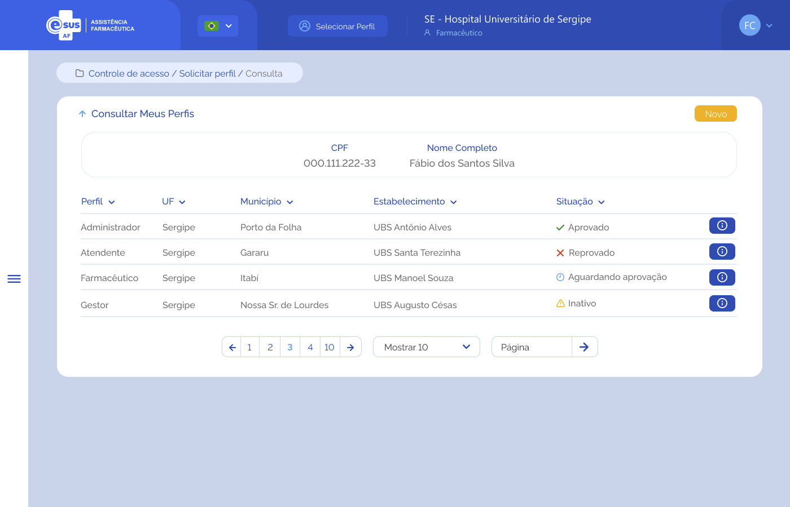

# Especificação Técnica 007 - Consultar Meus Perfis

## Descrição
Como usuário quero consultar a relação de perfis vinculados ao meu cadastro. 

## Protótipo 001

### Elementos de Tela:
* Bread Crumb – “Controle de Acesso / Solicitar Perfil / Consultar” 
* Título da página – “Consultar Meus Perfis” 
* “Seta” – M - retorna para a Tela Inicial/Dashboard 
* “Novo” – BT - direciona para a Tela de Solicitar Perfil  
* “CPF” – N (11) 
* “Nome Completo” – A (50) 
* Lista de perfil(is) do usuário 
    * “Perfil” – A (50) 
    * “UF” – A (2) 
    * Município – A (50) 
    * Estabelecimento – A (50) 
    * Situação – A (20) 
    * Detalhar – BT - direciona para a Tela de Detalhar Perfil  
* Ordenação nas colunas 
* Paginação 
* Registro por página 
* Ir para página 

**Legenda**  
TIPO: A = Alfanumérico, N = Numérico, D = Data, M = Imagem, BT = Botão, LK = Link, SU = Seleção Única, SM = Seleção Múltipla, AC = Autocomplete, * = Obrigatório. 

### Critérios de aceite 
1. O usuário somente poderá acessar a funcionalidade caso tenha permissão; [RGN001](DocumentoDeRegrasv2.md#rgn001)
2. O acesso à funcionalidade é dado através do menu lateral no item “Controle de Acesso” quando acionar o subitem “Solicitar Perfil”; 
3. A funcionalidade deve sempre estar disponível para acesso independente do usuário possuir ou não um perfil vinculado ao seu cadastro; 
4. Quando o usuário acionar a seta para cima ao lado do título da página, o sistema deve retornar à tela inicial do sistema (dashboard); 
5. Quando o usuário acionar a opção “Novo”, o sistema deve direcionar à tela de “Solicitar Perfil”; [ETE008](ETE008.md)
6. O sistema deve recuperar e apresentar o CPF e o Nome Completo do usuário logado e a lista dos perfis vinculados ao seu cadastro com a respectiva situação de cada registro. Caso não exista deve apresentar a imagem padrão "nenhum registro encontrado";  
7. O sistema, encontrando os registros de perfis do usuário logado, deve apresentar os dados:

    | Perfil | UF | Município | Estabelecimento | Situação | Botão "Detalhar" |
    |---|---|---|---|---|---|

8. A tabela deverá permitir ordenação crescente / decrescente nas colunas;
9. Os dados de UF, Município e Estabelecimento devem ser recuperados do cadastro do estabelecimento vinculado ao perfil do usuário logado; [RGN048](DocumentoDeRegrasv2.md#rgn048)
10. Quando o usuário acionar a opção “Detalhar”, o sistema deve direcionar à tela de “Detalhar Meu Perfil”. [ETE009](ETE009.md)
