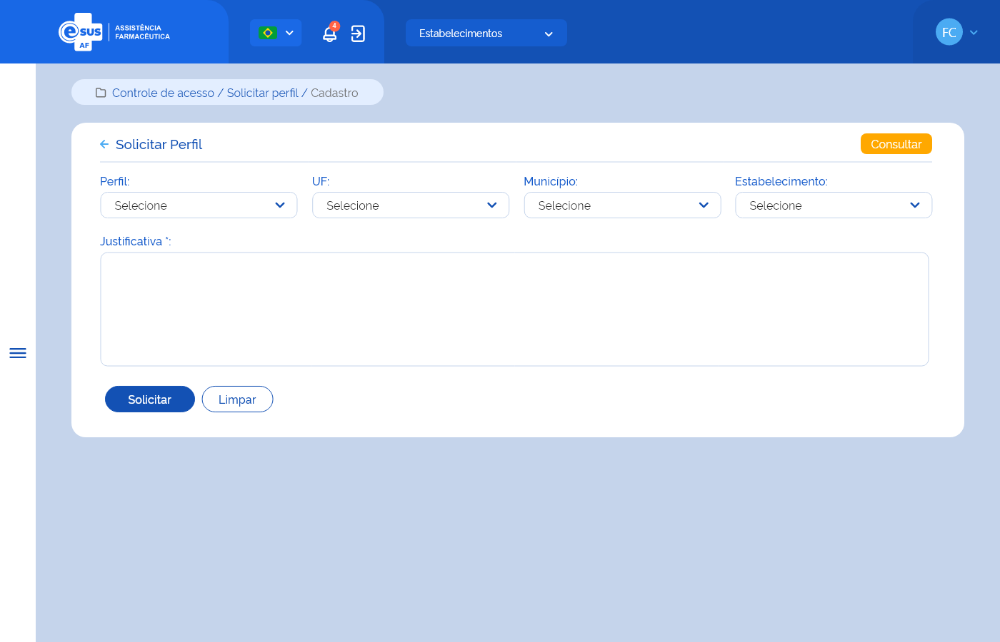

# Especificação Técnica 008 - Solicitar Perfil

## Descrição
Como usuário quero solicitar um perfil de acesso às funcionalidades do sistema, com suas respectivas permissões. 

## Protótipo 001
[Inserir imagem]<!--  -->

### Acesso
Controle de acesso > Solicitar perfil > ”Novo”

### Critérios de aceite 
1. A funcionalidade deve sempre estar disponível para acesso independente do usuário possuir ou não um perfil vinculado ao seu cadastro; 
2. No campo ‘Perfil”, o sistema deve recuperar e apresentar os perfis com cadastro ativo na instância, exceto os perfis de “Instalador” e “Administrador”; 
3. No campo “UF” o sistema deve recuperar e apresentar as unidades federativas participantes da instância com situação Ativo; 
4. No campo “Município” o sistema deve recuperar e apresentar a relação dos municípios vinculados à UF selecionada; 
5. No campo “Estabelecimento” o sistema deve recuperar e apresentar a relação dos estabelecimentos com cadastro ativo e vinculados à UF e/ou Município selecionados; 
6. O usuário ao realizar uma solicitação de permissão de acesso ao sistema, deve informar uma justificativa; [RGN053](DocumentoDeRegrasv2.md#rgn053) 
7. O sistema deve permitir solicitar: 
      * Perfis de acesso somente para Entes com situação Ativo;
      * Perfis de acesso iguais em estabelecimentos diferentes;  
      * Perfis de acesso para uma UF e/ou a um Município e/ou a um Estabelecimento;  
      * Perfis de acesso para UF a qual já possui permissão de acesso no Município e/ou Estabelecimento desta UF;
      * Perfis de acesso para municípios distintos na mesma UF. [RGN012](DocumentoDeRegrasv2.md#rgn012) 
8. O sistema não deve permitir solicitar mais de um perfil de acesso por estabelecimento; [MSG087](DocumentoDeMensagensv2.md#msg087) [RGN012](DocumentoDeRegrasv2.md#rgn012) 
9. Para solicitações de acesso é obrigatória a indicação de um estabelecimento exceto para os perfis de “Gestor”; [RGN056](DocumentoDeRegrasv2.md#rgn056) 
10. Quando o usuário acionar a opção de “Solicitar”, o sistema deve verificar se o preenchimento das informações atende às validações listadas, efetivar a solicitação do perfil de acesso, gravar o estado do registro como “Ativo” e a situação como “Solicitado”, apresentar a mensagem de sucesso e retornar à tela de consulta aos meus perfis apresentando este registro como o primeiro da listagem; [RGN005](DocumentoDeRegrasv2.md#rgn005) 
11. Quando o usuário acionar a opção de “Limpar”, o sistema deve limpar os dados preenchidos e permanecer na tela de solicitar perfil;  
12. O sistema deve gravar a data, hora e CPF e nome do usuário que a executou qualquer ação de alteração no estado do registro. [RGN005](DocumentoDeRegrasv2.md#rgn005) 
13. Quando usuário do sistema selecionar o perfil “Administrativo” abrir os campos: 
* Esfera “federal” abrir os campos: entes, estabelecimento e justificativa.  
* Esfera “estadual” abrir os campos: UF, estabelecimento e justificativa. 
* Esfera “municipal” abrir os campos: UF, município, estabelecimento e justificativa. 
* Esfera “Entidade/Instituição” abrir os campos: CNPJ / Nome fantasia, estabelecimento e justificativa.  
14. Quando usuário do sistema selecionar o perfil “Atendente” abrir os campos: 
      * Esfera “federal” abrir os campos: entes, estabelecimento e justificativa.  
      * Esfera “estadual” abrir os campos: UF, estabelecimento e justificativa. 
      * Esfera “municipal” abrir os campos: UF, município, estabelecimento e justificativa. 
      * Esfera “Entidade/Instituição” abrir os campos: CNPJ / Nome fantasia, estabelecimento e justificativa.  
15. Quando usuário do sistema selecionar o perfil “Farmacêutico” abrir os campos: 
      * Esfera “federal” abrir os campos: entes, estabelecimento e justificativa.  
      * Esfera “estadual” abrir os campos: UF, estabelecimento e justificativa. 
      * Esfera “municipal” abrir os campos: UF, município, estabelecimento e justificativa. 
      * Esfera “Entidade/Instituição” abrir os campos: CNPJ / Nome fantasia, estabelecimento e justificativa.
16. Quando usuário do sistema selecionar o perfil "Gestor" abrir os campos:
      * Esfera "federal" abrir os campos: entes e justificativa.
      * Esfera "estadual" abrir os campos: UF e justificativa.
      * Esfera "municipal" abrir os campos: UF, município e justificativa.
      * Esfera "Entidade/Instituição" abrir os campos: CNPJ / Nome fantasia, e justificativa.
17. Quando usuário do sistema selecionar o perfil "Gestor de Estabelecimento" abrir os campos:
      * Esfera "federal" abrir os campos: entes, estabelecimento e justificativa.
      * Esfera "estadual" abrir os campos: UF, estabelecimento e justificativa.
      * Esfera "municipal" abrir os campos: UF, município, estabelecimento e justificativa.
      * Esfera "Entidade/Instituição" abrir os campos: CNPJ / Nome fantasia, estabelecimento e justificativa.
18. Quando usuário do sistema selecionar o perfil “Perfil Personalizados” abrir os campos: 
      * Esfera “federal” abrir os campos: entes, estabelecimento e justificativa.  
      * Esfera “estadual” abrir os campos: UF, estabelecimento e justificativa. 
      * Esfera “municipal” abrir os campos: UF, município, estabelecimento e justificativa. 
      * Esfera “Entidade/Instituição” abrir os campos: CNPJ / Nome fantasia, estabelecimento e justificativa.  

