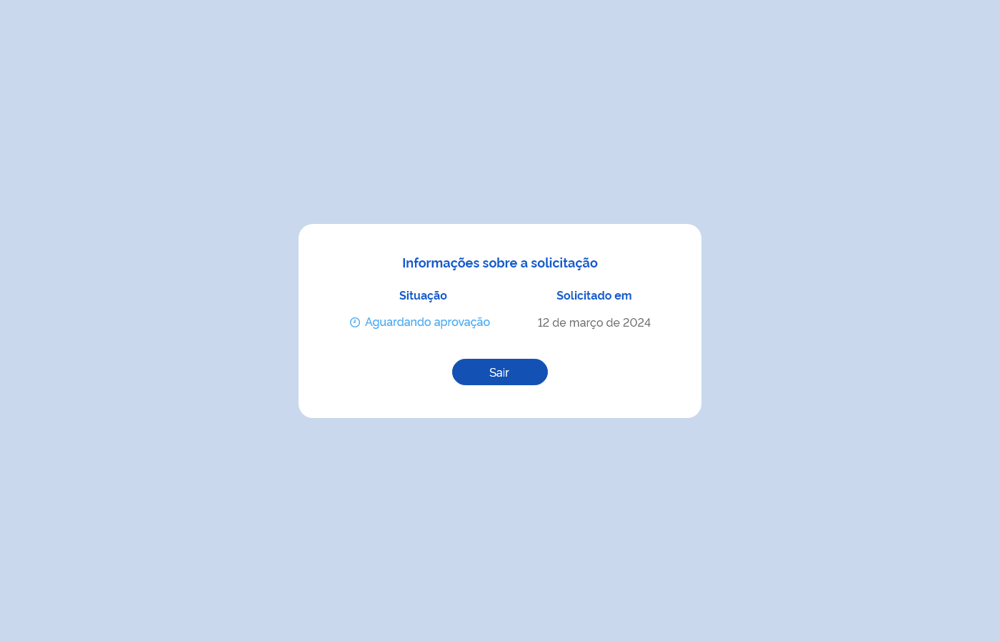
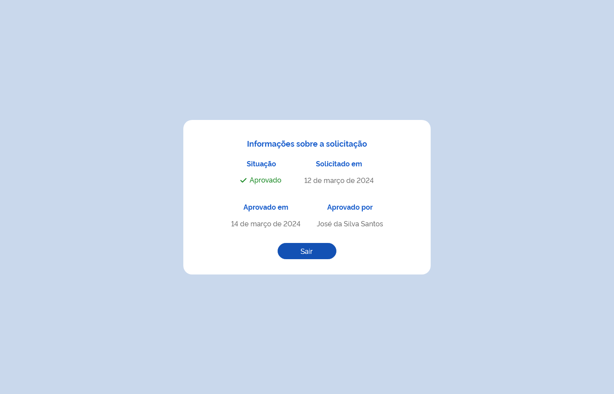
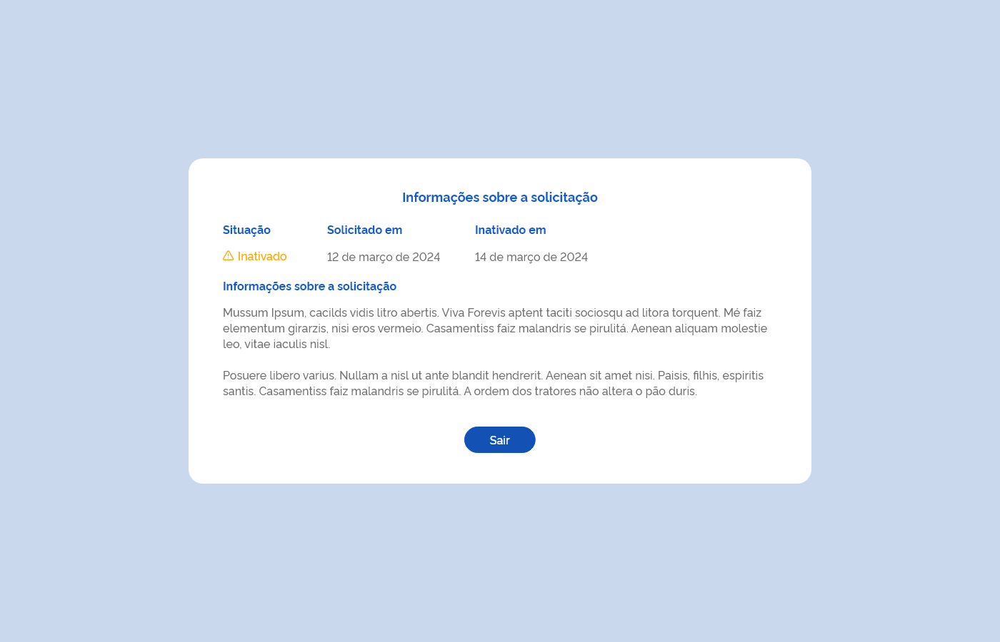

# Especificação Técnica 009 - Detalhar Meu Perfil

## Descrição
Como usuário quero detalhar os dados do meu perfil de acesso ao sistema. 

## Protótipo 001
[Inserir imagem]<!--  -->

### Acesso
Controle de Acesso > “Solicitar Perfil” > “Consultar Meus Perfis” quando acionar a opção “Detalhar”

### Critérios de Aceite 
1. O usuário somente pode acessar a funcionalidade caso tenha permissão; [RGN001](DocumentoDeRegrasv2.md#rgn001)   
2. A funcionalidade deve sempre estar disponível para acesso independente do usuário possuir ou não um perfil vinculado ao seu cadastro; 
3. O sistema deve recuperar e apresentar os dados relacionados ao perfil do usuário logado ao qual deseja detalhar; 
4. Quando o usuário acionar a opção “Sair”, o sistema deve finalizar o detalhamento e retornar à tela de “Consultar Meus Perfis”. [ETE004](ETE004.md)

## Protótipo 002
[Inserir imagem]<!--  -->

### Acesso
Controle de Acesso > “Solicitar Perfil” > “Consultar Meus Perfis” quando acionar a opção “Detalhar” 

### Critérios de Aceite
1. O usuário somente pode acessar a funcionalidade caso tenha permissão; [RGN001](DocumentoDeRegrasv2.md#rgn001)
2. A funcionalidade deve sempre estar disponível para acesso independente do usuário possuir ou não um perfil vinculado ao seu cadastro; 
3. O sistema deve recuperar e apresentar os dados relacionados ao perfil do usuário logado ao qual deseja detalhar; 
4. Quando o usuário acionar a opção “Sair”, o sistema deve finalizar o detalhamento e retornar à tela de “Consultar Meus Perfis”. [ETE004](ETE004.md)

## Protótipo 003
[Inserir imagem]<!--  -->

### Acesso
Controle de Acesso > “Solicitar Perfil” > “Consultar Meus Perfis” quando acionar a opção “Detalhar” 

### Critérios de Aceite
1. O usuário somente pode acessar a funcionalidade caso tenha permissão; [RGN001](DocumentoDeRegrasv2.md#rgn001)
2. A funcionalidade deve sempre estar disponível para acesso independente do usuário possuir ou não um perfil vinculado ao seu cadastro; 
3. O sistema deve recuperar e apresentar os dados relacionados ao perfil do usuário logado ao qual deseja detalhar; 
4. Quando o usuário acionar a opção “Sair”, o sistema deve finalizar o detalhamento e retornar à tela de “Consultar Meus Perfis”. [ETE004](ETE004.md)

## Protótipo 004
[Inserir imagem]<!--  -->

### Acesso
Controle de Acesso > “Solicitar Perfil” > “Consultar Meus Perfis” quando acionar a opção “Detalhar” 

### Critérios de Aceite
1. O usuário somente pode acessar a funcionalidade caso tenha permissão; [RGN001](DocumentoDeRegrasv2.md#rgn001)
2. A funcionalidade deve sempre estar disponível para acesso independente do usuário possuir ou não um perfil vinculado ao seu cadastro; 
3. O sistema deve recuperar e apresentar os dados relacionados ao perfil do usuário logado ao qual deseja detalhar; 
4. Quando o usuário acionar a opção “Sair”, o sistema deve finalizar o detalhamento e retornar à tela de “Consultar Meus Perfis”. [ETE004](ETE004.md)