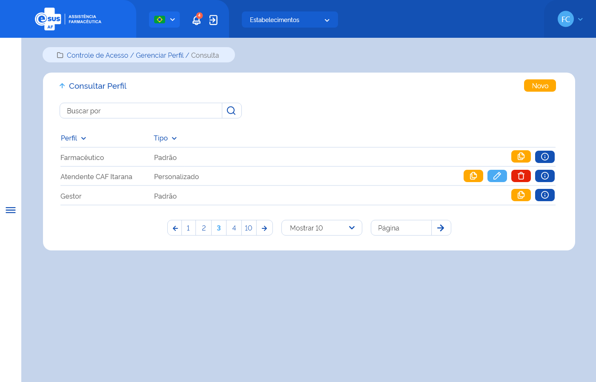

# Especificação Técnica 010 - Consultar Perfil

## Descrição
Como usuário quero consultar os perfis e funcionalidades que cada perfil tem acesso no sistema. 

## Protótipo 001
[Inserir imagem]<!--  -->

### Acesso
Controle de Acesso > Gerenciar perfil

### Critérios de aceite 
1. O usuário somente poderá acessar a funcionalidade caso tenha permissão; [RGN001](DocumentoDeRegrasv2.md#rgn001)
3. Quando o usuário acionar a seta para cima ao lado do título da página, o sistema deve retornar à tela inicial do sistema (dashboard); 
4. Quando o usuário acionar a opção de “Novo”, o sistema deve direcionar à tela “Cadastrar Perfil”; [ETE011](ETE011.md)
5. O sistema deve recuperar e apresentar a lista do(s) perfil(is) de acesso ao sistema com os dados: Perfil, Tipo, Situação e as ações de “Editar”, "Ativar", "Inativar" e “Detalhar”; 
6. O sistema deve apresentar as ações conforme: 
      * Para perfis do tipo “Padrão” com situação “Ativo”, as opções “Detalhar”; 
      * Para perfis do tipo “Personalizado” com situação “Ativo”, as opções “Editar”, “Inativar” e “Detalhar”; 
      * Para perfis do tipo “Personalizado” com situação “Inativo”, as opções “Ativar” e “Detalhar”. 
7. O sistema não deve permitir editar e inativar perfis do tipo “Padrão” e do tipo “Personalizado” que estão atribuídos ao cadastrado de ao menos um usuário do sistema; [RGN050](DocumentoDeRegrasv2.md#rgn050) 
9. Quando o usuário acionar a opção “Editar”, o sistema deve direcionar à tela “Cadastrar Perfil”, carregar automaticamente os dados informados no cadastro do perfil e permitir a edição das permissões de acesso às funcionalidades; [ETE011](ETE011.md)
10. Quando o usuário acionar a opção “Inativar”, o sistema deve apresentar a mensagem de confirmação ao usuário. Caso o usuário confirme a ação, o sistema deve excluir o registro do perfil personalizado, apresentar a mensagem de sucesso e deixar de apresentá-lo no resultado da consulta. Caso a ação não seja confirmada, o sistema permanece na tela de consulta; [MSG075](DocumentoDeMensagensv2.md#msg075) [RGN016](DocumentoDeRegrasv2.md#rgn016) 
11. Quando o usuário acionar a opção “Ativar”, o sistema deve apresentar a mensagem de confirmação ao usuário. Caso o usuário confirme a ação, o sistema deve excluir o registro do perfil personalizado, apresentar a mensagem de sucesso e deixar de apresentá-lo no resultado da consulta. Caso a ação não seja confirmada, o sistema permanece na tela de consulta; [MSG074](DocumentoDeMensagensv2.md#msg074) [RGN016](DocumentoDeRegrasv2.md#rgn016)
12. Quando o usuário acionar a opção “Detalhar”, o sistema deve direcionar à tela “Dados do Perfil”; [ETE012](ETE012.md)
13. O sistema deve gravar a data, hora e CPF e nome do usuário que a executou qualquer ação de alteração no registro. [RGN005](DocumentoDeRegrasv2.md#rgn005)