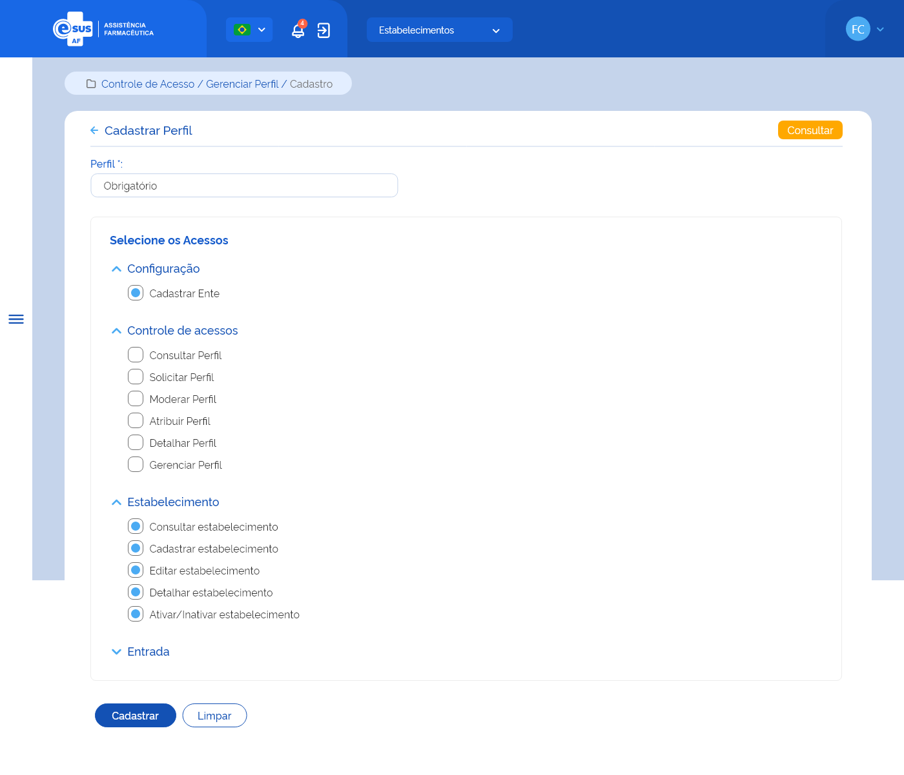

# Especificação Técnica 011 - Cadastrar Perfil

## Descrição
Como usuário quero cadastrar ou editar um perfil personalizado de acesso às funcionalidades do sistema, com suas respectivas permissões.

## Protótipo 001

### Elementos de Tela:
* Bread Crumb – “Controle de Acesso / Gerenciar Perfil / Cadastro” 
* Título da página – “Cadastrar Perfil” 
* “Seta” – M - retorna para a Tela Consultar Perfis 
* “Consultar” – BT - retorna para a Tela Consultar Perfis 
* Perfil* – A (50) 
* “Salvar” – BT 
* “Item do Menu” – A (50)  
* “Expandir/Retrair” – M 
* “Subitem do Menu” – A (50)  
* “Funcionalidade” – SM 
* “Selecionar todos” – SU 
* “Cadastrar” – BT 
* “Limpar” – BT 

**Legenda**  
TIPO: A = Alfanumérico, N = Numérico, D = Data, M = Imagem, BT = Botão, LK = Link, SU = Seleção Única, SM = Seleção Múltipla, AC = Autocomplete, * = Obrigatório. 

### Critérios de aceite 
1. O usuário somente poderá acessar a funcionalidade caso tenha permissão; [RGN001](DocumentoDeRegrasv2.md#rgn001)
2. O acesso à funcionalidade é dado através do menu lateral no item “Controle de Acesso”, subitem “Gerenciar Perfil”, na tela “Consultar Perfis”, quando acionar a opção “Novo”; 
3. Quando o usuário acionar a opção “Salvar”, o sistema deve verificar se existe um perfil com a mesma descrição de um perfil já cadastrado para a instância. Caso sim, o sistema apresenta uma mensagem de alerta ao usuário e permanece na tela de cadastro do perfil; [RGN051](DocumentoDeRegrasv2.md#rgn051) [MSG077](DocumentoDeMensagensv2.md#msg077)
Atendendo a validações, o sistema grava o registro do perfil com estado e situação “Ativo” e apresenta a relação das permissões por funcionalidades para seleção e os botões “Cadastrar” e “Limpar”; [MSG031](DocumentoDeMensagensv2.md#msg031) [RGN005](DocumentoDeRegrasv2.md#rgn005)
4. Quando o usuário acionar a opção de “Cadastrar”, o sistema deve verificar se o preenchimento das informações atende às validações listadas, efetivar o cadastro do perfil, gravar o estado e a situação do registro como “Ativo”, apresentar a mensagem de sucesso e retornar à tela de consulta aos perfis apresentando este registro como o primeiro da relação dos perfis cadastrados para a instância; [MSG078](DocumentoDeMensagensv2.md#msg078) [RGN005](DocumentoDeRegrasv2.md#rgn005)
5. Quando o usuário acionar a opção de “Limpar”, o sistema deve limpar os dados informados e permanece na tela de cadastro de perfil. 
6. Quando o usuário acionar a opção de “Voltar” ou “Consultar”, o sistema deve apresentar a mensagem de alerta ao usuário. Caso confirme a ação, retorna à tela de consulta aos perfis e não salva os dados incluídos. Caso a ação não seja confirmada, permanece na tela de cadastro de perfil; [MSG006](DocumentoDeMensagensv2.md#msg006)
7. O sistema deve gravar a data, hora e CPF e nome do usuário que a executou qualquer ação de alteração no registro. [RGN005](DocumentoDeRegrasv2.md#rgn005)

## Protótipo 002

### Elementos de tela
* Bread Crumb – “Controle de Acesso / Gerenciar Perfil / Cadastro” 
* Título da página – “Cadastrar Perfil” 
* “Seta” – M - retorna para a Tela Consultar Perfis 
* “Consultar” – BT - retorna para a Tela Consultar Perfis 
* Perfil* – A (50) 
* “Salvar” – BT 
* “Item do Menu” – A (50)  
* “Expandir/Retrair” – M 
* “Subitem do Menu” – A (50)  
* “Funcionalidade” – SM 
* “Selecionar todos” – SU 
* “Cadastrar” – BT 
* “Limpar” – BT 

**Legenda**  
TIPO: A = Alfanumérico, N = Numérico, D = Data, M = Imagem, BT = Botão, LK = Link, SU = Seleção Única, SM = Seleção Múltipla, AC = Autocomplete, * = Obrigatório. 

### Critérios de aceite
1. O usuário somente poderá acessar a funcionalidade caso tenha permissão; [RGN001](DocumentoDeRegrasv2.md#rgn001)
2. O acesso à funcionalidade é dado através do menu lateral no item “Controle de Acesso”, subitem “Gerenciar Perfil”, na tela “Consultar Perfis”, quando acionar a opção “Copiar”; 
3. O sistema deve recuperar e apresentar os dados informados no cadastro do perfil copiado e permitir a edição de todos os campos para cadastrar um novo perfil com características iguais ou similares, além dos botões “Salvar”, “Cadastrar” e “Limpar”;  
4. Quando o usuário acionar a opção “Salvar”, o sistema deve verificar se existe um perfil com a mesma descrição de um perfil já cadastrado para a instância. Caso sim, o sistema apresenta uma mensagem de alerta ao usuário e permanece na tela de cadastro da entrada; [RGN051](DocumentoDeRegrasv2.md#rgn051) [MSG077](DocumentoDeMensagensv2.md#msg077)
Atendendo a validações, o sistema grava o registro do perfil com estado e situação “Ativo”, herda a abrangência do escopo do perfil copiado, apresenta a relação das permissões por funcionalidades informadas no cadastro do perfil copiado e habilitada para edição.; [MSG031](DocumentoDeMensagensv2.md#msg031) [RGN005](DocumentoDeRegrasv2.md#rgn005)
5. Quando o usuário acionar a opção de “Cadastrar”, o sistema deve verificar se o preenchimento das informações atende às validações listadas, efetivar o cadastro do perfil, manter e gravar o estado e a situação do registro como “Ativo”, apresentar a mensagem de sucesso e retornar à tela de consulta aos perfis apresentando este registro como o primeiro da relação dos perfis cadastrados para a instância; [MSG078](DocumentoDeMensagensv2.md#msg078) [RGN005](DocumentoDeRegrasv2.md#rgn005)
6. Quando o usuário acionar a opção de “Limpar”, o sistema deve limpar os dados informados e permanece na tela de cadastro de perfil. 
7. Quando o usuário acionar a opção de “Voltar” ou “Consultar”, o sistema deve apresentar a mensagem de alerta ao usuário. Caso confirme a ação, retorna à tela de consulta aos perfis e não salva os dados incluídos. Caso a ação não seja confirmada, permanece na tela de cadastro de perfil; [MSG006](DocumentoDeMensagensv2.md#msg006)
8. O sistema deve gravar a data, hora e CPF e nome do usuário que a executou qualquer ação de alteração no registro. [RGN005](DocumentoDeRegrasv2.md#rgn005)

## Protótipo 003

### Elementos de tela
* Bread Crumb – “Controle de Acesso / Gerenciar Perfil / Cadastro” 
* Título da página – “Editar Perfil” 
* “Seta” – M - retorna para a Tela Consultar Perfis 
* “Consultar” – BT - retorna para a Tela Consultar Perfis 
* Perfil* – A - Inabilitado para a edição 
* “Item do Menu” – A (50)  
* “Expandir/Retrair” – M 
* “Subitem do Menu” – A (50)  
* “Funcionalidade” – SM 
* “Selecionar todos” – SU 
* “Atualizar” – BT 
* “Limpar” – BT 

**Legenda**  
TIPO: A = Alfanumérico, N = Numérico, D = Data, M = Imagem, BT = Botão, LK = Link, SU = Seleção Única, SM = Seleção Múltipla, AC = Autocomplete, * = Obrigatório. 

### Critérios de aceite
1. O usuário somente poderá acessar a funcionalidade caso tenha permissão; [RGN001](DocumentoDeRegrasv2.md#rgn001)
2. O acesso à funcionalidade é dado através do menu lateral no item “Controle de Acesso”, subitem “Gerenciar Perfil”, na tela “Consultar Perfis”, quando acionar a opção “Editar”; 
3. O sistema deve recuperar e apresentar os dados informados no cadastro do perfil, manter o campo “Perfil” inabilitado para edição e permitir a edição dos demais campos, além dos botões “Atualizar” e “Limpar”;  
4. Quando o usuário acionar a opção de “Atualizar”, o sistema deve verificar se o preenchimento das informações atende às validações listadas, atualizar o cadastro do perfil, manter e gravar o estado e a situação do registro como “Ativo”, apresentar a mensagem de sucesso e retornar à tela de consulta aos perfis apresentando este registro como o primeiro da relação dos perfis cadastrados para a instância; [MSG079](DocumentoDeMensagensv2.md#msg079) [RGN005](DocumentoDeRegrasv2.md#rgn005)
5. Quando o usuário acionar a opção de “Limpar”, o sistema deve limpar os dados informados e permanece na tela de cadastro de perfil. 
6. Quando o usuário acionar a opção de “Voltar” ou “Consultar”, o sistema deve apresentar a mensagem de alerta ao usuário. Caso confirme a ação, retorna à tela de consulta aos perfis e não salva os dados incluídos. Caso a ação não seja confirmada, permanece na tela de cadastro de perfil; [MSG006](DocumentoDeMensagensv2.md#msg006)
7. O sistema deve gravar a data, hora e CPF e nome do usuário que a executou qualquer ação de alteração no registro. [RGN005](DocumentoDeRegrasv2.md#rgn005)