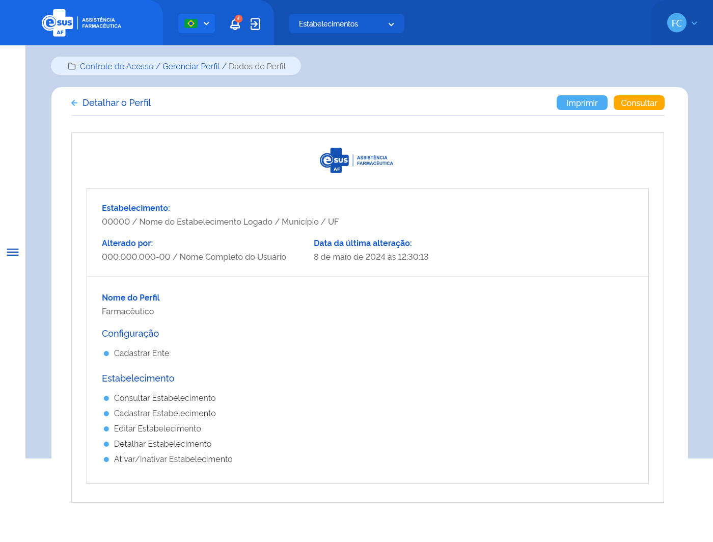

# Especificação Técnica 012 - Detalhar Perfil

## Descrição
Como usuário quero detalhar os dados de um perfil de acesso ao sistema. 

## Protótipo 001
[inserir imagem] <!--  -->

### Acesso
Controle de Acesso > Gerenciar perfil > Acionar o botão “detalhar”

### Campos <!-- Tem duas categorias "Nome do perfil: Gestor" -->
Nome do perfil: Administrador 
* Configurar instalação 
    * Listar entes que utilizam a aplicação 
    * Adiciona ou altera entes para utilizar a aplicação 
    * Detalhar informações sobre um ente no contexto da aplicação 
* Controle de acessos 
    * Listar usuários da Aplicação 
    * Lista detalhes de um usuário da aplicação 
    * Lista permissões atribuídas a usuários no contexto da aplicação 
    * Lista detalhes de permissão/permissões atribuída a um usuário no contexto da Aplicação 
    * Atribui uma permissão a usuário no contexto da aplicação 
    * Modera solicitações de permissões de um usuário 

Nome do perfil: Administrativo 

Nome do perfil: Atendente 
* Controle de acessos 
    * Lista detalhes de um usuário da aplicação 
    * Lista detalhes de permissão/permissões atribuída a um usuário no contexto da Aplicação 
* Estabelecimento 
    * Listar estabelecimentos de saúde 
    * Detalhar um estabelecimento de saúde 
    * Listar localizações físicas 
    * Criar ou localizações físicas 
    * Alterar localizações físicas 
    * Detalhar localização física 
    * Listar farmacêuticos existentes em um estabelecimento 
    * Listar departamentos existentes em um estabelecimento 
    * Listar os usuários do SUS para dispensação 
    * Criar os usuários do SUS para dispensação 
    * Atualizar dados de um usuário do SUS para dispensação 
    * Excluir um usuário do SUS para dispensação 

Nome do perfil: Farmacêutico 
* Controle de acessos 
    * Lista detalhes de um usuário da aplicação 
    * Lista detalhes de permissão/permissões atribuída a um usuário no contexto da Aplicação 
* Estabelecimento 
    * Listar estabelecimentos de saúde 
    * Detalhar um estabelecimento de saúde 
    * Listar localizações físicas 
    * Criar ou localizações físicas 
    * Alterar localizações físicas 
    * Detalhar localização física 
    * Listar farmacêuticos existentes em um estabelecimento 
    * Criar farmacêuticos em um estabelecimento 
    * Atualizar dados de um farmacêutico 
    * Excluir um farmacêutico 
    * Listar departamentos existentes em um estabelecimento 
    * Criar departamentos em um estabelecimento 
    * Atualizar dados de um departamento 
    * Exclui dados de um departamento num estabelecimento 
    * Listar os usuários do SUS para dispensação 
    * Criar os usuários do SUS para dispensação 
    * Atualizar dados de um usuário do SUS para dispensação 
    * Excluir um usuário do SUS para dispensação 

Nome do perfil: Gestor 
* Controle de acessos 
    * Listar usuários da Aplicação 
    * Lista detalhes de um usuário da aplicação 
    * Lista permissões atribuídas a usuários no contexto da aplicação 
    * Lista detalhes de permissão/permissões atribuída a um usuário no contexto da Aplicação 
    * Atribui uma permissão a usuário no contexto da aplicação 
    * Modera solicitações de permissões de um usuário 
    * Listar perfis existentes na aplicação 
    * Cria ou altera perfis personalizados para um ente 
    * Atualiza dados de um perfil e seus recursos 
    * Lista detalhes de um perfil específico 
    * Exclui um perfil da aplicação 
    * Lista funcionalidades da aplicação 
    * Lista detalhes de uma funcionalidade da aplicação 
* Estabelecimento 
    * Listar estabelecimentos de saúde 
    * Criar ou Alterar um estabelecimento de Saúde 
    * Permite selecionar o contexto do estabelecimento em que o usuário deverá atuar. 
    * Criar ou Alterar um estabelecimento de Saúde 
    * Detalhar um estabelecimento de saúde 
    * Listar localizações físicas 
    * Criar ou localizações físicas 
    * Alterar localizações físicas 
    * Detalhar localização física 
    * Listar farmacêuticos existentes em um estabelecimento 
    * Criar farmacêuticos em um estabelecimento 
    * Atualizar dados de um farmacêutico 
    * Excluir um farmacêutico 
    * Listar departamentos existentes em um estabelecimento 
    * Criar departamentos em um estabelecimento 
    * Atualizar dados de um departamento 
    * Exclui dados de um departamento num estabelecimento 
    * Listar os usuários do SUS para dispensação 
    * Criar os usuários do SUS para dispensação 
    * Atualizar dados de um usuário do SUS para dispensação 
    * Excluir um usuário do SUS para dispensação 

### Elementos de Tela:
* Bread Crumb – “Controle de Acesso / Gerenciar Perfil / Dados do Perfil” 
* Título da página – “Detalhar Perfil” 
* “Seta” – M - retorna para a Tela de Consultar Perfis 
* “Imprimir” – BT 
* “Consultar” – BT - retorna para a Tela de Consultar Perfis 
* Logotipo e-SUS AF - M 
* Cabeçalho:  
    * Estabelecimento: 
        * CNES / Nome do estabelecimento logado / Município / UF  
    * Alterado por:  
        * CPF / Nome completo do usuário que realizou a última ação no cadastro da entrada (anonimizar os dados)  
    * Data e Hora da última alteração: 
* “Nome do Perfil” – A (50) 
* “Item do Menu” – A (50) 
* “Subitem do Menu” – A (50) 
* “Funcionalidade” – A (50) 

**Legenda**  
TIPO: A = Alfanumérico, N = Numérico, D = Data, M = Imagem, BT = Botão, LK = Link, SU = Seleção Única, SM = Seleção Múltipla, AC = Autocomplete, * = Obrigatório. 

### Critérios de aceite 
1. O usuário somente pode acessar a funcionalidade caso tenha permissão; [RGN001](DocumentoDeRegrasv2.md#rgn001)
2. O sistema deve recuperar e apresentar os dados relacionados ao perfil ao qual deseja detalhar; 
3. Quando o usuário acionar a opção de “Imprimir”, o sistema deve permitir imprimir as informações da tela ou salvá-las em um arquivo no formato desejado (padrão Windows); 
4. Quando o usuário acionar a opção de “sair”, o sistema finaliza o detalhamento e retorna à tela “Consultar Perfis”.
