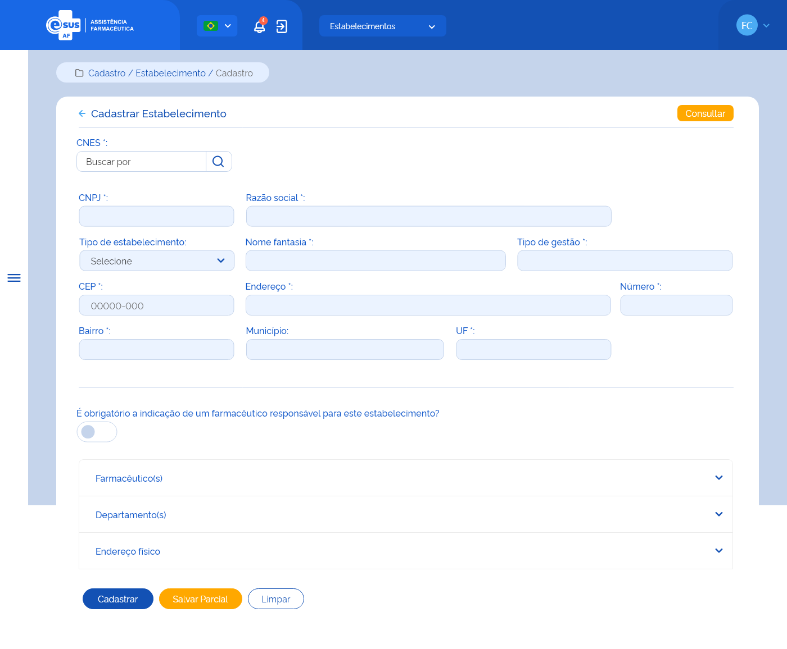
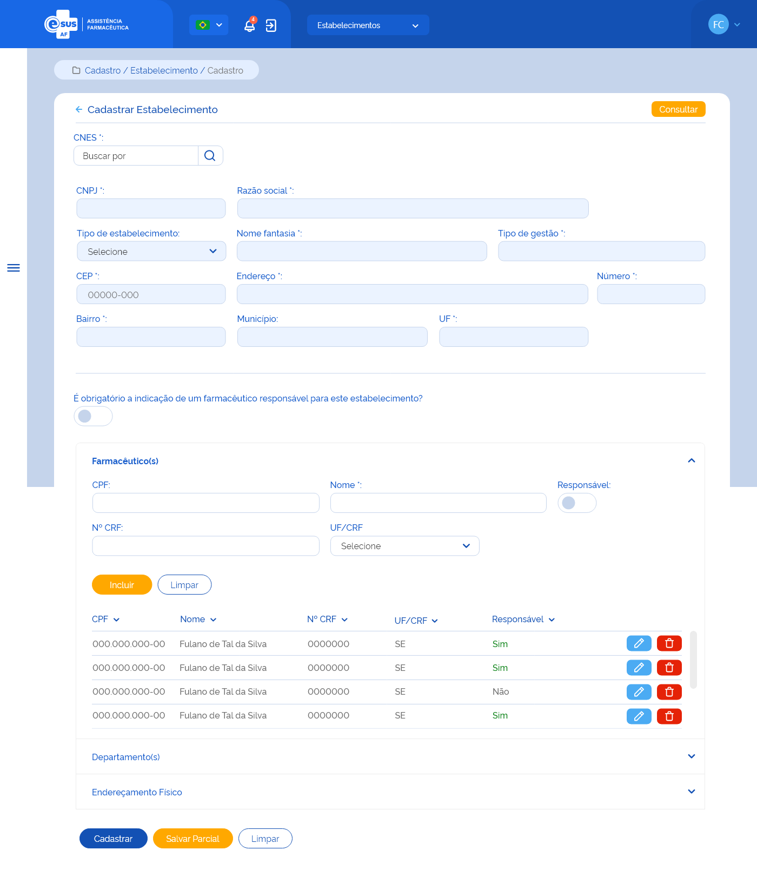
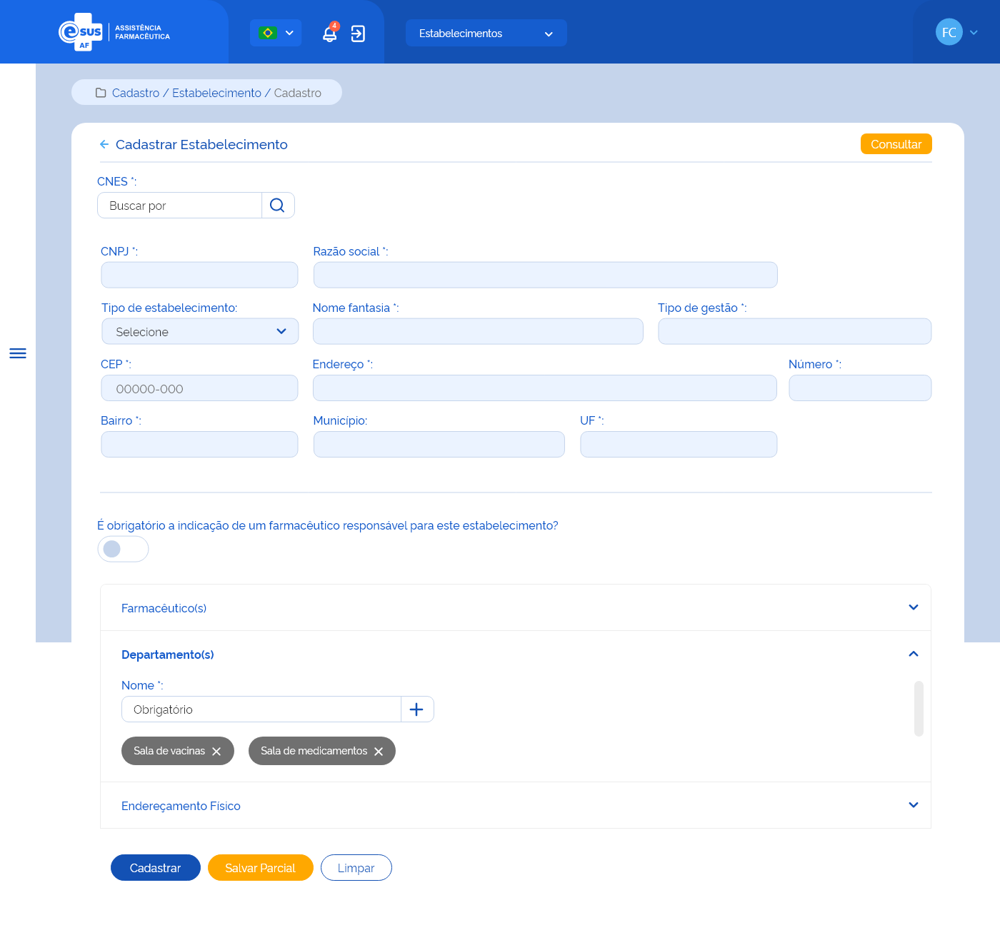
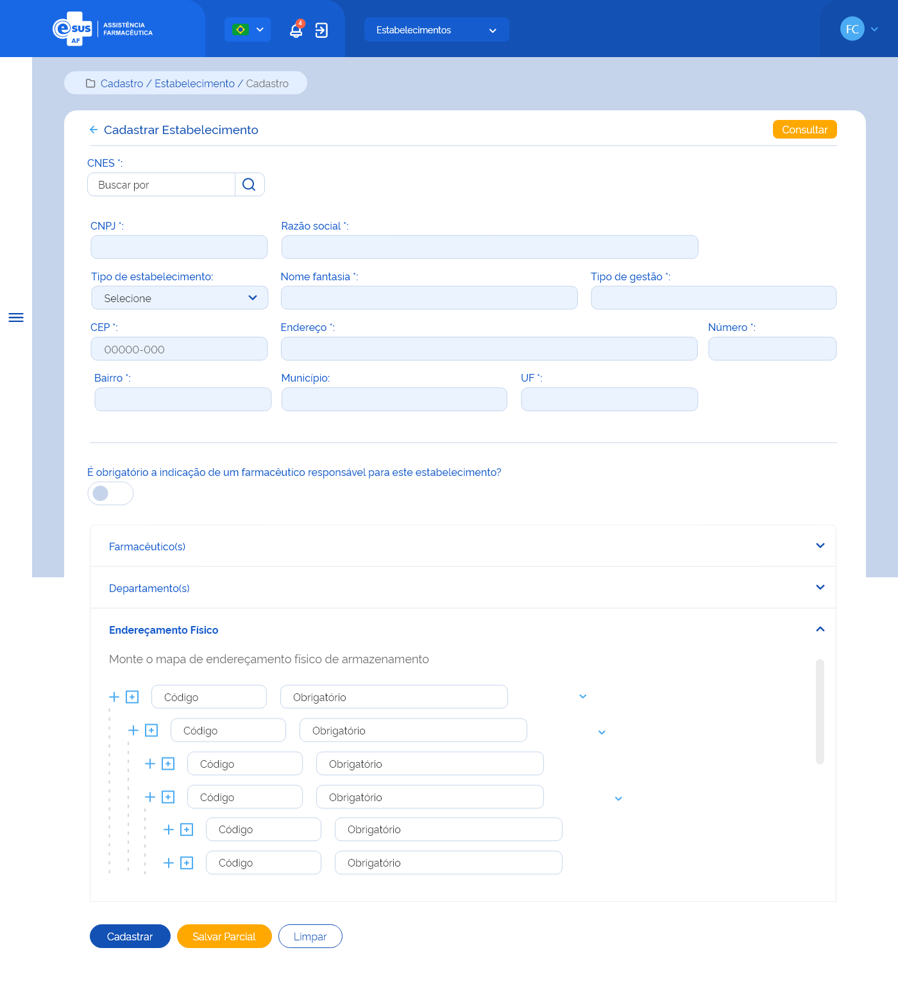

# ETE013 - Cadastrar Estabelecimento de Saúde

## Descrição (modelo história de usuário)
Como usuário quero cadastrar um estabelecimento de saúde através da recuperação de dados do portal do Cadastro Nacional dos Estabelecimentos de Saúde (CNES)

## Protótipo 001

  
  
  
  
[Link para protótipo no Adobe XD](https://xd.adobe.com/view/153e76da-8687-401d-a008-4ba101ed6f9b-406d/)

## Elementos de Tela 
* Bread Crumb – “Cadastro / Estabelecimento / Cadastro” 
* Título da página – “Cadastrar Estabelecimento” 
* “Seta” – M - retorna para a Tela de Consultar de Estabelecimento (ETE012) 
* “Consultar” – BT - retorna para a Tela de Consultar de Estabelecimento (ETE012) 
* CNES* – N (7) 
    * “Lupa” – M 
* Campos recuperados do portal CNES e desabilitados para edição: 
    * CNPJ* – N (14) 
    * Nome Razão Social* – A (150) 
    * Nome Fantasia* – A (150) 
    * Tipo Gestão* – A (9) 
    * CEP* – N (8) 
    * Endereço* – A (150) 
    * Número* – A (150) 
    * Bairro* – A (150) 
    * Município* – A (150) 
    * UF* – A (2) 
* Tipo de Estabelecimento* – SU 
* É obrigatória a indicação de um farmacêutico responsável para este estabelecimento? – SU 
* Farmacêutico(s) 
    * CPF – N (11) 
    * Nome Completo – A (150) 
    * Nº CRF – A (7) 
    * UF/CRF – SU 
    * Responsável – SU 
    * “Incluir” – BT 
    * “Limpar” – BT 
    * Lista farmacêutico(s) adicionado(s): 
        * CPF 
        * Nome  
        * Nº CRF 
        * UF/CRF 
        * Responsável (Sim/Não) 
        * “Editar” – BT 
        * “Excluir” – BT 
* Departamento(s) 
    * Nome – A (40) 
    * “Adição” – M 
    * Departamento(s) adicionado(s) 
        * Nome do departamento 
        * “Excluir” - M 
* Endereçamento Físico  
    * “Adicionar Mesmo Nível” – M 
    * “Adicionar Nível Abaixo” – M 
    * Código – A (7) 
    * Identificação – A (50) 
    * “Excluir” – M 
    * “Expandir/Retrair” – M 
* “Cadastrar” – BT 
* “Salvar Parcial” – BT 
* “Limpar” – BT 

**Legenda**  
TIPO: A = Alfanumérico, N = Numérico, D = Data, M = Imagem, BT = Botão, LK = Link, SU = Seleção Única, SM = Seleção Múltipla, AC = Autocomplete, * = Obrigatório.  
 
## Critérios de Aceite 
### 001
* O usuário somente poderá acessar a funcionalidade caso tenha permissão; [RGN001](DocumentoDeRegrasv2.md#rgn001)

---
### 002
* O acesso à funcionalidade é dado através do menu lateral no item “Cadastro”, subitem “Estabelecimento”, na tela “Consultar Estabelecimento” quando for acionada a opção “Novo”;  

---
### 003
* O sistema deve recuperar e apresentar os dados do estabelecimento através da integração com o portal do Cadastro Nacional dos Estabelecimentos de Saúde (CNES);  

---
### 004
* O sistema deve informar ao usuário caso a consulta retorne um estabelecimento com cadastro inativo ou não encontre o registro; [MSG002](DocumentoDeMensagensv2.md#msg002) 

---
### 005
* Caso algum campo retornar vazio da consulta ao portal do CNES, o sistema deve apresentar a descrição “Sem informação”; 

---
### 006
* No campo “Tipo de Estabelecimento”, o sistema deve apresentar as opções: Almoxarifado/CAF, Almoxarifado Regional/Regional de Saúde e Farmácia/Dispensário; 

---
### 007
* Deve ser possível incluir farmacêutico(s) ao cadastro do estabelecimento conforme: 
    * A inclusão do farmacêutico ao estabelecimento não é obrigatória, desde que não tenha sido indicado a obrigatoriedade; 
    * Pode ser incluído um ou mais farmacêuticos; 
    * Pode ser indicado um ou mais farmacêuticos como responsáveis pelo estabelecimento de saúde; 
    * O(s) farmacêutico(s) incluído(s) pode(m) ser excluído(s). [RGN016](DocumentoDeRegrasv2.md#rgn016) 

---
### 008
* Caso a UF da inscrição no CRF do farmacêutico seja diferente da UF do estabelecimento de saúde, o sistema deve informar ao usuário; [MSG003](DocumentoDeMensagensv2.md#msg003) 

---
### 009
* Caso o farmacêutico do CPF informado já tenha sido relacionado a algum estabelecimento participante da instância, o sistema deve carregar os dados de nome completo, nº de inscrição no conselho da classe (CRF), UF do CRF deste; 

---
### 010
* O sistema não deve permitir a inclusão um farmacêutico com o mesmo CPF de um já incluído neste estabelecimento de saúde e deve informar ao usuário; [MSG051](DocumentoDeMensagensv2.md#msg051) 

---
### 011
* Quando o usuário acionar a opção “Limpar”, o sistema deve apagar as informações preenchidas nos campos CPF, Nome, Nº CRF e UF; 

---
### 012
* Quando o usuário acionar a opção “Incluir”, o sistema deve gravar o estado do registro como “Ativo” e apresentar os dados: CPF, Nome, Nº CRF, UF/CRF e se é responsável pelo estabelecimento na lista de farmacêutico(s) do estabelecimento, com as ações “Editar” e “Excluir” para cada registro.  

---
### 013
* Quando o usuário acionar a opção “Editar” o registro de um farmacêutico, o sistema carrega os campos CPF, Nome, Nº CRF, UF/CRF, com os dados informados anteriormente e permite a edição, bem como a indicação se o farmacêutico é responsável pelo estabelecimento de saúde; 

---
### 014
* Quando o usuário acionar a opção “Excluir” o registro de um farmacêutico, o sistema deve excluí-lo da lista de farmacêutico(s) do estabelecimento de saúde e alterar o estado do registro para “inativo”; [RGN016](DocumentoDeRegrasv2.md#rgn016) 

---
### 015
* Deve ser possível incluir departamento(s) ao cadastro do estabelecimento de saúde conforme: 
    * A inclusão de um departamento não é obrigatória; 
    * Pode ser incluído um ou mais departamentos; 
    * O(s) departamento(s) relacionado (s) pode(m) ser excluído(s). [RGN016](DocumentoDeRegrasv2.md#rgn016) 

---
### 016
* Não é permitido incluir um departamento com a mesma descrição de um já relacionado;  

---
### 017
* Quando o usuário acionar a opção “Incluir”, o sistema deve gravar o estado do registro como “Ativo” e apresentar o nome informado na relação de departamento(s) do estabelecimento de saúde e a ação “Excluir” para cada registro; 

---
### 018
* Quando o usuário acionar a opção “Excluir” um departamento, o sistema deve excluí-lo da relação de departamento(s) do estabelecimento de saúde e alterar o estado do registro para “inativo”; [RGN016](DocumentoDeRegrasv2.md#rgn016) 

---
### 019
* Deve ser possível incluir o mapa de endereçamento físico com níveis hierárquicos ao cadastro do estabelecimento de saúde; 

---
### 020
* No mapa de endereçamento o sistema deve: 
    * Permitir a navegabilidade entre os endereços, expandir ou retrair os níveis para visualização; 
    * Permitir a edição do mapa através da inclusão ou exclusão de um nível hierárquico; 
    * Apresentar a opção” Excluir” somente ao selecionar o item desejado. 

---
### 021
* O sistema não deve permitir a inclusão de um endereço com o mesmo “Código do Endereço” de um já incluído para o estabelecimento de saúde; [MSG007](DocumentoDeMensagensv2.md#msg007) 

---
### 022
* Quando o usuário acionar a opção “Incluir”, o sistema deve gravar o estado do endereçamento como “Ativo” e apresentá-lo no mapa; 

---
### 023
* Quando o usuário acionar a opção “Excluir”, o sistema deve validar: 
* Se é permitido a exclusão do endereço devido à hierarquia. Caso não, o sistema apresenta uma mensagem de alerta ao usuário; [RGN006](DocumentoDeRegrasv2.md#rgn006) [MSG008](DocumentoDeMensagensv2.md#msg008) 
* Se existe algum produto do estoque do estabelecimento vinculado ao endereçamento físico. Caso sim, o sistema apresenta uma mensagem de alerta ao usuário. [RGN007](DocumentoDeRegrasv2.md#rgn007) [MSG009](DocumentoDeMensagensv2.md#msg009) 
* Se o preenchimento das informações atende às validações listadas anteriormente e alterar o estado do endereçamento para “Inativo” e excluí-lo do mapa. [RGN016](DocumentoDeRegrasv2.md#rgn016) 

---
### 024
* O sistema não deve permitir o cadastro de mais de um estabelecimento de saúde com o mesmo CNES para a mesma instância. Ao identificar essa tentativa, o sistema deve apresentar mensagem de impedimento ao usuário e de acordo com a opção selecionada, deve direcioná-lo à tela de alteração do estabelecimento ou permanecer na tela de cadastro e limpando o campo “CNES” para inserir novo dado; [RGN003](DocumentoDeRegrasv2.md#rgn003) [MSG004](DocumentoDeMensagensv2.md#msg004) 

---
### 025
* O sistema deve verificar se foi indicado a obrigatoriedade de ter um farmacêutico responsável pelo estabelecimento de saúde. Caso sim e se este não foi incluído, deve apresentar uma mensagem de impedimento ao usuário, não permitindo cadastrar o referido estabelecimento; [MSG005](DocumentoDeMensagensv2.md#msg005) 

---
### 026
* Quando o usuário acionar a opção de “Salvar Parcial”, o sistema deve verificar se o preenchimento das informações atende às validações listadas, gravar o registro do estabelecimento de saúde com estado “Ativo” e a situação “Em preenchimento”, apresentar a mensagem de sucesso e permanecer à tela de cadastro de estabelecimento de saúde; [MSG031](DocumentoDeMensagensv2.md#msg031) [RGN005](DocumentoDeRegrasv2.md#rgn005) 

---
### 027
* Quando o usuário acionar a opção de “Cadastrar”, o sistema deve verificar se o preenchimento das informações atende às validações listadas, efetivar o cadastro do estabelecimento saúde, gravar o estado e a situação do registro como “Ativo”, apresentar a mensagem de sucesso e retornar à tela de consulta aos estabelecimentos de saúde apresentando este registro como o primeiro da relação dos estabelecimentos cadastrados para a instância; [MSG052](DocumentoDeMensagensv2.md#msg052) [RGN005](DocumentoDeRegrasv2.md#rgn005) 

---
### 028
* Quando o usuário acionar a opção de “Voltar”, o sistema deve apresentar a mensagem de alerta ao usuário. Caso confirme a ação, retorna à tela de consulta aos estabelecimentos de saúde e não salva os dados incluídos. Caso a ação não seja confirmada, permanece na tela de cadastro de estabelecimento; [MSG006](DocumentoDeMensagensv2.md#msg006) 

---
### 029
* O sistema deve gravar a data, hora e CPF e nome do usuário que a executou qualquer ação de alteração no registro. [RGN005](DocumentoDeRegrasv2.md#rgn005)  

