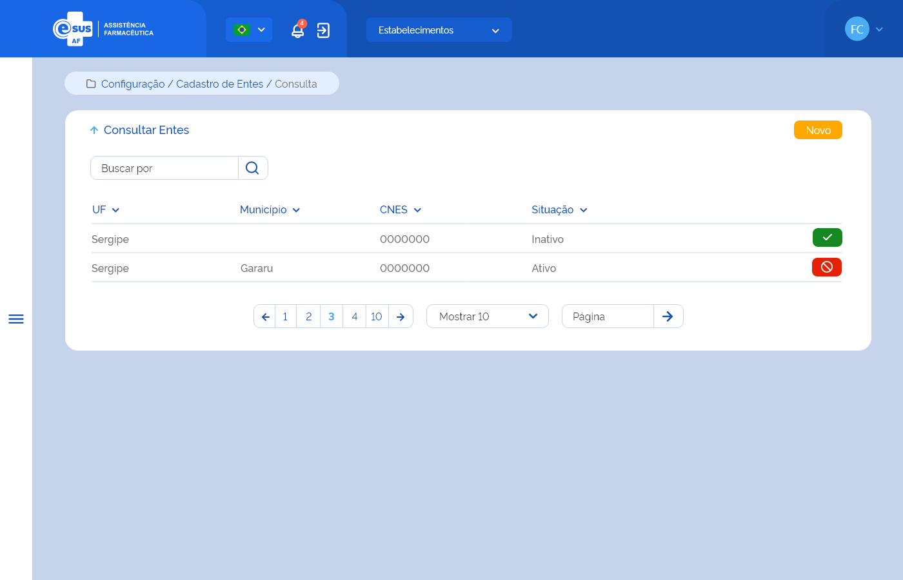

# Especificação Técnica 013 - Consultar Entes

## Descrição
Como usuário quero consultar os entes que pertencem à minha instância. 

# Protótipo 001

## Elementos de Tela:
* Bread Crumb – “Configuração / Cadastro de Entes / Consulta” 
* Título da página – “Consultar Entes” 
* “Seta” – M - retorna para a Tela Inicial/Dashboard 
* “Novo” – BT - direciona para a Tela de Cadastrar Ente 
* Buscar por – A / AC 
* Lista de entes 
    * UF – A (2) 
    * Município – A (50) 
    * CNES – N (7)  
    * Situação – A (20) 
    * “Ativar” – BT 
    * “Desativar” – BT 
* Ordenação nas colunas 
* Paginação 
* Registro por página 
* Ir para página 

**Legenda**  
TIPO: A = Alfanumérico, N = Numérico, D = Data, M = Imagem, BT = Botão, LK = Link, SU = Seleção Única, SM = Seleção Múltipla, AC = Autocomplete, * = Obrigatório. 

## Critérios de aceite 
1. O usuário somente poderá acessar a funcionalidade caso tenha permissão; [RGN001](DocumentoDeRegrasv2.md#rgn001)
2. O acesso à funcionalidade é dado através do menu lateral no item “Configuração” quando acionar o subitem “Cadastro de Entes”; 
3. Quando o usuário acionar a opção de “Voltar”, o sistema deve retornar à tela inicial do sistema (dashboard); 
4. Quando o usuário acionar a opção de “Novo”, o sistema deve direcionar à tela “Cadastrar Ente”; [ETE014](ETE014.md)
5. O sistema deve recuperar o(s) ente(s) cadastrado(s) e que pertence(m) à instância do usuário e apresentar a lista com os dados: UF, Município, CNES, Situação e as ações desejáveis para cada registro. Caso algum campo retornar vazio, o sistema deve apresentar a descrição “-”; 
6. O sistema deve apresentar as ações conforme: 
* Para registro com situação “Ativo”, a opção “Inativar”; 
* Para registro com situação “Inativo”, a opção “Ativar”; 
7. Quando o usuário acionar a opção “Ativar”, o sistema deve apresentar mensagem de confirmação ao usuário. Caso o usuário confirme a ação, o sistema deve ativar a participação do ente e apresentar a mensagem de sucesso. Caso a ação não seja confirmada, o sistema permanece na tela de consulta; [MSG066](DocumentoDeMensagensv2.md#msg066) [MSG068](DocumentoDeMensagensv2.md#msg068)
8. Quando o usuário acionar a opção “Inativar”, o sistema deve apresentar mensagem de confirmação ao usuário. Caso o usuário confirme a ação, o sistema deve inativar a participação do ente e apresentar a mensagem de sucesso. Caso a ação não seja confirmada, o sistema permanece na tela de consulta; [MSG067](DocumentoDeMensagensv2.md#msg067) [MSG069](DocumentoDeMensagensv2.md#msg069)
9. O sistema deve gravar a data, hora e CPF e nome do usuário que a executou qualquer ação de alteração no registro. [RGN005](DocumentoDeRegrasv2.md#rgn005)
