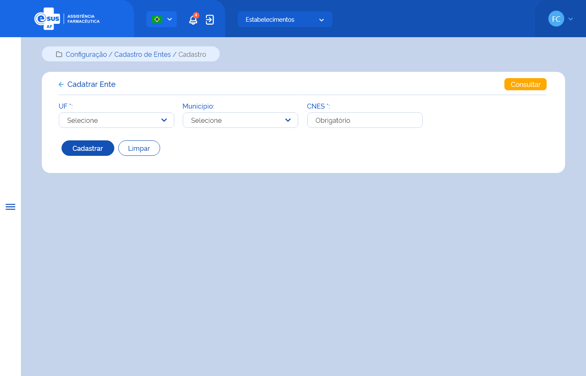

# Especificação Técnica 014 - Cadastrar Ente

## Descrição
Como usuário quero cadastrar um ente para participar da minha instância. 

## Protótipo 001

### Elementos de Tela:
* Bread Crumb – “Configuração / Cadastro de Entes / Cadastro” 
* Título da página – “Cadastrar Ente” 
* “Seta” – M - retorna para a Tela Consultar Entes 
* “Consultar” – BT - retorna para a Tela Consultar Entes 
* UF – SU 
* Município – SU 
* CNES – N (7) 
* “Cadastrar” – BT 
* “Limpar” – BT 

**Legenda**  
TIPO: A = Alfanumérico, N = Numérico, D = Data, M = Imagem, BT = Botão, LK = Link, SU = Seleção Única, SM = Seleção Múltipla, AC = Autocomplete, * = Obrigatório. 

### Critérios de aceite 
1. O usuário somente poderá acessar a funcionalidade caso tenha permissão; [RGN001](DocumentoDeRegrasv2.md#rgn001)
2. O acesso à funcionalidade é dado através do menu lateral no item “Configuração”, subitem “Cadastro de Entes”, na tela “Consultar Entes” quando acionar a opção “Novo”; 
3. No campo “UF”, o sistema deve apresentar a relação das unidades da federação em ordem alfabética; 
4. No campo “Município”, o sistema deve apresentar a relação dos municípios relacionados a UF selecionada no campo anterior; 
5. Quando o usuário informar noº do CNES no campo de igual nome, o sistema de recuperar e apresentar o nome do estabelecimento através da integração com o portal do Cadastro Nacional dos Estabelecimentos de Saúde (CNES); 
6. O sistema deve permitir cadastrar um ou mais ente e estes podem set de UF distintas; 
7. O sistema não deve permitir cadastrar: 
      * Um Ente com mesma UF e Município já cadastrado e deve emitir alerta ao usuário; [RGN049](DocumentoDeRegrasv2.md#rgn049) [MSG072](DocumentoDeMensagensv2.md#msg072)
      * Mais de um Ente com o mesmo CNES para a mesma instância e deve emitir alerta ao usuário. [RGN049](DocumentoDeRegrasv2.md#rgn049) [MSG073](DocumentoDeMensagensv2.md#msg073)
8. Os Entes podem ser uma UF ou um Município ou um Estabelecimento de Saúde; 
9. Após o cadastro dos entes da instalação, o usuário deve obrigatoriamente indicar um gestor para cada participante; 
10. Quando o usuário acionar a opção de “Cadastrar”, o sistema deve verificar se o preenchimento das informações atende às validações listadas, efetivar o cadastro do ente, gravar o estado e a situação do registro como “Ativo”, apresentar a mensagem de sucesso e retornar à tela de consulta aos entes apresentando este registro como o primeiro da relação dos entes cadastrados para a instância; [MSG071](DocumentoDeMensagensv2.md#msg071) [RGN005](DocumentoDeRegrasv2.md#rgn005)
11. Quando o usuário acionar a opção de “Voltar ou Consultar”, o sistema deve apresentar a mensagem de alerta ao usuário. Caso confirme a ação, retorna à tela de consulta aos estabelecimentos de saúde e não salva os dados incluídos. Caso a ação não seja confirmada, permanece na tela de cadastro de estabelecimento; [MSG006](DocumentoDeMensagensv2.md#msg006)
12. O sistema deve gravar a data, hora e CPF e nome do usuário que a executou qualquer ação de alteração no registro. [RGN005](DocumentoDeRegrasv2.md#rgn005)
