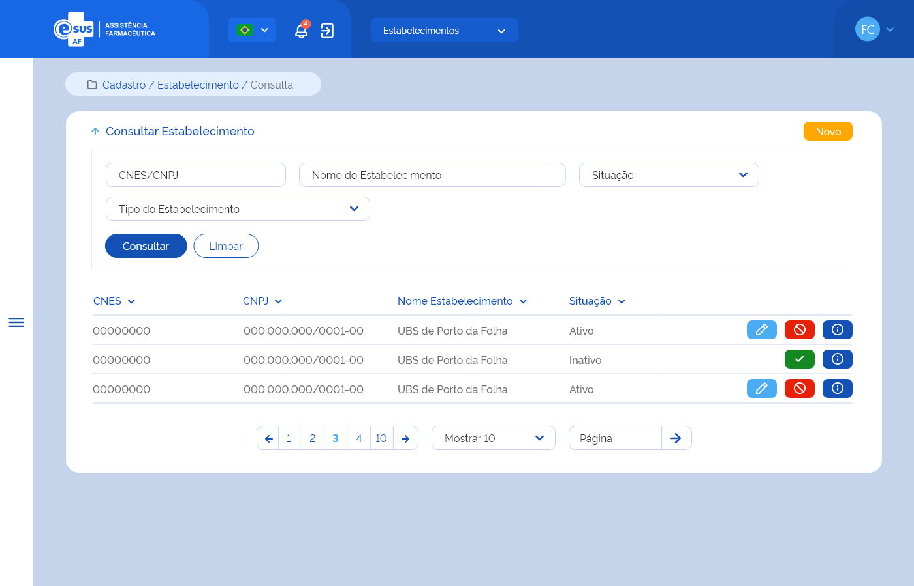

# ETE015 - Consultar Estabelecimento de Saúde

## Descrição <!-- (modelo história de usuário) -->
Como usuário, quero consultar os estabelecimentos de saúde cadastrados no ente. 

## Protótipo 001

### Descrição resumida
Como usuário, desejo consultar os estabelecimentos cadastrados e realizar a busca por CNES, nome do estabelecimento, situação e tipo de estabelecimento.  

[Inserir imagem] <!--  -->

### Acesso
Menu lateral “cadastro” > Estabelecimento

### Critérios de Aceite 
1. O usuário somente poderá acessar a funcionalidade caso tenha permissão. [RGN001](DocumentoDeRegrasv2.md#rgn001);
2. Quando o usuário acionar a seta para cima ao lado do título da página, o sistema deve retornar à tela inicial do sistema (dashboard); 
3. Quando o usuário acionar a opção de “Novo”, o sistema o sistema deve direcionar para a tela de cadastro de um novo estabelecimento de saúde. [ETE016](ETE016.md);
4. No campo “Situação”, o sistema deve apresentar as opções: Ativo e Inativo; 
5. No campo “Tipo de Estabelecimento”, o sistema deve apresentar as opções: Almoxarifado/CAF, Almoxarifado Regional/Regional de Saúde e/ou Farmácia/Dispensário; 
6. Quando o usuário acionar a opção “Consultar”, o sistema deve recuperar e apresentar o(s) estabelecimento(s) de saúde dentre os cadastrados e vinculados os participantes da instância do usuário do logado de acordo com o(s) filtro(s) informado(s). Caso não seja informado nenhum filtro, o sistema deve recuperar e apresentar todo(s) o(s) estabelecimento(s) da instância. Caso algum campo retorne vazio, o sistema deve apresentar a descrição “Sem informação”. [RGN002](DocumentoDeRegrasv2.md#rgn002);
7. O sistema, não encontrando o(s) estabelecimento(s) para os filtros informados, deve informar que o(s) registro(s) não foram encontrados. [MSG041](DocumentoDeMensagensv2.md#msg041);
8. O sistema, encontrando o(s) estabelecimento(s) de saúde, deve apresentá-lo(s) em ordem decrescente de inclusão com os respectivos dados: CNES, CNPJ, Nome do Estabelecimento, Situação e as ações desejáveis para cada registro; 
9. No campo “Nome do Estabelecimento”, na grid do resultado, o sistema deve recuperar e apresentar o nome fantasia informado no cadastro do estabelecimento, caso retorne vazio deve apresentar a razão social deste; 
10. O sistema deve permitir editar, ativar, inativar ou detalhar um registro de estabelecimento de saúde; 
11. O sistema deve apresentar as ações conforme: 
    * Para registro com situação “Ativo”, as opções “Editar”, “Inativar” e “Detalhar”; 
    * Para registro com situação “Inativo”, as opções “Ativar” e “Detalhar”.
12. As grids com resultados de consultas devem permitir a ordenação por coluna, paginação, seleção de registro por página e filtrar o resultado da consulta. [RGN004](DocumentoDeRegrasv2.md#rgn004);
13. Quando o usuário acionar a opção de “Limpar”, o sistema deve limpar o(s) filtro(s) informado(s), o resultado consulta e permanecer na tela de consultar estabelecimento; 
14. Quando o usuário acionar a opção “Editar”, o sistema deve direcionar para a tela de edição de um estabelecimento de saúde. [ETE017](ETE017.md);
15. As opções “Ativar” e “Inativar” somente serão apresentadas para usuários com perfil de “Gestor”; 
16. Quando o usuário acionar a opção “Inativar”, o sistema deve: 
    * Verificar se existe(m) produto(s) no estoque do estabelecimento, caso possua apresenta uma mensagem de impedimento. [RGN008](DocumentoDeRegrasv2.md#rgn008) [MSG013](DocumentoDeMensagensv2.md#msg013);
    * Apresentar a mensagem de confirmação ao usuário. Caso o usuário confirme a ação, o sistema altera o estado e a situação do registro para “Inativo” e apresenta a mensagem de sucesso. Caso a ação não seja confirmada, o sistema permanece na tela de consulta. [MSG011](DocumentoDeMensagensv2.md#msg011) [MSG049](DocumentoDeMensagensv2.md#msg049);
17. Quando o usuário acionar a opção “Ativar”, o sistema deve apresentar a mensagem de confirmação ao usuário. Caso o usuário confirme a ação, o sistema deve o sistema altera o estado e a situação do registro para “Ativo” e apresenta a mensagem de sucesso. [MSG012](DocumentoDeMensagensv2.md#msg012) [MSG050](DocumentoDeMensagensv2.md#msg050);
18. Quando o usuário acionar a opção “Detalhar”, o sistema deve direcionar para a tela de detalhamento dos dados do estabelecimento de saúde. [ETE018](ETE018.md);
19. O sistema deve gravar a data, hora e CPF e nome do usuário que a executou qualquer ação de alteração no registro. [RGN005](DocumentoDeRegrasv2.md#rgn005).

