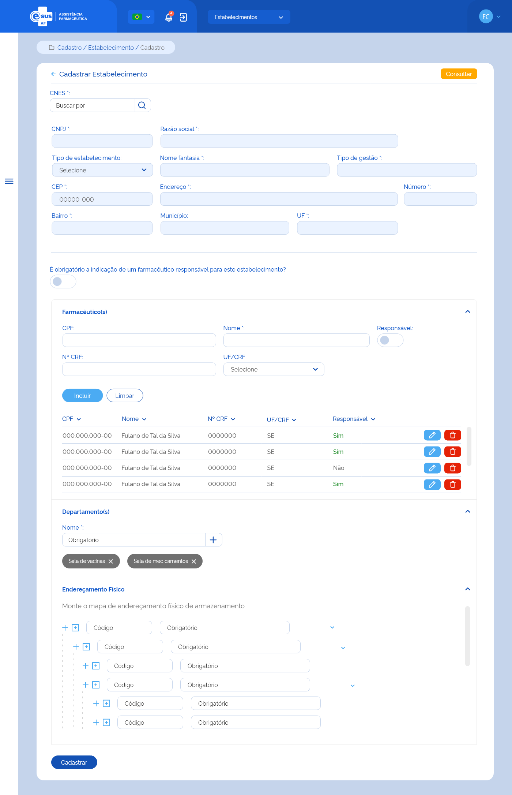

# ETE016 - Cadastrar Estabelecimento de Saúde

## Descrição
Como usuário quero cadastrar um estabelecimento de saúde através da recuperação de dados do portal do Cadastro Nacional dos Estabelecimentos de Saúde (CNES)

## Protótipo 001

[Inserir imagem] <!--  -->

### Acesso  

Cadastro > Estabelecimento > Acionar o botão “Novo” 

### Critérios de Aceite 
1. O usuário somente poderá acessar a funcionalidade caso tenha permissão. [RGN001](DocumentoDeRegrasv2.md#rgn001);
2. Quando o usuário informar o CNES, o sistema deve recuperar e apresentar os dados do estabelecimento através da integração com o portal do Cadastro Nacional dos Estabelecimentos de Saúde (CNES);  
3. O sistema deve informar ao usuário caso a consulta retorne um estabelecimento com cadastro inativo ou não encontre o registro. [MSG002](DocumentoDeMensagensv2.md#msg002);
4. Caso algum campo retornar vazio da consulta ao portal do CNES, o sistema deve apresentar a descrição “Sem informação”. 
5. No campo “Tipo de Estabelecimento”, o sistema deve apresentar as opções: Almoxarifado/CAF, Almoxarifado Regional/Regional de Saúde e Farmácia; 
6. O usuário somente poderá realizar os cadastros de Farmacêuticos / Departamentos / Localização Física se ele tiver permissões de Gestor ou Gestor de Estabelecimento e estiver dentro do contexto do estabelecimento desejado;
7. Deve ser possível incluir farmacêutico(s) ao cadastro do estabelecimento conforme: 
      * Pode ser incluído um ou mais farmacêuticos; 
      * Pode ser indicado um ou mais farmacêuticos como responsáveis pelo estabelecimento de saúde; 
      * O(s) farmacêutico(s) incluído(s) pode(m) ser excluído(s). [RGN016](DocumentoDeRegrasv2.md#rgn016).
8. Caso a UF da inscrição no CRF do farmacêutico seja diferente da UF do estabelecimento de saúde, o sistema deve informar ao usuário. [MSG003](DocumentoDeMensagensv2.md#msg003);
9.  Caso o farmacêutico do CPF informado já tenha sido relacionado a algum estabelecimento participante da instância, o sistema deve carregar os dados de nome completo, nº de inscrição no conselho da classe (CRF), UF do CRF deste; 
10. O sistema não deve permitir a inclusão um farmacêutico com o mesmo CPF de um já incluído neste estabelecimento de saúde e deve informar ao usuário. [MSG051](DocumentoDeMensagensv2.md#msg051);
11. Quando o usuário acionar a opção “Limpar”, o sistema deve apagar as informações preenchidas nos campos CPF, Nome, Nº CRF e UF; 
12. Quando o usuário acionar a opção “Incluir”, o sistema deve gravar o estado do registro como “Ativo” e apresentar os dados: CPF, Nome, Nº CRF, UF/CRF e se é responsável pelo estabelecimento na lista de farmacêutico(s) do estabelecimento, com as ações “Editar” e “Excluir” para cada registro;  
13. Quando o usuário acionar a opção “Editar” o registro de um farmacêutico, o sistema carrega os campos CPF, Nome, Nº CRF, UF/CRF, com os dados informados anteriormente e permite a edição, bem como a indicação se o farmacêutico é responsável pelo estabelecimento de saúde; 
14. Deve ser possível incluir departamento(s) ao cadastro do estabelecimento de saúde conforme: 
    * A inclusão de um departamento não é obrigatória; 
    * Pode ser incluído um ou mais departamentos; 
    * O(s) departamento(s) relacionado (s) pode(m) ser excluído(s). [RGN016](DocumentoDeRegrasv2.md#rgn016).
15. Não é permitido incluir um departamento com a mesma descrição de um já relacionado;  
16. Quando o usuário acionar a opção “Incluir”, o sistema deve gravar o estado do registro como “Ativo” e apresentar o nome informado na relação de departamento(s) do estabelecimento de saúde e a ação “Excluir” para cada registro; 
17. Deve ser possível incluir o mapa de endereçamento físico com níveis hierárquicos ao cadastro do estabelecimento de saúde; 
18. No mapa de endereçamento o sistema deve: 
    * Permitir a navegabilidade entre os endereços, expandir ou retrair os níveis para visualização; 
    * Permitir a edição do mapa através da inclusão ou exclusão de um nível hierárquico; 
    * Apresentar a opção” Excluir” somente ao selecionar o item desejado. 
19. O sistema não deve permitir a inclusão de um endereço com o mesmo “Código do Endereço” de um já incluído para o estabelecimento de saúde. [MSG007](DocumentoDeMensagensv2.md#msg007);
20. Quando o usuário acionar a opção “Incluir”, o sistema deve gravar o estado do endereçamento como “Ativo” e apresentá-lo no mapa; 
21. Quando o usuário acionar a opção “Excluir”, o sistema deve validar: 
    * Se é permitido a exclusão do endereço devido à hierarquia. Caso não, o sistema apresenta uma mensagem de alerta ao usuário. [RGN006](DocumentoDeRegrasv2.md#rgn006) [MSG008](DocumentoDeMensagensv2.md#msg008);
    * Se existe algum produto do estoque do estabelecimento vinculado ao endereçamento físico. Caso sim, o sistema apresenta uma mensagem de alerta ao usuário. [RGN007](DocumentoDeRegrasv2.md#rgn007) [MSG009](DocumentoDeMensagensv2.md#msg009).
22. O sistema não deve permitir o cadastro de mais de um estabelecimento de saúde com o mesmo CNES para a mesma instância. Ao identificar essa tentativa, o sistema deve apresentar mensagem de impedimento ao usuário e de acordo com a opção selecionada, deve direcioná-lo à tela de alteração do estabelecimento ou permanecer na tela de cadastro e limpando o campo “CNES” para inserir novo dado. [RGN003](DocumentoDeRegrasv2.md#rgn003) [RGN004](DocumentoDeRegrasv2.md#rgn004);
23. Quando o usuário acionar a opção de “Cadastrar”, o sistema deve verificar se o preenchimento das informações atende às validações listadas, efetivar o cadastro do estabelecimento saúde, gravar o estado e a situação do registro como “Ativo”, apresentar a mensagem de sucesso e retornar à tela de consulta aos estabelecimentos de saúde apresentando este registro como o primeiro da relação dos estabelecimentos cadastrados para a instância. [MSG052](DocumentoDeMensagensv2.md#msg052) [RGN005](DocumentoDeRegrasv2.md#rgn005);
24. Quando o usuário acionar a opção de “Voltar”, o sistema deve apresentar a mensagem de alerta ao usuário. Caso confirme a ação, retorna à tela de consulta aos estabelecimentos de saúde e não salva os dados incluídos. Caso a ação não seja confirmada, permanece na tela de cadastro de estabelecimento. [MSG006](DocumentoDeMensagensv2.md#msg006);
25. O sistema deve gravar a data, hora e CPF e nome do usuário que a executou qualquer ação de alteração no registro. [RGN005](DocumentoDeRegrasv2.md#rgn005).
