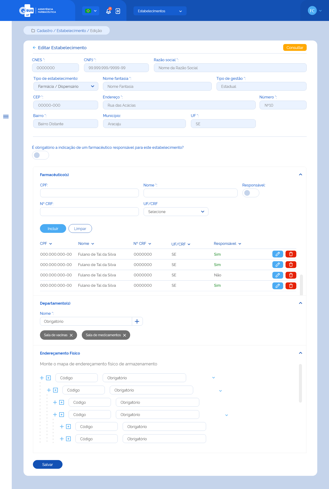

# ETE017 - Editar Estabelecimento de Saúde

## Finalidade

## Descrição da funcionalidade <!-- (modelo história de usuário) -->
Como usuário desejo editar os dados do cadastro de um estabelecimento de saúde dentre os participantes da instância para mantê-los atualizados 

## Protótipo 001

### Descrição resumida  
Como usuário desejo editar os dados de um estabelecimento de saúde do ente . 

[Inserir imagem] <!--  -->

### Acesso  
Cadastro > Estabelecimento > Consultar estabelecimento > acionar o botão “editar” 

### Campos  
* CNES =  campo para pesquisa <!-- Mostrava-se indentado no documento -->
* Campos recuperados do portal CNES e desabilitados para edição:  
    * CNPJ*  
    * Nome Razão Social*  
    * Nome Fantasia*  
    * Tipo Gestão*  
    * CEP*  
    * Endereço*  
    * Número*  
    * Bairro*  
    * Município*  
    * UF*  
    * Tipo de estabelecimento: Campo para seleção 
        1. Farmácia/Dispensário 
        2. Almoxarifado/CAF 
        3. Almoxarifado Regional/ Regional de Saúde 
    * Farmacêutico: 
        1. CPF: 
        2. Nome: 
        3. Nº CRF 
        4. UF/CRF 
        5. Responsável: S/N 

|CPF|NOME|Nº CRF|UF/CRF|Responsável|Ações|
|---|----|------|------|-----------|-----|
|   |    |      |      |&#8226; Sim|&#8226; Editar|
|   |    |      |      |&#8226; Não|&#8226; Excluir|

* Endereçamento Físico   
    1. “Adicionar Mesmo Nível”  
    2. “Adicionar Nível Abaixo”  
    3. Código   
    4. Identificação  
    5. “Excluir”  
    6. “Expandir/Retrair” 

### Elementos de Tela 
* Bread Crumb – “Cadastro / Estabelecimento / Edição
* Título da página – Editar Estabelecimento” 
* “Seta” – M - retorna para a Tela de Consultar de Estabelecimento 
* “Consultar” – BT
* Campos desabilitados para edição: 
    * CNES* – N (7) 
    * CNPJ* – N (14) 
    * Nome Razão Social* – A (150) 
    * Nome Fantasia* – A (150) 
    * Tipo Gestão* – A (9) 
    * CEP* – N (8) 
    * Endereço* – A (150) 
    * Número* – A (150) 
    * Bairro* – A (150) 
    * Município* – A (150) 
    * UF* – A (2) 
* Tipo de Estabelecimento* – SU 
* É obrigatória a indicação de um farmacêutico responsável para este estabelecimento? – SU 
* Farmacêutico(s) 
    * CPF – N (11) 
    * Nome Completo – A (150) 
    * Nº CRF – A (7) 
    * UF/CRF – SU 
    * Responsável – SU 
    * “Incluir” – BT 
    * “Limpar” – BT 
    * Lista farmacêutico(s) adicionado(s): 
        * CPF 
        * Nome  
        * Nº CRF 
        * UF/CRF 
        * Responsável (Sim/Não) 
        * “Editar” – BT 
        * “Excluir” – BT 
* Departamento(s) 
    * Nome – A (40) 
    * “Adição” – M 
    * Departamento(s) adicionado(s) 
        * Nome do departamento 
        * “Excluir” - M 
* Endereçamento Físico  
    * “Adicionar Mesmo Nível” – M 
    * “Adicionar Nível Abaixo” – M 
    * Código – A (7) 
    * Identificação – A (50) 
    * “Excluir” – M 
    * “Expandir/Retrair” – M 
* "Salvar"– BT 

**Legenda**  
TIPO: A = Alfanumérico, N = Numérico, D = Data, M = Imagem, BT = Botão, LK = Link, SU = Seleção Única, SM = Seleção Múltipla, AC = Autocomplete, * = Obrigatório.  
 
### Critérios de Aceite 
1. O usuário somente poderá acessar a funcionalidade caso tenha permissão; [RGN001](DocumentoDeRegrasv2.md#rgn001)
2. O sistema deve recuperar e apresentar os dados do estabelecimento de saúde cadastrado previamente, permitindo somente a edição dos campos: Tipo de Estabelecimento, Farmacêutico, Departamento, Endereçamento Físico e indicar a obrigatoriedade de farmacêutico responsável pelo estabelecimento; 
3. O sistema deve recuperar e apresentar os dados do estabelecimento de saúde cadastrado previamente, permitindo somente a edição dos campos: Tipo de Estabelecimento, Farmacêutico, Departamento, Endereçamento Físico.
4. Caso algum campo retornar vazio da consulta ao cadastro do estabelecimento, este deve apresentar a descrição “Sem informação”; 
5. Deve ser possível incluir farmacêutico(s) ao cadastro do estabelecimento conforme:  
      * A inclusão do farmacêutico ao estabelecimento não é obrigatória;   
      * Pode ser incluído um ou mais farmacêuticos;   
      * Pode ser indicado um ou mais farmacêuticos como responsáveis pelo estabelecimento de saúde; 
      * O(s) farmacêutico(s) relacionado(s) pode(m) ser excluído(s) (exclusão lógica – manter histórico). [RGN016](DocumentoDeRegrasv2.md#rgn016)
6. Caso a UF da inscrição no CRF do farmacêutico seja diferente da UF do estabelecimento de saúde, o sistema deve informar ao usuário; [MSG003](DocumentoDeMensagensv2.md#msg003)
7. Caso o farmacêutico do CPF informado já tenha sido relacionado a algum estabelecimento participante da instância, o sistema deve carregar os dados de nome completo, nº de inscrição no conselho da classe (CRF), UF do CRF deste; 
8. O sistema não deve permitir a inclusão um farmacêutico com o mesmo CPF de um já incluído neste estabelecimento de saúde e deve informar ao usuário; [MSG051](DocumentoDeMensagensv2.md#msg051)
9. Quando o usuário acionar a opção “Limpar”, o sistema deve apagar as informações preenchidas nos campos CPF, Nome, Nº CRF e UF; 
10. Quando o usuário acionar a opção “Incluir”, o sistema deve gravar o estado do registro como “Ativo” e apresentar os dados: CPF, Nome, Nº CRF, UF/CRF e se é responsável pelo estabelecimento na lista de farmacêutico(s) do estabelecimento, com as ações “Editar” e “Excluir” para cada registro.  
11. Quando o usuário acionar a opção “Editar” o registro de um farmacêutico, o sistema carrega os campos CPF, Nome, Nº CRF, UF/CRF, com os dados informados anteriormente e permite a edição, bem como a indicação se o farmacêutico é responsável pelo estabelecimento de saúde; 
12. Quando o usuário acionar a opção “Excluir” o registro de um farmacêutico, o sistema deve excluí-lo da lista de farmacêutico(s) do estabelecimento de saúde. 
13. Deve ser possível incluir departamento(s) ao cadastro do estabelecimento de saúde conforme: 
    * A inclusão de um departamento não é obrigatória; 
    * Pode ser incluído um ou mais departamentos; 
    * O(s) departamento(s) relacionado (s) pode(m) ser excluído(s) (exclusão lógica – manter histórico). [RGN016](DocumentoDeRegrasv2.md#rgn016)
14. Quando o usuário acionar a opção “Incluir”, o sistema deve gravar o estado do registro como “Ativo” e apresentar o nome informado na relação de departamento(s) do estabelecimento e a ação “Excluir” para cada registro; 
15. Quando o usuário acionar a opção “Excluir” um departamento, o sistema deve excluí-lo da relação de departamento(s) do estabelecimento de saúde. 
16. Deve ser possível incluir e/ou editar o mapa de endereçamento físico com níveis hierárquicos ao cadastro do estabelecimento de saúde; 
17. No mapa de endereçamento o sistema deve: 
    * Permitir a navegabilidade entre os endereços, expandir ou retrair os níveis para visualização; 
    * Permitir a edição do mapa através da inclusão ou exclusão de um nível hierárquico; 
    * Apresentar a opção” Excluir” somente ao selecionar o item desejado. 
18. O sistema não deve permitir a inclusão de um endereço com o mesmo “Código do Endereço” de um já incluído para o estabelecimento de saúde; [MSG007](DocumentoDeMensagensv2.md#msg007)
19. Quando o usuário acionar a opção “Incluir”, o sistema deve gravar o estado do endereçamento como “Ativo” e apresentá-lo no mapa; 
20. Quando o usuário acionar a opção “Excluir”, o sistema deve validar: 
    * Se é permitido a exclusão do endereço devido à hierarquia. Caso não, o sistema apresenta uma mensagem de alerta ao usuário; RGN006 [MSG008](DocumentoDeMensagensv2.md#msg008)
    * Se existe algum produto do estoque do estabelecimento vinculado ao endereçamento físico. Caso sim, o sistema apresenta uma mensagem de alerta ao usuário; RGN007 MSG009 
    * Se o preenchimento das informações atende às validações listadas anteriormente e excluí-lo do mapa.
21. Quando o usuário acionar a opção de “Salvar”, o sistema deve verificar se o preenchimento das informações atende às validações listadas, efetivar o cadastro do estabelecimento saúde, manter o estado e a situação do registro como “Ativo”, apresentar a mensagem de sucesso e retornar à tela de consulta aos estabelecimentos de saúde apresentando este registro como o primeiro da relação dos estabelecimentos cadastrados para a instância; [MSG062](DocumentoDeMensagensv2.md#msg062) [RGN005](DocumentoDeRegrasv2.md#rgn005)
22. Quando o usuário acionar a opção de “Voltar”, o sistema deve apresentar a mensagem de alerta ao usuário. Caso confirme a ação, retorna à tela de consulta aos estabelecimentos de saúde e não salva as edições realizadas. Caso a ação não seja confirmada, permanece na tela de edição do cadastro de estabelecimento; [MSG006](DocumentoDeMensagensv2.md#msg006) [ETE015](ETE015.md)
23. O sistema deve gravar a data, hora e CPF e nome do usuário que a executou qualquer ação de alteração no registro. [RGN005](DocumentoDeRegrasv2.md#rgn005)
