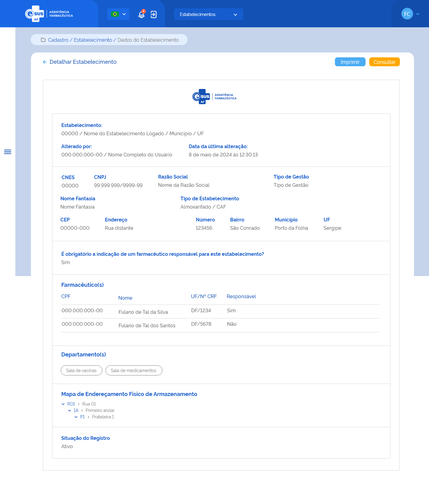

# ETE018 - Detalhar Estabelecimento de Saúde

## Descrição
Como usuário quero detalhar os dados de estabelecimento de saúde. 

## Protótipo 001

### Descrição resumida  
Como usuário desejo detalhar os dados de estabelecimento de saúde. 

[Inserir imagem] <!--  -->

### Acesso  
Cadastro > Estabelecimento > Consultar estabelecimento > Acionar o botão “detalhar” 

# Campos  
Todos os campos são espelhados conforme preenchimento do cadastro de estabelecimento.  
* Estabelecimento 
* Nome e CPF do último alterador 
* Alterado pela última vez em 
* CNES 
* CNPJ 
* Razão social 
* Esfera 
* Nome fantasia 
* Tipo de estabelecimento 
* CEP 
* Endereço 
* Bairro 
* UF 
* Município 
* Dados do farmacêutico(s)

|Nome|CPF|UF/CRF|Responsável|
|----|---|------|-----------|
|    |   |      |           |

* Departamento(s) 
* Mapa de endereçamento físico do armazenamento 
* Situação do registro do estabelecimento 

### Elementos de Tela 
* Bread Crumb – “Cadastro / Estabelecimento / Dados do Estabelecimento” 
* Título da página – “Detalhar Estabelecimento” 
* “Seta” – M - retorna para a Tela de Consultar Estabelecimento
* “Imprimir” – BT 
* “Consultar” – BT - retorna para a Tela de Consultar Estabelecimento
* Logotipo e-SUS AF - M 
* Cabeçalho:  
    * Estabelecimento: 
        * CNES / Nome do estabelecimento logado / Município / UF  
    * Alterado por:  
        * CPF / Nome completo do usuário que realizou a última ação no cadastro da entrada (anonimizar os dados)  
        * Data e Hora da última alteração: 
* CNES  
* CNPJ 
* Razão Social  
* Tipo Gestão 
* Nome Fantasia 
* Tipo de Estabelecimento  
* CEP 
* Endereço 
* Número 
* Bairro 
* Município 
* UF 
* É obrigatória a indicação de um farmacêutico responsável para este estabelecimento? - Sim ou Não 
* Farmacêutico(s) 
    * CPF 
    * Nome 
    * UF/Nº CRF 
    * Responsável - Sim ou Não 
* Departamento(s) 
    * Descrição departamento 
* Mapa do Endereçamento Físico de Armazenamento 
    * Código > Descrição Endereço 
* Situação do Registro
 
### Critérios de Aceite 
1. O usuário somente poderá acessar a funcionalidade caso tenha permissão; [RGN001](DocumentoDeRegrasv2.md#rgn001)
2. O acesso à funcionalidade é dado através do menu lateral no item “Cadastro”, subitem “Estabelecimento”, na tela “Consultar Estabelecimento” quando for acionada a opção “Detalhar”;   
3. O sistema deve recuperar e apresentar os dados relacionados ao cadastro do estabelecimento de saúde que o usuário deseja detalhar; 
4. Os dados do CNES, Nome, Município e UF, do cabeçalho (Emitido por:), devem ser recuperados do cadastro do estabelecimento do usuário logado. Já o Nome e CPF do usuário responsável pela última alteração no registro do cadastro e a data dessa ação devem ser recuperados do histórico do registro da funcionalidade em questão; [RGN014](DocumentoDeRegrasv2.md#rgn014)
5. Quando o usuário acionar a opção de “Imprimir”, o sistema deve permitir imprimir as informações da tela ou salvá-las em um arquivo no formato desejado (padrão Windows); 
6. Quando o usuário acionar a opção de “Voltar” ou “Consultar”, o sistema finaliza o detalhamento e retorna à tela de consulta aos estabelecimentos de saúde. [ETE015](ETE015.md)

