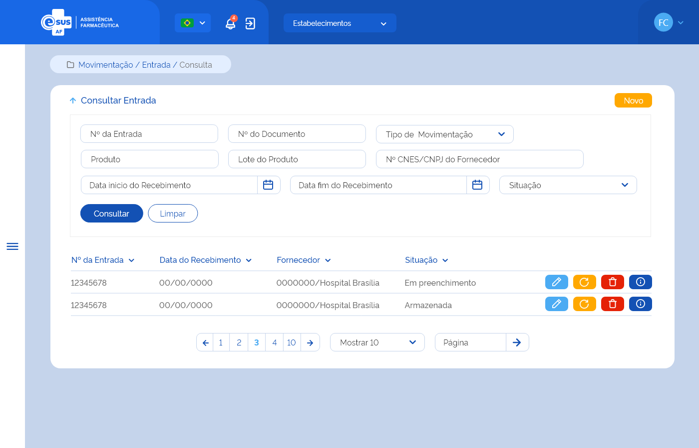

# ETE019 - Consultar Entrada

## Descrição (modelo história de usuário)
Como usuário quero consultar a(s) entrada(s) de produto(s) realizada(s) no estabelecimento de saúde logado

## Protótipo 001

[Link para protótipo no Adobe XD](https://xd.adobe.com/view/153e76da-8687-401d-a008-4ba101ed6f9b-406d/)

## Elementos de Tela 
* Bread Crumb – “Movimentação / Entrada / Consulta” 
* Título da página – “Consultar Entrada” 
* “Seta” – M - retorna para a Tela Inicial/Dashboard 
* “Novo” – BT - direciona para a Tela de Cadastrar Entrada 
* Filtros para consulta: 
    * Nº da Entrada – N (11) 
    * Nº do Documento – A (20) 
    * Tipo de Movimentação – SU  
    * Produto – AC (500) 
    * Lote do Produto – A (20) 
    * Nº CNES/CNPJ do Fornecedor – N (14) 
    * Data Início do Recebimento – D (dd/mm/aaaa) 
    * Data Fim do Recebimento – D (dd/mm/aaaa) 
    * Situação – SM 
* “Consultar” – BT 
* “Limpar” – BT 
* Lista de registro de entrada(s) no estabelecimento logado: 
    * Buscar por – A / AC 
    * Nº da Entrada 
    * Data do Recebimento 
    * Fornecedor – A (100) - (CNES ou CNPJ) - (Razão Social) 
    * Situação – A (9) 
* Ações conforme situação: 
    * Editar – BT - direciona para a Tela de Editar Entrada  
    * Excluir – BT 
    * Estornar – BT 
* Detalhar - direciona para a Tela de Detalhar Entrada  
* Ordenação nas colunas 
* Paginação 
* Registro por página 
* Ir para página 

**Legenda**  
TIPO: A = Alfanumérico, N = Numérico, D = Data, M = Imagem, BT = Botão, LK = Link, SU = Seleção Única, SM = Seleção Múltipla, AC = Autocomplete, * = Obrigatório.  
 
## Critérios de Aceite 
### 001
* O usuário somente poderá acessar a funcionalidade caso tenha permissão; [RGN001](DocumentoDeRegrasv2.md#rgn001) 

---
### 002
* O acesso à funcionalidade é dado através do menu lateral no item “Movimentação” quando acionar o subitem “Entrada”; 

---
### 003
* Quando o usuário acessar a funcionalidade, o sistema deve apresentar os filtros de pesquisa e somente apresentar a lista de resultado da consulta quando a opção “Consultar” for acionada; [RGN004](DocumentoDeRegrasv2.md#rgn004) 

---
### 004
* No campo “Tipo de Movimentação”, o sistema deve apresentar as opções: Ajuste de Estoque, Doação/Permuta, Entrada Ordinária, Produção Própria, Saldo de Implantação, Entrada por Estorno de Dispensação, Entrada por Estorno de Saída Diversa e Entrada por Estorno de Distribuição; 

---
### 005
* Quando o campo “Produto” for informado, o sistema deve: 
    * Apresentar a lista de produtos ativos no sistema que correspondam ao valor informado no campo autocomplete a partir da indicação do 3º caractere, consultando por nome do produto ou princípio ativo do medicamento, código de barras e CATMAT Raiz; [RGN015](DocumentoDeRegrasv2.md#rgn015) 
    * Validar se o produto informado foi encontrado. Caso não, o sistema deve realçar o campo e alertar ao usuário; [MSG015](DocumentoDeMensagensv2.md#msg015) 
    * Recuperar e apresentar a(s) entrada(s) cujo ao menos um do(s) produto(s) relacionado(s) a ela, possua um dos dados informados: Código de Barras, CATMAT, forma farmacêutica ou princípio ativo do medicamento.  

---
### 006
* Quando o campo “Lote do Produto” for informado, o sistema deve recuperar e apresentar a(s) entrada(s) cujo ao menos um dos produtos relacionados a ela, possua o dado informado; 

---
### 007
* Quando o campo “CNES/CNPJ do Fornecedor” for informado, o sistema deve verificar se o dado é válido.  Caso não, o sistema deve realçar o campo e alertar ao usuário; [MSG015](DocumentoDeMensagensv2.md#msg015) 

---
### 008
* No campo “Situação”, o sistema deve apresentar as opções: Em preenchimento, Armazenada e Estornada; 

---
### 009
* Quando o usuário acionar a opção “Consultar”, o sistema deve recuperar e apresentar o(s) registro(s) de entrada do estabelecimento logado de acordo com o(s) filtro(s) informado(s). Caso não seja informado nenhum filtro, o sistema deve recuperar e apresentar todo(s) o(s) registro(s) de entrada do estabelecimento logado. Caso algum campo retorne vazio, o sistema deve apresentar a descrição “Sem informação”; 

---
### 010
* O sistema, não encontrando a(s) entrada(s) para os filtros informados, deve informar que o(s) registro(s) não foram encontrados; [MSG041](DocumentoDeMensagensv2.md#msg041) 

---
### 011
* O sistema, encontrando a(s) entrada(s), deve apresentá-la(s) em ordem decrescente de data de recebimento com os respectivos dados: Nº da Entrada, Data do Recebimento, Fornecedor (<CNES ou CNPJ> - <Razão Social>) e Situação e as ações desejáveis para cada registro; 

---
### 012
* O sistema deve permitir excluir, editar, estornar ou detalhar um registro de entrada; 

---
### 013
* O sistema deve apresentar as ações conforme: 
    * Para registro com situação “Em preenchimento”, as opções “Excluir”, “Editar” e “Detalhar”; 
    * Para registro com situação “Armazenada”, as opções “Estornar” e “Detalhar”, exceto para a situação a seguir: 
        * Para a(s) entrada(s) do tipo “Entrada por Estorno de Dispensação”, “Entrada por Estorno de Saída Diversa” e “Entrada por Estorno de Distribuição”, o sistema deve apresentar apenas a opção “Detalhar”, uma vez que se trata(m) de entrada(s) gerada(s) automaticamente pelo sistema para o controle de estoque. 
    * Para registro com situação “Estornada” a opção “Detalhar”. 

---
### 014
* A grid com resultados de consultas deve permitir a ordenação por coluna, paginação, seleção de registro por página e filtrar o resultado da consulta; [RGN004](DocumentoDeRegrasv2.md#rgn004)  

---
### 015
* Quando o usuário acionar a opção “Novo”, o sistema deve direcionar para a tela de cadastro de uma nova entrada; (ETE020) 

---
### 016
* Quando o usuário acionar a opção “Limpar”, o sistema deve limpar o(s) filtro(s) informado(s), o resultado consulta e permanecer na tela de consultar entrada;  

---
### 017
* Quando o usuário acionar a opção “Voltar”, o sistema deve retornar para a tela inicial do sistema (dashboard); 

---
### 018
* Quando o usuário acionar a opção “Editar”, o sistema deve direcionar para a tela de edição de uma entrada (ETE021); 

---
### 019
* Quando o usuário acionar a opção “Excluir”, o sistema deve apresentar a mensagem de confirmação ao usuário. Caso o usuário confirme a ação, o sistema deve excluir o registro da entrada e deixar de apresentá-lo no resultado da consulta. Caso a ação não seja confirmada, o sistema permanece na tela de consulta. A exclusão física somente será possível para entrada(s) com situação “Em preenchimento”; [MSG010](DocumentoDeMensagensv2.md#msg010) [MSG042](DocumentoDeMensagensv2.md#msg042) [RGN016](DocumentoDeRegrasv2.md#rgn016) 

---
### 020
* Quando o usuário acionar a opção “Estornar”, o sistema deve apresentar a mensagem de confirmação ao usuário. Caso o usuário confirme a ação, o sistema estorna a entrada do(s) produto(s), altera a situação da entrada para “Estornada” e retira o(s) produto(s) do estoque do estabelecimento da entrada estornada, considerando o lote, validade e programa de saúde, através da criação de um registro de saída. Caso a ação não seja confirmada, o sistema permanecerá na tela de consulta; [MSG016](DocumentoDeMensagensv2.md#msg016) [MSG043](DocumentoDeMensagensv2.md#msg043) [RGN005](DocumentoDeRegrasv2.md#rgn005) 

---
### 021
* O sistema não deve permitir estornar uma entrada se ao menos um do(s) produto(s) vinculado(s) a ela foi movimentado, ou seja, distribuído, dispensado ou uma saída diversa foi registrada no estoque; [RGN017](DocumentoDeRegrasv2.md#rgn017) 

---
### 022
* Ao realizar o estorno da entrada do(s) produto(s), o sistema deve: 
    * Retirar o(s) produto(s) do estoque do estabelecimento da entrada estornada, através da criação de um registro de saída, gravando as seguintes informações: 
        * Tipo de Saída = “Saída por Estorno de Entrada”;  
        * Fornecedor = CNES ou CNPJ do estabelecimento que realizou entrada; 
        * Tipo de Documento = “Estorno de Entrada”; 
        * Número do Documento = Número da entrada que foi estornada; 
        * Produto, recupera os dados conforme gravado na entrada contendo: 
            * Princípio ativo ou Descrição do Produto 
            * Concentração + Forma farmacêutica (se for medicamento) 
            * CATMAT 
            * Fabricante 
            * Lote 
            * Validade 
            * Valor Unitário 
            * Quantidade  
        * Situação do registro de saída como “Registrada”; 
    * Alterar a situação do cadastro da entrada para “Estornada”; [RGN005](DocumentoDeRegrasv2.md#rgn005) [RGN018](DocumentoDeRegrasv2.md#rgn018) 

---
### 023
* O sistema, identificando que uma entrada de produto(s) foi estornada, deve debitar a quantidade do saldo deste(s), considerando o lote, validade e programa de saúde e atualizar a posição de estoque do estabelecimento que realizou o estorno da entrada; [RGN019](DocumentoDeRegrasv2.md#rgn019) 

---
### 024
* Quando o usuário acionar a opção “Detalhar”, o sistema deve direcionar para a tela de detalhamento dos dados da entrada; (ETE022)

---
### 025
* O sistema deve gravar a data, hora e CPF e nome do usuário que a executou qualquer ação de alteração na situação do registro. [RGN005](DocumentoDeRegrasv2.md#rgn005) 

