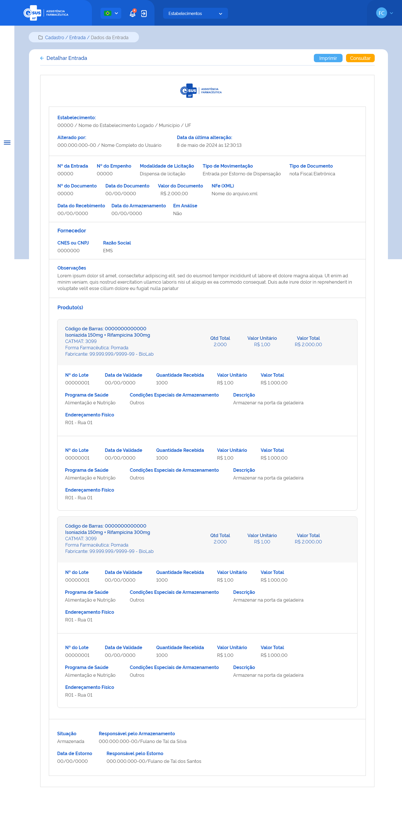

# ETE019 - Detalhar Entrada

## Descrição (modelo história de usuário)
Como usuário quero detalhar os dados de uma entrada de produto

## Protótipo 001

## Elementos de Tela 
* Bread Crumbs – “Movimentação / Entrada / Dados da Entrada” 
* Título da página – “Detalhar Entrada” 
* “Seta” – M - retorna para a Tela de Consultar Entrada (ETE016) 
* “Imprimir” – BT 
* “Consultar” – BT 
* Logotipo e-SUS AF - M 
* Cabeçalho:  
    * Estabelecimento: 
        * CNES / Nome do estabelecimento logado / Município / UF  
    * Alterado por:  
        * CPF / Nome completo do usuário que realizou a última ação no cadastro da entrada (anonimizar os dados)  
    * Data e Hora da última alteração: 
* Nº da Entrada 
* Nº do Empenho  
* Modalidade de Licitação  
* Tipo de Movimentação  
* Tipo de Documento  
* Nº do Documento  
* Data do Documento  
* Valor do Documento  
* NFe (XML) 
    * Nome do arquivo XML 
* Data do Recebimento 
* Data do Armazenamento 
* Fornecedor 
    * CNES ou CNPJ 
    * Razão Social 
* Observações 
* Produto(s) – lista produtos adicionados à entrada 
    * Código de Barras: 
    * Princípio Ativo + Concentração ou Descrição CATMAT 
    *  CATMAT: 
    * Forma Farmacêutica: (se medicamento) 
    * Fabricante: CNPJ-Razão Social (se medicamento) 
    * Qtd Total 
    * Valor Unitário  
    * Valor Total  
    * Detalhe Produto 
        * Nº do Lote 
        * Data de Validade 
        * Quantidade Recebida 
        * Valor Unitário  
        * Valor Total  
        * Programa de Saúde 
        * Condições Especiais de Armazenamento 
        * Descrição (se houver) 
        * Endereçamento Físico 
        * Fabricante CNES ou CNPJ-Nome Razão Social (se produto para saúde) 
* Situação 
* Responsável pelo Armazenamento:  
    * CPF / Nome Completo  
* Data Estorno: (se houver) 
* Responsável pelo Estorno: (se houver) 
    * CPF / Nome Completo 
 
## Critérios de Aceite 

* O usuário somente pode acessar a funcionalidade caso tenha permissão; [RGN001](DocumentoDeRegrasv2.md#rgn001) 

---
* O acesso à funcionalidade é dado através do menu lateral no item “Movimentação”, subitem “Entrada”, na tela “Consultar Entrada” quando for acionada a opção “Detalhar”; 

---
* O sistema deve recuperar e apresentar os dados relacionados ao cadastro da entrada de produto(s) que o usuário deseja detalhar; 

---
* Os dados do CNES, Nome, Município e UF, do cabeçalho (Emitido por:), devem ser recuperados do cadastro do estabelecimento do usuário logado. Já o Nome e CPF do usuário responsável pela última alteração no registro do cadastro e a data dessa ação devem ser recuperados do histórico do registro da funcionalidade em questão; [RGN014](DocumentoDeRegrasv2.md#rgn014) 

---
* O campo “Data do Armazenamento” deve ser apresentado em branco quando o registro da entrada estiver com a situação “Em preenchimento”; 

---
* Os produtos relacionados na entrada devem ser apresentados conforme o padrão do sistema; [RGN023](DocumentoDeRegrasv2.md#rgn023) 

---
* O campo “Responsável pelo Armazenamento” somente é apresentado quando o registro da entrada estiver com a situação “Armazenada” ou “Estornada”; 

---
* Os campos “Data do Estorno” e “Responsável pelo Estorno” somente serão apresentados quando o registro da entrada estiver com a situação “Estornada”; 

---
* Quando o usuário acionar a opção de “Imprimir”, o sistema deve permitir imprimir as informações da tela ou salvá-las em um arquivo no formato desejado (padrão Windows); 

---
* Quando o usuário acionar a opção de “Voltar” ou “Consultar”, o sistema finaliza o detalhamento e retorna à tela de consulta às entradas de produtos. 
