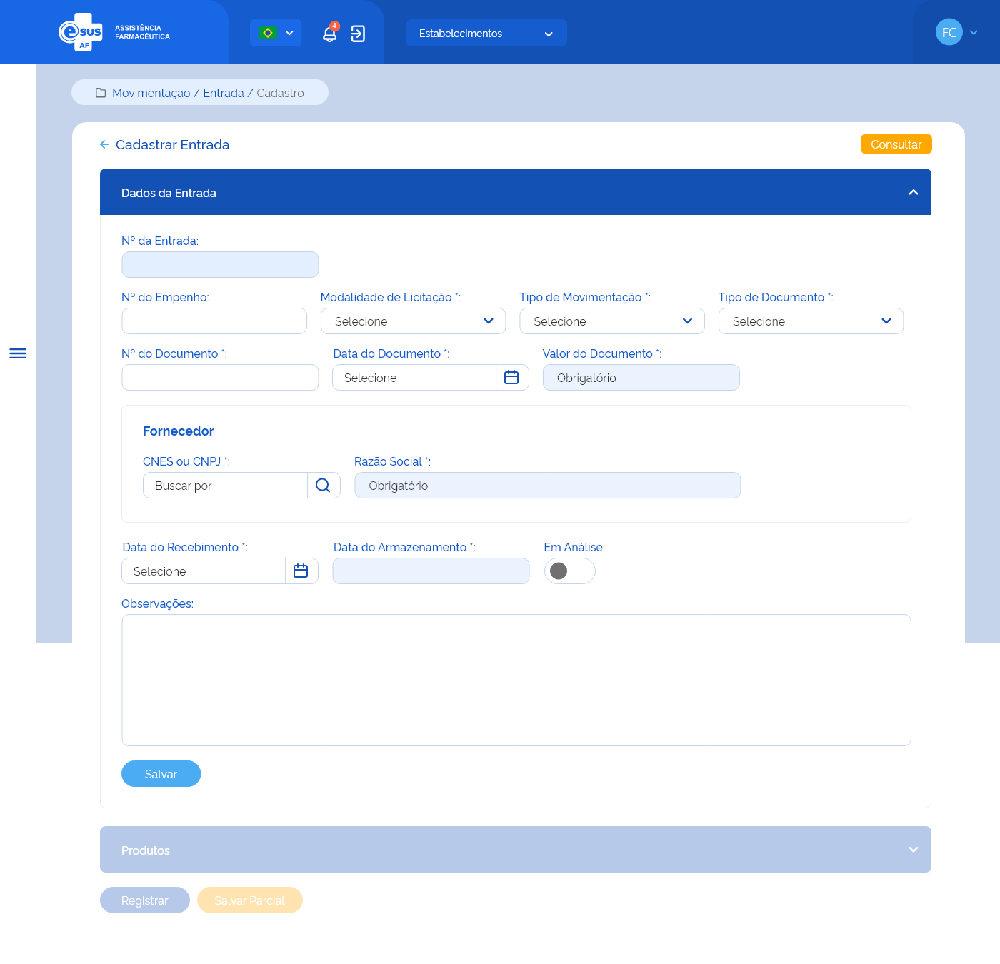
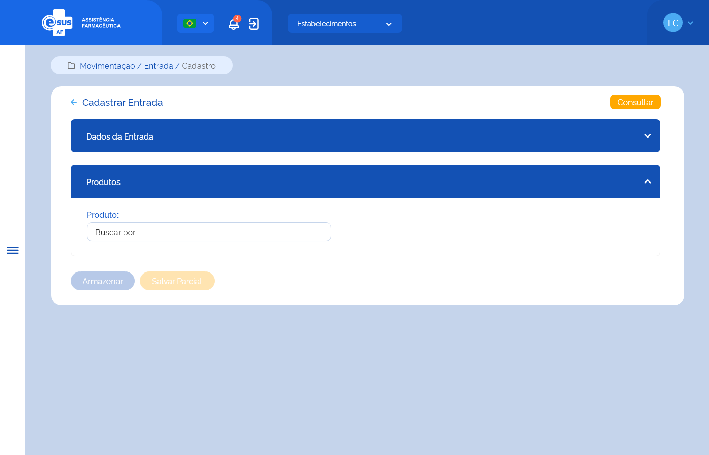
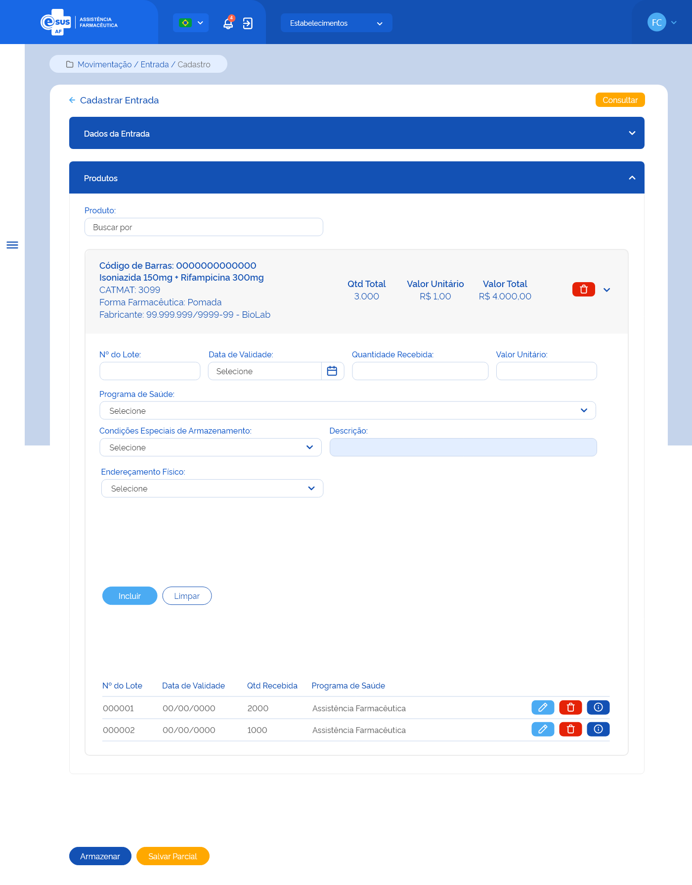
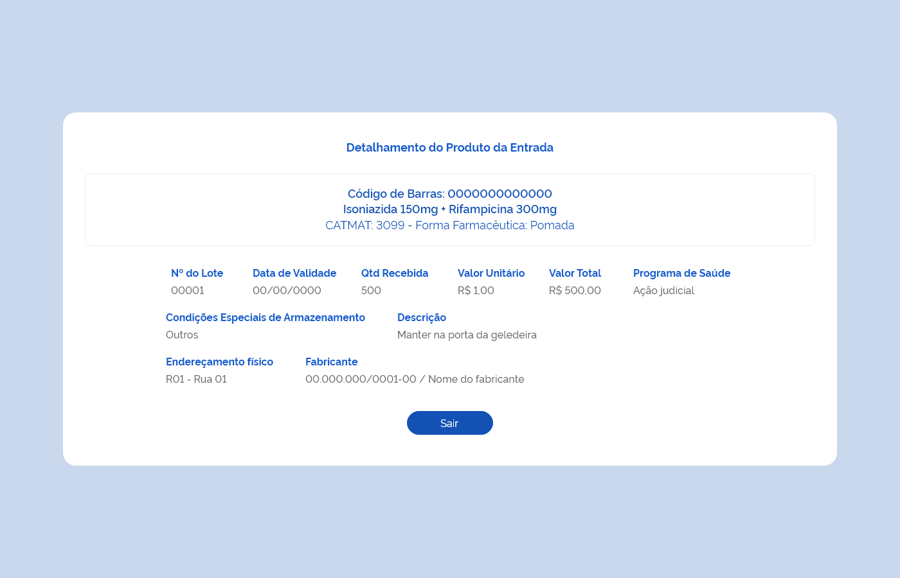

# ETE021 - Editar Entrada

## Descrição <!-- (modelo história de usuário) -->
Como usuário quero editar uma entrada de produto(s) para adicioná-lo(s) ao estoque do estabelecimento de saúde logado

## Protótipo 001

### Descrição resumida 
Eu como usuário desejo editar entrada com status em preenchimento no estabelecimento logado para que possa ajustar as informações necessárias.  

[Inserir imagem] <!--  -->

### Acesso  
Menu lateral > Movimentações > Entrada > consultar entrada > acionar o botão ações “editar” 

### Critérios de Aceite 
1. O usuário somente pode acessar a funcionalidade caso tenha permissão. [RGN001](DocumentoDeRegrasv2.md#rgn001);
2. O sistema deve recuperar e apresentar os dados da entrada cadastrada previamente, permitindo a edição de todos os campos; 
3. A sessão dados de entrada os seguintes campos podem ser editados: 
    * Tipo de movimentação  
    * Modalidade de licitação 
    * N° do empenho 
    * Tipo de documento 
    * N° do documento  
    * Data do documento  
    * Dados do fornecedor 
    * Data do recebimento 
    * Observações 
4. A sessão produtos os seguintes campos podem ser editados: 
    * N° do lote 
    * Data de validade 
    * Qtd recebida 
    * Valor unitário 
    * Programa de saúde 
    * Condições especiais de armazenamento 
    * Endereçamento físico 
5. Somente poderão ser editados as entradas não armazenadas com status “em preenchimento”;
6. Ao finalizar a edição clicar em “armazenar” ou “salvar parcial”; <!-- Quando o usuário selecionar no campo “Tipo de Movimentação” a opção: “Saldo de Implantação” ou “Ajuste de Estoque”, o preenchimento dos campos “Modalidade de Licitação”, “CNES/CNPJ” (fornecedor), “Razão Social” (fornecedor), “Tipo de Documento”, “Número do Documento” e “Data do Documento” deixa de ser obrigatório. Já se selecionar a opção “Produção Própria”, o preenchimento dos campos “Tipo de Documento”, “Número do Documento” e “Data do Documento” deixam de ser obrigatórios; [RGN024](DocumentoDeRegrasv2.md#rgn024)  NÃO HAVIA COMENTÁRIOS SOBRE OS DEMAIS CRITÉRIOS, PORTANTO, NÃO FIZ MODIFICAÇÕES -->
7.  O sistema deve validar a data do documento informada: 
    * Caso a data seja posterior a data atual, o sistema deve apresentar uma mensagem de alerta ao usuário. [MSG018](DocumentoDeMensagensv2.md#msg018);
    * Caso a data seja anterior a 1 ano da data atual, o sistema deve apresentar uma mensagem de alerta ao usuário. [MSG019](DocumentoDeMensagensv2.md#msg019);
8.  O campo “Valor do Documento” deve ser inabilitado para edição, com valor inicial 0 (zero) e o sistema deve calculá-lo automaticamente somado todos os valores totais dos produtos adicionados à entrada e apresentado em reais (R$) com até 2 dígitos após a virgula, realizando o arredondamento do valor se necessário. [RGN026](DocumentoDeRegrasv2.md#rgn026) [RGN028](DocumentoDeRegrasv2.md#rgn028);
9. Quando o usuário informar o CNES ou CNPJ do fornecedor e acionar a consulta, o sistema deve:  
    * Validar o CNES ou CNPJ. Caso o dado seja inválido, o sistema deve realçar o campo e alertar ao usuário. [MSG015](DocumentoDeMensagensv2.md#msg015);
    * Recuperar e apresentar o nome do fornecedor do CNES informado, através da integração com o portal do Cadastro Nacional dos Estabelecimentos de Saúde (CNES). Caso não seja encontrado um estabelecimento para o dado informado, o sistema deve apresentar uma mensagem de alerta ao usuário. [RGN020](DocumentoDeRegrasv2.md#rgn020) [RGN021](DocumentoDeRegrasv2.md#rgn021) [MSG017](DocumentoDeMensagensv2.md#msg017);
    * Recuperar e apresentar a razão social do fornecedor do CNPJ informado, através da integração com o portal da Receita Federal do Brasil (RFB). Caso não seja encontrado a pessoa jurídica para o CNPJ, o sistema deve apresentar uma mensagem de alerta ao usuário. [RGN020](DocumentoDeRegrasv2.md#rgn020) [RGN021](DocumentoDeRegrasv2.md#rgn021) [MSG017](DocumentoDeMensagensv2.md#msg017);
10. O campo “Data do Recebimento” dever ser preenchido automaticamente com a data atual e habilitado para edição; 
11. O sistema deve validar a data de recebimento informada: 
    * Caso a data seja posterior a data atual, o sistema deve apresentar uma mensagem de alerta ao usuário. [MSG020](DocumentoDeMensagensv2.md#msg020);
    * Caso a data seja anterior a 1 ano da data atual, o sistema deve apresentar uma mensagem de alerta ao usuário. [MSG021](DocumentoDeMensagensv2.md#msg021).
12. O campo “Data do Armazenamento” dever ser preenchido automaticamente com a data atual e desabilitado para edição; 
13. O campo “Em Análise” pode ser selecionado enquanto o(s) produtos da entrada não for(em) armazenado(s). Quando for selecionado, o sistema desabilita o botão “Armazenar”; 
14. Quando o usuário acionar a opção de “Salvar”, o sistema deve verificar se: 
    * Existe uma entrada com o mesmo tipo, número de documento e fornecedor de uma entrada armazenada ou em preenchimento para o estabelecimento. Caso sim, o sistema apresenta uma mensagem de alerta ao usuário e permanece na tela de cadastro da entrada. [RGN029](DocumentoDeRegrasv2.md#rgn029) [MSG028](DocumentoDeMensagensv2.md#msg028).
    Atendendo a validações, o sistema grava o registro da entrada com estado “Ativo” e a situação “Em preenchimento”, mantêm os campos habilitados para edição, permanece na tela de cadastro da entrada e apresenta o campo “Produto(s)”. [MSG031](DocumentoDeMensagensv2.md#msg031) [RGN030](DocumentoDeRegrasv2.md#rgn030) [RGN005](DocumentoDeRegrasv2.md#rgn005); 
15. Quando o usuário acionar a opção “Limpar”, o sistema deve apresentar a mensagem de alerta ao usuário. Caso confirme a ação, limpar os campos preenchidos e permanecer na tela de cadastro da entrada. Caso a ação não seja confirmada, não limpar os dados informados e permanecer na tela de cadastro da entrada. [MSG065](DocumentoDeMensagensv2.md#msg065);
16. Quando o usuário acionar a opção de “Voltar” ou “Consultar”, o sistema deve apresentar a mensagem de alerta ao usuário. Caso confirme a ação, retornar à tela de consulta as entradas e não salvar as edições realizadas. Caso a ação não seja confirmada, permanece na tela de cadastro da entrada. [MSG006](DocumentoDeMensagensv2.md#msg006);
17. O sistema deve gravar a data, hora e CPF e nome do usuário que a executou qualquer ação de alteração no estado do registro. [RGN005](DocumentoDeRegrasv2.md#rgn005).

## Protótipo 002

### Descrição resumida 
Eu como usuário desejo editar entrada com status em preenchimento no estabelecimento logado para que possa ajustar as informações necessárias.  

[Inserir imagem] <!--  -->

### Acesso  
Menu lateral > Movimentações > Entrada > consultar entrada > acionar o botão ações “editar” 

### Critérios de Aceite 
1. O usuário somente pode acessar a funcionalidade caso tenha permissão. [RGN001] (DocumentoDeRegrasv2.md#rgn001);
<!-- No campo “Produto” quando o usuário informar: 
    * O Código de Barras do produto, o sistema deve: 
        * Recuperar o produto relacionado ao código de barras da base de dados de medicamentos; [RGN015](DocumentoDeRegrasv2.md#rgn015) 
        * Emitir um alerta ao usuário caso o sistema não encontre o produto na base de dados de medicamentos; [MSG022](DocumentoDeMensagensv2.md#msg022) 
        * Limpar o campo Produto, quando o dado de código de barras for apagado. 
    * O Princípio Ativo ou Nome Comercial de um Medicamento ou Descrição do Produto para Saúde, o sistema deve: 
        * Emitir um alerta ao usuário caso o sistema não encontre o produto na base de dados de medicamentos ou produtos para saúde; [MSG022](DocumentoDeMensagensv2.md#msg022) 
        * Apresentar a lista de produtos ativos no sistema correspondestes ao valor informado no campo autocomplete a partir da indicação do 3º caractere; [RGN015](DocumentoDeRegrasv2.md#rgn015)  -->
2. O usuário deve selecionar o produto que deseja adicionar na lista produtos ativos no sistema; 
3. O sistema deve recuperar e apresentar os dados da entrada cadastrada previamente, permitindo a edição de todos os campos; <!-- O sistema não deve permitir adicionar um produto já relacionado à entrada. [MSG023](DocumentoDeMensagensv2.md#msg023) -->
4. A sessão produtos os seguintes campos podem ser editados: 
    * N° do lote 
    * Data de validade 
    * Qtd recebida 
    * Valor unitário 
    * Programa de saúde 
    * Condições especiais de armazenamento 
    * Endereçamento físico 
5. Somente poderão ser editados as entradas não armazenadas com status “em preenchimento”; 
6. Ao finalizar a edição clicar em “armazenar” ou “salvar parcial”. 
 

<!-- No documento não tem nada sobre o "Protótipo 003" -->
## Protótipo 003

### Critérios de Aceite
1. Quando o usuário realizar a busca de um produto e selecioná-lo, o sistema deve incluí-lo  a lista de produtos adicionados à entrada por ordem alfabética. A lista será expansiva, permitindo o preenchimento dos campos de detalhamento do produto. [RGN023](DocumentoDeRegrasv2.md#rgn023);
2. O(s) produto(s) adicionado(s) à entrada pode(m) ser excluído(s) desde que não tenha(m) detalhamento(s) vinculado(s) a ele. [RGN025](DocumentoDeRegrasv2.md#rgn025);
3. O campo “Qtd Total” deve ser desabilitado para edição e o sistema deve:  
    * Recuperar automaticamente a quantidade informada no campo “Qtd. Recebida” quando apenas um detalhamento do produto for adicionado; 
    * Calcular automaticamente somando todas as quantidades informadas nos detalhamentos adicionados ao produto. [RGN037](DocumentoDeRegrasv2.md#rgn037).
4. O campo “Valor Unitário” será carregado automaticamente com o dado informado neste campo no primeiro detalhamento do produto adicionado, ser apresentado em reais (R$) com até 9 dígitos após a virgula e desabilitado para edição; 
5. O campo “Valor Total” deve ser desabilitado para edição, calculado automaticamente através da fórmula: Qtd Total Recebida X Valor Unitário do produto e apresentado em reais (R$) com até 2 dígitos após a virgula, realizando o arredondamento do valor se necessário. [RGN027](DocumentoDeRegrasv2.md#rgn027) [RGN028](DocumentoDeRegrasv2.md#rgn028);
6. No detalhamento do Produto, o sistema deve verificar se: 
    * A data de validade informada é anterior ou igual à data atual ou com vencimento superior a 10 anos e emitir um alerta ao usuário. [MSG024](DocumentoDeMensagensv2.md#msg024);
    * A quantidade recebida do produto é inferior a 1 e emitir um alerta ao usuário. [MSG025](DocumentoDeMensagensv2.md#msg025);
    * O valor unitário informado para o produto é inferior a 0 e emitir um alerta ao usuário. [MSG026](DocumentoDeMensagensv2.md#msg026).
7. No campo “Valor Unitário” no detalhamento do Produto, o sistema deve: 
    * Apresentá-lo em reais (R$) com até 9 dígitos após a virgula;  
    * Atribuir o mesmo valor unitário informado no primeiro detalhamento desse produto aos demais detalhamentos e desabilitar o campo para edição. 
8.  No campo “Programa de Saúde” no detalhamento do Produto, o sistema deve apresentar as opções:

    * Ação Judicial
    * Alimentação e Nutrição
    * Aciden. por Anim. Peçonhentos
    * Alzheimer
    * Antimicrobianos
    * Assistência Farmacêutica
    * Assist. Farmacêutica Básica
    * Assist. Farmacêutica Indígena
    * Assistência Social
    * Atenção Secundária
    * Brucelose
    * Calamidade Pública
    * Coagulopatias
    * Cólera
    * Coqueluche
    * Covid-19
    * Dengue
    * Diabetes
    * Doença de Chagas
    * Doença Falciforme
    * DPOC
    * DST/AIDS
    * DST/AIDS - Infec. Oportunistas
    * Enxerto contra hospedeiro
    * Endemias Focais
    * Especializado
    * Esquistossomose
    * Febre Maculosa
    * Filariose
    * Geohelmintíases
    * Glaucoma
    * Imunização
    * Hanseníase
    * Hemoderivados
    * Hemoglobinopatias
    * Hepatites
    * Hipertensão
    * Hospitalar
    * Influenza
    * Insumos e Produtos para saúde
    * Leishmaniose
    * Lúpus Eritematoso Sistêmico
    * Malária
    * Manipulados
    * Meningite
    * Micoses Sistêmicas
    * Mieloma Múltiplo
    * Odontologia
    * Oncologia
    * Órteses e Próteses
    * Parkinson
    * Peste
    * Programa de Toxicologia
    * Raiva, Sarampo
    * Saúde da Criança
    * Saúde da Família
    * Saúde do Idoso
    * Saúde Mental
    * Saúde da Mulher
    * Saúde Prisional
    * Sífilis
    * Suplementação de Ferro
    * Tabagismo
    * Toxoplasmose
    * Tracoma
    * Tuberculose
    * Tuberculose Multirresistente
    * Urgência e Emergência. 

9.  No campo “Condições Especiais de Armazenamento” no detalhamento do Produto, o sistema deve apresentar as opções:

    * Climatizado (15°C a 30°C)
    * Congelado (Abaixo de 0°C)
    * Resfriado (2°C a 8°C)
    * Sem Condições Especiais
    * Outros. 

10. O campo “Descrição” somente será apresentado quando no campo “Condições Especiais de Armazenamento” for selecionada a opção “Outros”;  
11. No campo “Endereçamento Físico” no detalhamento do Produto, o sistema deve: 
    * Desabilitá-lo para edição quando o estabelecimento não possuir um endereçamento físico cadastrado e ativo; 
    * Preenche-lo automaticamente com endereçamento físico quando o estabelecimento possuir apenas um endereço cadastrado e ativo; 
    * Apresentar a lista de endereçamentos físicos cadastrados e ativos para o estabelecimento quando este possuir mais de um endereço. 
12. Os Campos “CNES ou CNPJ” e “Razão Social” do Fabricante, no detalhamento do Produto, somente serão apresentados quando o produto adicionado for um Produto para a Saúde [(Descrição do Produto) + (CATMAT)]; 
13. Quando o usuário informar o CNES ou CNPJ do fabricante e acionar a consulta, o sistema deve: 
    * Validar o CNES ou CNPJ. Caso o dado seja inválido, o sistema deve realçar o campo e alertar ao usuário. [MSG015](DocumentoDeMensagensv2.md#msg015);
    * Recuperar e apresentar o nome do fabricante do CNES informado, através da integração com o portal do Cadastro Nacional dos Estabelecimentos de Saúde (CNES). Caso não seja encontrado um estabelecimento para o dado informado, o sistema deve apresentar uma mensagem de alerta ao usuário. [RGN020](DocumentoDeRegrasv2.md#rgn020) [RGN021](DocumentoDeRegrasv2.md#rgn021) [MSG045](DocumentoDeMensagensv2.md#msg045);
    * Recuperar e apresentar a razão social do fabricante do CNPJ informado, através da integração com o portal da Receita Federal do Brasil (RFB). Caso não seja encontrado a pessoa jurídica para o CNPJ, o sistema deve apresentar uma mensagem de alerta ao usuário. [RGN020](DocumentoDeRegrasv2.md#rgn020) [RGN021](DocumentoDeRegrasv2.md#rgn021) [MSG045](DocumentoDeMensagensv2.md#msg045).
14. O sistema deve permitir adicionar mais de um detalhamento ao produto, permitindo a entrada do mesmo produto com lotes e datas de validades diferentes; 
15. O(s) detalhamento(s) vinculado(s) ao produto pode(m) ser editado(s), excluído(s) e detalhado(s); 
16. O sistema não deve permitir adicionar um detalhamento com o mesmo Nº do Lote e Data de Validade de um detalhamento já vinculado o produto na entrada. [MSG027](DocumentoDeMensagensv2.md#msg027);
17. Quando o usuário acionar a opção “Incluir”, o sistema deve gravar os dados do detalhamento e os apresentar na lista contendo: Nº do Lote, Data de Validade, Qtd Recebida e Programa de Saúde, com as ações “Editar”, “Excluir” e “Detalhar” para cada registro; 
18. Quando o usuário acionar a opção “Limpar”, o sistema deve limpar os campos preenchidos no detalhamento; 
19. Quando o usuário acionar a opção “Editar” o registro de um detalhamento, o sistema carrega os campos com os dados informados anteriormente e permite a edição; 
20. Quando o usuário acionar a opção “Excluir” o registro de um detalhamento, o sistema deve excluí-lo da lista de detalhamento(s) do produto. [RGN016](DocumentoDeRegrasv2.md#rgn016);
21. Quando o usuário acionar a opção “Detalhar” o registro de um detalhamento, o sistema deve apresentar os dados do referido registro. [Protótipo 004](ETE020.md#protótipo-004);
22. Quando o usuário acionar a opção “Armazenar”, o sistema deve verificar se: 
    * Existe ao menos um produto relacionado à entrada. Caso não, o sistema apresenta uma mensagem de alerta ao usuário e permanece na tela de cadastro da entrada. [MSG030](DocumentoDeMensagensv2.md#msg030);
    * O detalhamento de todos os produtos da entrada foi incluído. Caso não, o sistema apresenta uma mensagem de alerta ao usuário e permanece na tela de cadastro da entrada. [MSG029](DocumentoDeMensagensv2.md#msg029);
    
    Atendendo as validações, o sistema efetiva o cadastro da entrada, mantém o estado do registro como “Ativo” e a situação como “Armazenada”, armazena os produtos no estoque do estabelecimento, apresenta a mensagem de sucesso, retorna à tela de consulta às entradas e apresenta este registro como o primeiro da relação das entradas cadastradas para o estabelecimento. [MSG044](DocumentoDeMensagensv2.md#msg044) [RGN030](DocumentoDeRegrasv2.md#rgn030) [RGN005](DocumentoDeRegrasv2.md#rgn005);  

23. O sistema, identificando que uma entrada de produto(s) foi armazenada, deve creditar a quantidade no saldo deste(s), considerando lote, validade e programa de saúde e atualizar a posição de estoque do estabelecimento que realizou a entrada. [RGN031](DocumentoDeRegrasv2.md#rgn031);
24. Quando o usuário acionar a opção de “Salvar Parcial”, o sistema deve verificar se: 
    * Existe ao menos um detalhamento vinculado ao(s) produto(s) da entrada. Caso não, o sistema apresenta uma mensagem de alerta ao usuário e permanece na tela de cadastro da entrada; [MSG029](DocumentoDeMensagensv2.md#msg029);
    
    Atendendo as validações, o sistema mantém o registro da entrada com estado “Ativo” e a situação “Em preenchimento” e permanece na tela de cadastro da entrada. [MSG031](DocumentoDeMensagensv2.md#msg031) [RGN030](DocumentoDeRegrasv2.md#rgn030) [RGN005](DocumentoDeRegrasv2.md#rgn005).

25. Quando o usuário acionar a opção de “Voltar” ou “Consultar”, o sistema deve apresentar a mensagem de alerta ao usuário. Caso confirme a ação, retornar à tela de consulta as entradas e não salvar as edições realizadas. Caso a ação não seja confirmada, permanece na tela de cadastro da entrada. [MSG006](DocumentoDeMensagensv2.md#msg006);
26. O sistema deve gravar a data, hora e CPF e nome do usuário que a executou qualquer ação de alteração no estado do registro. [RGN005](DocumentoDeRegrasv2.md#rgn005).

## Protótipo 004

### Critérios de Aceite 
1. O acesso aos dados de um detalhamento do produto da entrada é realizado quando o usuário acionar a opção “Detalhar” no cadastro da entrada; 
2. O sistema deve recuperar e apresentar os dados relacionados ao detalhamento do produto da entrada que o usuário deseja detalhar;
3. Caso algum campo retornar vazio, o sistema deve apresentar a descrição “Sem informação”;  
4. Quando o usuário acionar a opção “Sair”, o sistema deve retornar à tela de “Cadastro da Entrada”. 