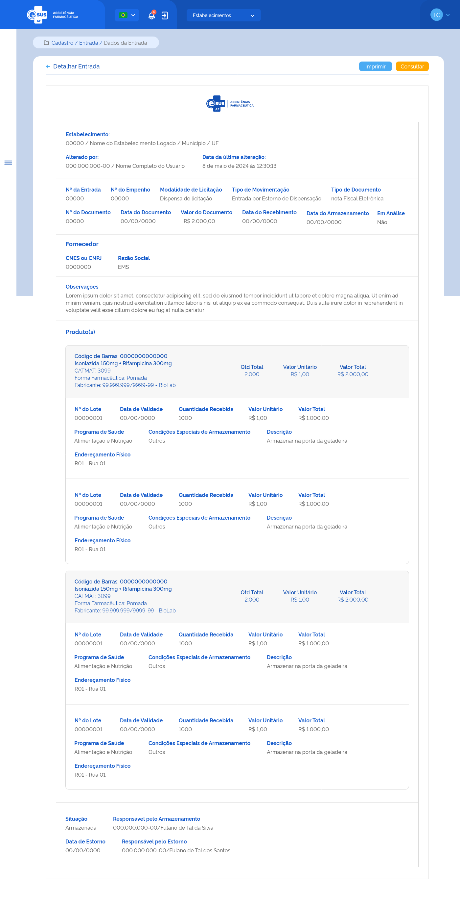

# ETE022 - Detalhar Entrada

## Descrição 
Como usuário quero detalhar os dados de uma entrada de produto

## Protótipo 001

### Descrição resumida 
Como usuário quero detalhar os dados de uma entrada de produto 

[Inserir imagem] <!-- -->

### Acesso  
Menu lateral > Movimentações > Entrada > consultar entrada > acionar o botão ações “detalhar” 

### Campos 
* Estabelecimento 
* Alterado por 
* Data da última alteração 
* N° de entrada 
* N° do empenho 
* Modalidade de licitação 
* Tipo de movimentação 
* Tipo de documento 
* Data do documento 
* N° do documento 
* Valor do documento 
* Data do recebimento 
* Data do armazenamento 
* Em análise 
* Fornecedor 
    1. CNPJ 
    2. Razão social 
* Observações 
* Produto(s) 

    |Dados Medicamento|Quantidade Recebida|Valor Total|
    |-----------------|-------------------|-----------|
    |                 |                   |           |

    1. N° do lote 
    2. Data de validade 
    3. Qtd recebida 
    4. Valor unitário 
    5. Valor total 
    6. Programa de saúde 
    7. Condições especiais de armazenamento 
    8. Endereçamento físico 

### Elementos de Tela 
* Bread Crumb – “Movimentação / Entrada / Dados da Entrada” 
* Título da página – “Detalhar Entrada” 
* “Seta” – M - retorna para a Tela de Consultar Entrada (ETE016) 
* “Imprimir” – BT 
* “Consultar” – BT 
* Logotipo e-SUS AF - M 
* Cabeçalho:  
    * Estabelecimento: 
        * CNES / Nome do estabelecimento logado / Município / UF  
    * Alterado por:  
        * CPF / Nome completo do usuário que realizou a última ação no cadastro da entrada (anonimizar os dados)  
    * Data e Hora da última alteração: 
* Nº da Entrada 
* Nº do Empenho  
* Modalidade de Licitação  
* Tipo de Movimentação  
* Tipo de Documento  
* Nº do Documento  
* Data do Documento  
* Valor do Documento  
* Data do Recebimento 
* Data do Armazenamento 
* Fornecedor 
    * CNES ou CNPJ 
    * Razão Social 
* Observações 
* Produto(s) – lista produtos adicionados à entrada 
    * Código de Barras: 
    * Descrição do Produto
    * CATMAT: 
    * Forma Farmacêutica
    * Fabricante: CNPJ-Razão Social
    * Qtd Total 
    * Valor Unitário  
    * Valor Total  
    * Detalhe Produto 
        * Nº do Lote 
        * Data de Validade 
        * Quantidade Recebida 
        * Valor Unitário  
        * Valor Total  
        * Programa de Saúde 
        * Condições Especiais de Armazenamento 
        * Descrição
        * Endereçamento Físico 
        * Fabricante CNES ou CNPJ-Nome Razão Social
* Situação 
* Responsável pelo Armazenamento:  
    * CPF / Nome Completo  
* Data Estorno: 
* Responsável pelo Estorno: 
    * CPF / Nome Completo 

**Legenda**  
TIPO: A = Alfanumérico, N = Numérico, D = Data, M = Imagem, BT = Botão, LK = Link, SU = Seleção Única, SM = Seleção Múltipla, AC = Autocomplete, * = Obrigatório.

### Critérios de Aceite 
1. O usuário somente pode acessar a funcionalidade caso tenha permissão; [RGN001](DocumentoDeRegrasv2.md#rgn001) 
2. O sistema deve recuperar e apresentar os dados relacionados ao cadastro da entrada de produto(s) que o usuário deseja detalhar; 
3. Os dados do CNES, Nome, Município e UF, do cabeçalho (Emitido por:), devem ser recuperados do cadastro do estabelecimento do usuário logado. Já o Nome e CPF do usuário responsável pela última alteração no registro do cadastro e a data dessa ação devem ser recuperados do histórico do registro da funcionalidade em questão; [RGN014](DocumentoDeRegrasv2.md#rgn014) 
4. Os produtos relacionados na entrada devem ser apresentados conforme o padrão do sistema; [RGN023](DocumentoDeRegrasv2.md#rgn023) 
5. Os campos "Data o Armazenamento" e “Responsável pelo Armazenamento” somente serão apresentados quando o registro da entrada estiver com a situação “Armazenada” ou “Estornada”; 
6. Quando o usuário acionar a opção de “Imprimir”, o sistema deve permitir imprimir as informações da tela ou salvá-las em um arquivo no formato desejado (padrão Windows); 
7.  Quando o usuário acionar a opção de “Voltar” ou “Consultar”, o sistema finaliza o detalhamento e retorna à tela de consulta às entradas de produtos. 
