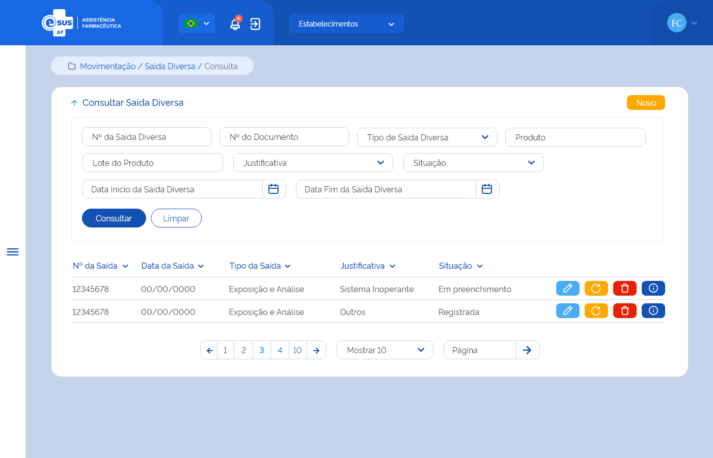

# ETE023 - Consultar Saída

## Descrição
Como usuário quero consultar a(s) saída(s) de produto(s) realizada(s) no estabelecimento de saúde logado e poder realizar estornos que se façam necessários para estas movimentações. <!-- Documento não informa qual deixa e qual apaga. Este é o que estava neste arquivo md e, possivelmente, é o antigo: Como usuário quero consultar a(s) saída(s) de produto(s) realizada(s) no estabelecimento de saúde logado -->

## Protótipo 001
### Descrição resumida 
Consultar saída- Como usuário quero consultar a(s) movimentações de saída(s) de produto(s) realizada(s) no estabelecimento de saúde logado.
[Inserir imagem] <!--  -->

### Acesso 
Menu lateral > Movimentação > Saída 

### Critérios de Aceite 
1. O usuário somente poderá acessar a funcionalidade caso tenha permissão; [RGN001](DocumentoDeRegrasv2.md#rgn001)
2. Quando o usuário acessar a funcionalidade, o sistema apresenta os filtros de pesquisa e a lista de resultados é apresentada previamente sem nenhum filtro adicionado. Para apresentar a lista com filtros desejados é necessário selecionar e clicar no botão “Consultar”. 
3. No campo “Tipo de Saída” o sistema deve apresentar as opções: Ajuste de Estoque, Amostra, Exposição e Análise, Apreensão Sanitária, Distribuição sem Requisição, Empréstimo, Perda, Requisição, Roubo, Saída para Departamento, Saída por Dispensação, Saída por Estorno de Entrada, Transferência, Usuário SUS Não Identificado, Validade Vencida; <!-- Não alterou, mas já está apresentado em “Campos” , DEVE APAGAR? -->
4. No campo “Tipo de Documento” o sistema deve apresentar as opções: Aviso, Boletim, Carta, Certidão, Circular, Comprovante, Contrato, Convênio, Decreto, Despacho, Edital, Fax, Guia, Guia De Remessa, Instrução Normativa, Memorando, Mensagem, Nota Fiscal, Nota Fiscal Eletrônica, Ofício, Ordem De Serviço, Parecer, Portaria, Protocolo, Requerimento, Requisição, Resolução; <!-- Não alterou, mas já está apresentado em “Campos”, DEVE APAGAR?  -->
5. Quando o campo “Produto” for informado, o sistema deve: 
      * Validar se o produto foi encontrado. Caso não, o sistema deve apresentar a mensagem de “Nenhum registro encontrado”. 
      * Recuperar e apresentar a(s) saída(s) cujo ao menos um do(s) produto(s) relacionado(s) a ela, possua um dos dados informados: CATMAT, forma farmacêutica ou princípio ativo do medicamento.  
6. Quando o campo “Lote do Produto” for informado, o sistema deve recuperar e apresentar a(s) saída(s) cujo ao menos um dos produtos relacionados a ela, possua o dado informado; 
7. No campo “Justificativa” o sistema deve apresentar as opções: Ajuste de estoque, Demanda ordinária,  Descarte ou devolução a fornecedores, Devolução e empréstimos, Doação, Outros, Quebra do produto/medicamento, Recebimento maior que a demanda, Recebimento próximo da validade, Roubo, Sistema inoperante, ou Transferência.
8. No campo “Situação”, o sistema deve apresentar as opções: Em preenchimento, Distribuído e Estornado; 
9. Quando o usuário acionar a opção “Consultar”, o sistema deve recuperar e apresentar o(s) registro(s) de Saída do estabelecimento logado de acordo com o(s) filtro(s) informado(s). Caso não seja informado nenhum filtro, o sistema deve recuperar e apresentar todo(s) o(s) registro(s) de Saída do estabelecimento logado. Caso algum campo retorne vazio, o sistema deve apresentar a mensagem “Nenhum registro encontrado”;  
10. O sistema, não encontrando a(s) saída(s) para os filtros informados, deve informar que o(s) registro(s) não foram encontrados; [MSG041](DocumentoDeMensagensv2.md#msg041) 
11. O sistema, encontrando a(s) saída(s), deve apresentá-la(s) em ordem decrescente de data da saída com os respectivos dados: Nº da Saída, Data da Saída, Tipo da Saída, Destino e Situação e as ações desejáveis para cada registro; 
12. O sistema deve permitir excluir, editar, estornar, copiar, estornar e copiar ou detalhar um registro de Saída;  
13. O sistema deve apresentar as ações conforme: 
    * Para registro com situação “Em preenchimento” as opções “Excluir”, “Editar” e “Detalhar”; 
    * Para registro com situação “Distribuído” as opções “Estornar” e “Detalhar”, “Copiar” e “Estornar e copiar”. 
    * Para registro com situação “Estornada” a opção “Detalhar” e “Copiar”. 
14. As grids com resultados de consultas devem permitir a ordenação por coluna, paginação, seleção de registro por página e filtrar o resultado da consulta; [RGN004](DocumentoDeRegrasv2.md#rgn004) 
15. Quando o usuário acionar a opção “Novo”, o sistema deve direcionar para a tela de cadastro de uma nova Saída; [ETE024](ETE024.md) 
16. Quando o usuário acionar a opção “Limpar”, o sistema deve limpar o(s) filtro(s) informado(s), o resultado consulta e permanecer na tela de consultar Saída;  
17. Quando o usuário acionar a opção “Voltar”, o sistema deve retornar para a tela inicial do sistema (dashboard); 
18. Quando o usuário acionar a opção “Editar”, o sistema deve direcionar para a tela de edição de uma Saída; [ETE025](ETE025.md) 
19. Quando o usuário acionar a opção “Excluir”, o sistema deve apresentar a mensagem de confirmação ao usuário. Caso o usuário confirme a ação, o sistema deve excluir o registro da Saída e seus descendentes e deixar de apresentá-lo no resultado da consulta. Caso a ação não seja confirmada, o sistema permanece na tela de consulta. A exclusão física somente será possível para saída(s) com situação “Em preenchimento”; [MSG010](DocumentoDeMensagensv2.md#msg010) [MSG046](DocumentoDeMensagensv2.md#msg046) [RGN016](DocumentoDeRegrasv2.md#rgn016) 
20. Quando o usuário acionar a opção “Estornar”, o sistema deve apresentar a mensagem de confirmação ao usuário. Caso o usuário confirme a ação, o sistema estorna a Saída do(s) produto(s), altera a situação da Saída para “Estornada” e credita o(s) produto(s) no estoque do estabelecimento da Saída estornada, considerando lote, validade e programa de saúde, através da criação de um registro de entrada. Caso a ação não seja confirmada, o sistema permanecerá na tela de consulta; [MSG016](DocumentoDeMensagensv2.md#msg016) [Protótipo 002](ETE023.md#prototipo-002) 
21. Quando o usuário acionar a opção “Detalhar”, o sistema deve direcionar para a tela de detalhamento dos dados da Saída; [ETE026](ETE026.md)

