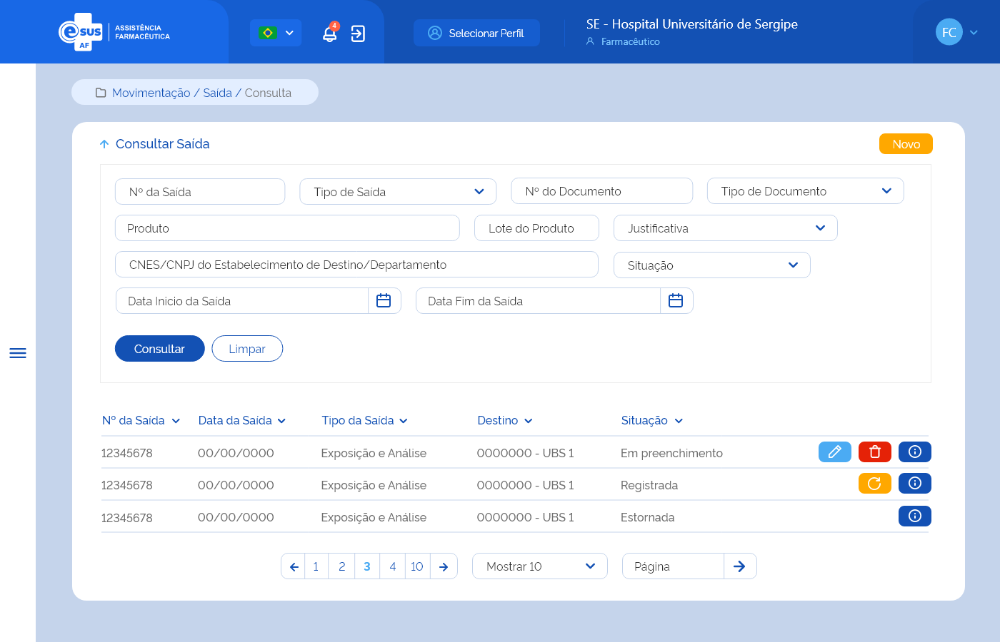

# ETE023 - Consultar Saída

## Descrição (modelo história de usuário)
Como usuário quero consultar a(s) saída(s) de produto(s) realizada(s) no estabelecimento de saúde logado

## Protótipo 001

### Elementos de Tela 
* Bread Crumb – “Movimentação / Saída / Consulta” 
* Título da página – “Consultar Saída” 
* “Seta” – M - retorna para a Tela Inicial/Dashboard 
* “Novo” – BT - direciona para a Tela de Cadastrar Saída 
* Filtros para consulta: 
    * Nº da Saída – N (11) 
    * Nº do Documento – A (20) 
    * Tipo de Documento - SU
    * Produto – AC (500) 
    * Lote do Produto – A (20) 
    * Justificativa – SU 
    * CNES/CNPJ do Estabelecimento de Destino/Departamento – A (50) 
    * Data Início da Saída – D (dd/mm/aaaa) 
    * Data Fim da Saída – D (dd/mm/aaaa) 
    * Situação – SU
* “Consultar” – BT 
* “Limpar” – BT 
* Lista de registro da(s) saída(s) no estabelecimento logado:
    * Nº da Saída 
    * Data da Saída 
    * Tipo da Saída 
    * Destino
    * Situação 
* Ações conforme situação: 
    * Editar – BT - direciona para a Tela de Editar Saída  
    * Excluir – BT 
    * Estornar – BT 
    * Detalhar - direciona para a Tela de Detalhar Saída 
* Ordenação nas colunas 
* Paginação 
* Registro por página 
* Ir para página 

**Legenda**  
TIPO: A = Alfanumérico, N = Numérico, D = Data, M = Imagem, BT = Botão, LK = Link, SU = Seleção Única, SM = Seleção Múltipla, AC = Autocomplete, * = Obrigatório.

### Critérios de Aceite 
1. O usuário somente poderá acessar a funcionalidade caso tenha permissão; [RGN001](DocumentoDeRegrasv2.md#rgn001)
2. O acesso à funcionalidade é dado através do menu lateral no item “Movimentação” quando acionar o subitem “Saída”;  
3. Quando o usuário acessar a funcionalidade, o sistema deve apresentar os filtros de pesquisa e somente apresentar a lista de resultado da consulta quando a opção “Consultar” for acionada; [RGN004](DocumentoDeRegrasv2.md#rgn004)
4. No campo “Tipo de Saída” o sistema deve apresentar as opções: Ajuste de Estoque, Amostra, Exposição e Análise, Apreensão Sanitária, Distribuição sem Requisição, Empréstimo, Perda, Requisição, Roubo, Saída para Departamento, Saída por Dispensação, Saída por Estorno de Entrada, Transferência, Usuário SUS Não Identificado, Validade Vencida; 
5. No campo “Tipo de Documento” o sistema deve apresentar as opções: Aviso, Boletim, Carta, Certidão, Circular, Comprovante, Contrato, Convênio, Decreto, Despacho, Edital, Fax, Guia, Guia De Remessa, Instrução Normativa, Memorando, Mensagem, Nota Fiscal, Nota Fiscal Eletrônica, Ofício, Ordem De Serviço, Parecer, Portaria, Protocolo, Requerimento, Requisição, Resolução; 
6. Quando o campo “Produto” for informado, o sistema deve: 
      * Apresentar a lista de produtos ativos no sistema que correspondam ao valor informado no campo autocomplete a partir da indicação do 3º caractere, consultando por nome do produto ou princípio ativo do medicamento, código de barras e CATMAT Raiz; [RGN015](DocumentoDeRegrasv2.md#rgn015) 
      * Validar se o produto informado foi encontrado. Caso não, o sistema deve realçar o campo e alertar ao usuário; [MSG015](DocumentoDeMensagensv2.md#msg015) 
      * Recuperar e apresentar a(s) saída(s) cujo ao menos um do(s) produto(s) relacionado(s) a ela, possua um dos dados informados: CATMAT, forma farmacêutica ou princípio ativo do medicamento.  
7. Quando o campo “Lote do Produto” for informado, o sistema deve recuperar e apresentar a(s) saída(s) cujo ao menos um dos produtos relacionados a ela, possua o dado informado; 
8. No campo “Justificativa” o sistema deve apresentar as opções: Diferença de Estoque, Quebra do produto/medicamento, Recebimento maior que a demanda, Recebimento próximo da validade, Roubo, Sistema Inoperante, Outros; 
9. No campo “Situação”, o sistema deve apresentar as opções: Em preenchimento, Registrada e Estornada; 
10. Quando o usuário acionar a opção “Consultar”, o sistema deve recuperar e apresentar o(s) registro(s) de Saída do estabelecimento logado de acordo com o(s) filtro(s) informado(s). Caso não seja informado nenhum filtro, o sistema deve recuperar e apresentar todo(s) o(s) registro(s) de Saída do estabelecimento logado. Caso algum campo retorne vazio, o sistema deve apresentar a descrição “Sem informação”; 
11. O sistema, não encontrando a(s) saída(s) para os filtros informados, deve informar que o(s) registro(s) não foram encontrados; [MSG041](DocumentoDeMensagensv2.md#msg041) 
12. O sistema, encontrando a(s) saída(s), deve apresentá-la(s) em ordem decrescente de data da saída com os respectivos dados: Nº da Saída, Data da Saída, Tipo da Saída, Destino e Situação e as ações desejáveis para cada registro; 
13. O sistema deve permitir excluir, editar, estornar ou detalhar um registro de Saída; 
14. O sistema deve apresentar as ações conforme: 
    * Para registro com situação “Em preenchimento” as opções “Excluir”, “Editar” e “Detalhar”; 
    * Para registro com situação “Registrada” as opções “Estornar” e “Detalhar”, exceto para a situação a seguir: 
        * Para a(s) saída(s) do tipo Saída por Dispensação” e “Saída por Estorno de Entrada”, o sistema deve apresentar apenas a opção “Detalhar”, uma vez que se trata(m) de saída(s) gerada(s) automaticamente pelo sistema para o controle de estoque.
    * Para registro com situação “Estornada” a opção “Detalhar”. 
15. As grids com resultados de consultas devem permitir a ordenação por coluna, paginação, seleção de registro por página e filtrar o resultado da consulta; [RGN004](DocumentoDeRegrasv2.md#rgn004) 
16. Quando o usuário acionar a opção “Novo”, o sistema deve direcionar para a tela de cadastro de uma nova Saída; [ETE024](ETE024.md) 
17. Quando o usuário acionar a opção “Limpar”, o sistema deve limpar o(s) filtro(s) informado(s), o resultado consulta e permanecer na tela de consultar Saída;  
18. Quando o usuário acionar a opção “Voltar”, o sistema deve retornar para a tela inicial do sistema (dashboard); 
19. Quando o usuário acionar a opção “Editar”, o sistema deve direcionar para a tela de edição de uma Saída; [ETE025](ETE025.md) 
20. Quando o usuário acionar a opção “Excluir”, o sistema deve apresentar a mensagem de confirmação ao usuário. Caso o usuário confirme a ação, o sistema deve excluir o registro da Saída e seus descendentes e deixar de apresentá-lo no resultado da consulta. Caso a ação não seja confirmada, o sistema permanece na tela de consulta. A exclusão física somente será possível para saída(s) com situação “Em preenchimento”; [MSG010](DocumentoDeMensagensv2.md#msg010) [MSG046](DocumentoDeMensagensv2.md#msg046) [RGN016](DocumentoDeRegrasv2.md#rgn016) 
21. Quando o usuário acionar a opção “Estornar”, o sistema deve apresentar a mensagem de confirmação ao usuário. Caso o usuário confirme a ação, o sistema estorna a Saída do(s) produto(s), altera a situação da Saída para “Estornada” e credita o(s) produto(s) no estoque do estabelecimento da Saída estornada, considerando lote, validade e programa de saúde, através da criação de um registro de entrada. Caso a ação não seja confirmada, o sistema permanecerá na tela de consulta; [MSG016](DocumentoDeMensagensv2.md#msg016) [Protótipo 002](ETE023.md#prototipo-002) 
22. Quando o usuário acionar a opção “Detalhar”, o sistema deve direcionar para a tela de detalhamento dos dados da Saída; [ETE026](ETE026.md)

## Protótipo 002

### Elementos de Tela 
* Título da página – “Informações sobre o Estorno da Saída” 
* Nº da Saída – N (36) 
* Tipo de Saída – A (50) 
* Data da Saída – D (DD/MM/AAAA) 
* Valor Total Saída – N (13,9) (R$ 99999999999999,999999999) 
* “Justificativa” * – A (250) 
* “Estornar” – BT  
* “Sair” – BT  

**Legenda**  
TIPO: A = Alfanumérico, N = Numérico, D = Data, M = Imagem, BT = Botão, LK = Link, SU = Seleção Única, SM = Seleção Múltipla, AC = Autocomplete, * = Obrigatório.

### Critérios de Aceite 
1. O acesso à funcionalidade é dado através do menu lateral no item “Movimentação”, subitem “Saída”, na tela “Consultar Saídas” quando acionar a opção “Estornar”; 
2. O sistema deve recuperar e apresentar os dados da saída, com os dados:  Nº da Saída, Tipo de Saída, Data da Saída, Valor Total Saída e o campo para inclusão da justificativa; 
3. Quando o usuário acionar a opção “Estornar”, o sistema estorna a Saída do(s) produto(s), mantém o estado do registro como “Ativo”, altera a situação da Saída para “Estornada” e credita o(s) produto(s) no estoque do estabelecimento da Saída estornada, considerando lote, validade e programa de saúde, através da criação de um registro de entrada. [MSG047](DocumentoDeMensagensv2.md#msg047) [RGN005](DocumentoDeRegrasv2.md#rgn005)
4. Ao realizar o estorno da Saída do(s) produto(s), o sistema deve: 
      * Creditar o(s) produto(s) no estoque do estabelecimento da saída estornada, através da criação de um registro de entrada, gravando as seguintes informações: 
      * Modalidade de Licitação = “Saída”;	
      * Tipo de Movimentação = “Entrada por Estorno de Saída”;  
      * Fornecedor = CNES ou CNPJ do estabelecimento que realizou saída;  
      * Tipo de Documento = “Estorno de Saída”;  
      * Número do Documento = Número da saída que foi estornada; 
      * No detalhamento do produto:  
        * Princípio ativo ou Descrição do produto 
        * Concentração + Forma farmacêutica (se for medicamento) 
        * CATMAT 
        * Fabricante 
        * Lote 
        * Validade 
        * Valor Unitário 
        * Quantidade  
      * Estado do registro de entrada como “Ativo”; 
      * Situação do registro de entrada como “Armazenada”; 
      * Manter o estado do registro da Saída como “Ativo”; 
      * Alterar a situação do registro da Saída para “Estornada”. [RGN005](DocumentoDeRegrasv2.md#rgn005) [RGN032](DocumentoDeRegrasv2.md#rgn032)
5. O sistema, identificando que uma Saída de produto(s) foi estornada, deve creditar a quantidade no saldo deste(s), considerando o lote, validade e programa de saúde e atualizar a posição de estoque do estabelecimento que realizou o estorno da Saída; [RGN033](DocumentoDeRegrasv2.md#rgn033)
6. Quando usuário acionar a opção “Sair”, o sistema retorna à tela de consulta; 
7. O sistema deve gravar a data, hora e CPF e nome do usuário que a executou qualquer ação de alteração na situação do registro. [RGN005](DocumentoDeRegrasv2.md#rgn005)
