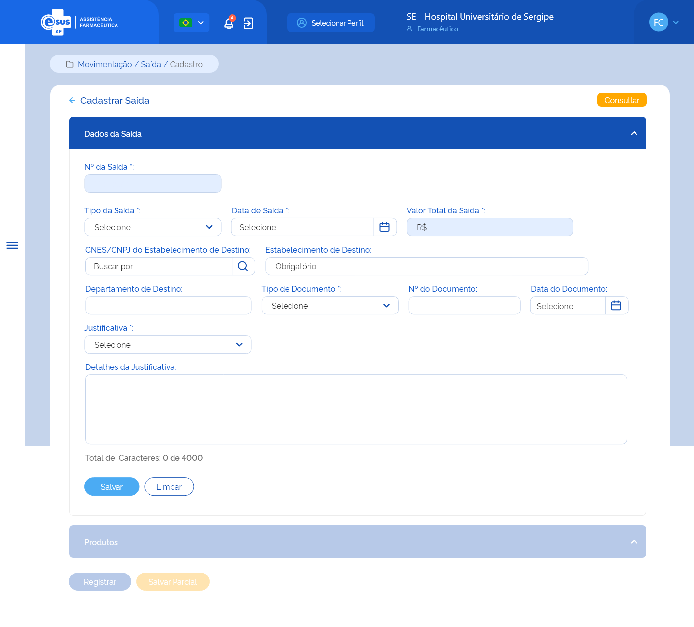
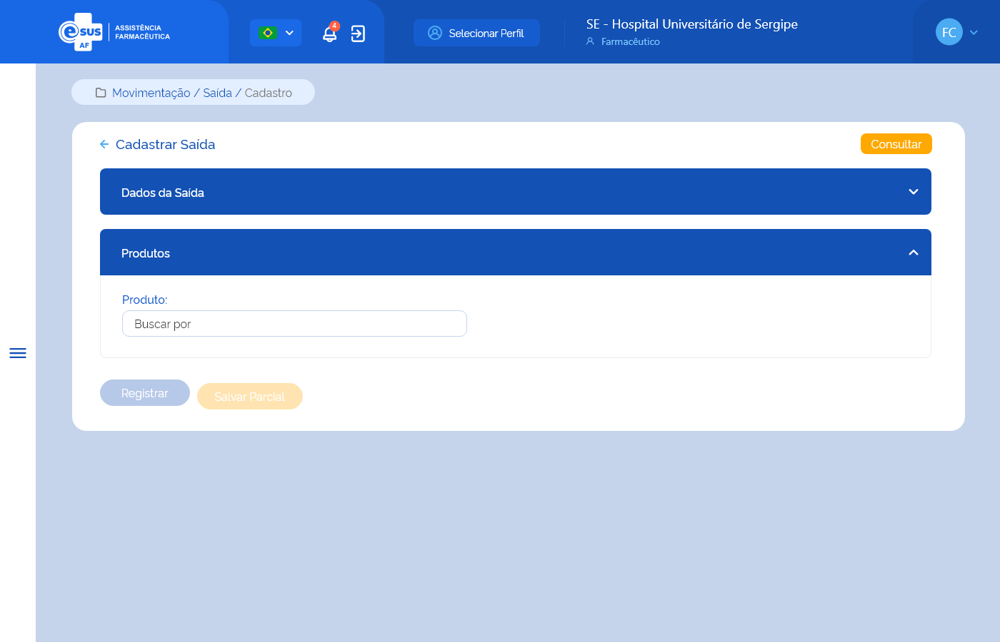

# ETE024 - Cadastrar Saída

## Descrição
Como usuário quero cadastrar uma saída de produto(s) para retirá-lo(s) do estoque do estabelecimento de saúde logado. 

## Protótipo 001

### Descrição resumida 
Cadastrar saída/Dados da saída - Como usuário quero realizar movimentações de saída de produtos do estoque do meu estabelecimento de saúde. Para tanto, incialmente é necessário realizar o cadastro das informações gerais relativas à saída de estoque. 

[Inserir imagem] <!--  -->

### Acesso 
Menu lateral > Movimentação > Saída > Consultar saída > Botão Novo 

### Campos 

- Número da saída - inserido automaticamente pelo sistema; 
- Tipo da saída  
    a) Ajuste de estoque  
    b) Amostra  
    c) Apreensão sanitária  
    d) Distribuição sem requisição  
    e) Doação/Permuta  
    f) Empréstimo  
    g) Exposição e análise  
    h) Perda  
    i) Requisição  
    j) Roubo  
    k) Saída para departamento  
    l) Transferência  
    m) Usuário SUS não identificado  
    n) Validade vencida  

- Data da saída - inserido automaticamente pelo sistema; 
- Valor total – inserido automaticamente pelo sistema; 
- CNES/CNPJ do Estabelecimento de Destino - obrigatório 
- Estabelecimento de Destino - inserido automaticamente pelo sistema ao informar o campo CNES/CNPJ; 
- Departamento de Destino - seleção depende dos departamentos cadastrados pelo estabelecimento 
- Tipo de Documento 
    a) Aviso  
    b) Boletim  
    c) Carta  
    d) Certidão  
    e) Circular  
    f) Comprovante  
    g) Contrato  
    h) Convênio  
    i) Decreto  
    j) Despacho  
    k) Edital  
    l) Fax  
    m) Guia  
    n) Guia de remessa  
    o) Instrução normativa  
    p) Memorando  
    q) Mensagem  
    r) Nota fiscal  
    s) Nota fiscal eletrônica  
    t) Ofício  

- Número do documento – inserido pelo usuário 
- Data do documento - inserido pelo usuário 
- Justificativa  
    a) Ajuste de estoque  
    b) Demanda ordinária  
    c) Descarte ou devolução a fornecedores  
    d) Devolução e empréstimos  
    e) Doação  
    f) Outros  
    g) Quebra do produto/medicamento  
    h) Recebimento maior que a demanda  
    i)Recebimento próximo da validade  
    j) Roubo  
    k) Sistema inoperante  
    l) Transferência  

- Detalhar Justificativa – campo texto inserido pelo usuário 

### Elementos de Tela 
* Bread Crumb – “Movimentação / Saída / Cadastro” 
* Título da página – “Cadastrar Saída” 
* “Seta” – M - retorna para a Tela de Consultar Saída  
* “Consultar” – BT - retorna para a Tela de Consultar Saída 
* Título da sessão 1 – “Dados da Saída” 
* Nº da Saída – N (36) – Desabilitado para edição 
* Tipo de Saída – SU / AC 
* Data da Saída – D (DD/MM/AAAA) 
* Valor Total Saída – N (13,9) (R$ 99999999999999,999999999) - Desabilitado para edição 
* CNES/CNPJ do Estabelecimento de Destino – N (7/14) 
* Lupa – M  
* Estabelecimento de Destino – A (20) 
* Departamento de Destino – SU /AC 
* Tipo de Documento* – SU / AC  
* Nº do Documento* – A (20) 
* Data do Documento* - D (DD/MM/AAAA)
    * Justificativa* – SU / AC 
* Detalhes Justificativa – A (4000) - contador regressivo 
* “Salvar” – BT 
* “Limpar” – BT 
* Título da sessão 2 – “Produtos” - desabilitado 
* “Registrar” – BT - desabilitado 
* “Salvar Parcial” – BT - desabilitado 

**Legenda**  
TIPO: A = Alfanumérico, N = Numérico, D = Data, M = Imagem, BT = Botão, LK = Link, SU = Seleção Única, SM = Seleção Múltipla, AC = Autocomplete, * = Obrigatório.
 
### Critérios de Aceite 
1. O usuário somente pode acessar a funcionalidade caso tenha permissão; [RGN001](DocumentoDeRegrasv2.md#rgn001)
2. O acesso à funcionalidade é dado através do menu lateral no item “Movimentação”, subitem “Saída”, na tela “Consultar Saída” quando for acionada a opção “Novo”; <!-- "Não alterou, mas já está no “Acesso”. " -->
3. O sistema deve apresentar os seguintes campos: Nº da Saída, Tipo de Saída, Data da Saída, Valor Total Saída, CNES/CNPJ do Estabelecimento de Destino, opção Lupa Estabelecimento de Destino, Departamento de Destino, Tipo de Documento, Nº do Documento, Data do documento, Justificativa, Detalhar Justificativa e as opções “Salvar” e “Limpar”; <!-- "Já está em “Campos” "-->
4. No campo “Tipo de Saída” o sistema deve apresentar as opções: Ajuste de Estoque, Amostra, Exposição e Análise, Apreensão Sanitária, Distribuição sem Requisição, Empréstimo, Perda, Requisição, Roubo, Saída para Departamento, Transferência, Usuário SUS não Identificado, Validade Vencida. Exceto os tipos criados para saídas geradas automaticamente pelo sistema: “Saída por Estorno de Entrada” e “Saída por Dispensação”;  <!-- "Não alterou, mas já está no “Acesso”. " -->
5. Quando o usuário selecionar no campo “Tipo de Saida” a opção: Ajuste de Estoque, Amostra, Exposição e Análise, Apreensão Sanitária, Perda, Usuário SUS Não Identificado, Validade Vencida, o sistema deve preencher os campos “CNES/CNPJ do Estabelecimento de Destino" e "Estabelecimento de Destino” com os dados do estabelecimento logado e mantendo-os desabilitados para edição e desabilitar para edição o campo: “Departamento de Destino”; [RGN065](DocumentoDeRegrasv2.md#rgn065)
6. Quando o usuário selecionar no campo “Tipo de Saida” a opção: "Distribuição sem Requisição" ou “Empréstimo” ou “Requisição” ou "Transferência", o sistema deve habilitar e tornar obrigatório o preenchimento dos campos "CNES/CNPJ do Estabelecimento de Destino" e "Estabelecimento de Destino” e manter desabilitado para edição o campo “Departamento de Destino”; [RGN065](DocumentoDeRegrasv2.md#rgn065)
      * O sistema deve verificar se CNES/CNPJ do Estabelecimento de Destino informado é igual ao do CNES/CNPJ do Estabelecimento logado. Caso sim, deve emitir mensagem de alerta ao usuário; [RGN064](DocumentoDeRegrasv2.md#rgn064) [MSG095](DocumentoDeMensagensv2.md#msg095)
      * Quando o usuário acionar a opção “Lupa” após informar o CNES/CNPJ do Estabelecimento de Destino, o sistema deve recuperar e apresentar o nome fantasia do estabelecimento dentre os cadastrados na instância. 
7. Quando o usuário selecionar no campo “Tipo de Saida” a opção: "Saída para Departamento", o sistema deve preencher os campos “CNES/CNPJ do Estabelecimento de Destino" e "Estabelecimento de Destino” com os dados do estabelecimento logado e mantendo-os desabilitados para edição e habilitar e tornar obrigatório a seleção de um item no campo "Departamento de Destino"; [RGN065](DocumentoDeRegrasv2.md#rgn065)
      * No campo "Departamento de Destino", o sistema deve recuperar e apresentar para seleção a relação dos departamentos cadastrados para o estabelecimento logado. 
8. O campo “Data da Saída” dever ser preenchido automaticamente com a data atual e desabilitado para edição; 
9. O campo “Valor Total da Saída” deve ser desabilitado para edição, calculado automaticamente somando todos os valores totais dos produtos adicionados à saída e apresentado em reais (R$) com até 2 dígitos após a virgula, realizando o arredondamento do valor se necessário; [RGN038](DocumentoDeRegrasv2.md#rgn038) [RGN028](DocumentoDeRegrasv2.md#rgn028)
10. No campo “Tipo de Documento” o sistema deve apresentar as opções: Aviso, Boletim, Carta, Certidão, Circular, Comprovante, Contrato, Convênio, Decreto, Despacho, Edital, Fax, Guia, Guia De Remessa, Instrução Normativa, Memorando, Mensagem, Nota Fiscal, Nota Fiscal Eletrônica, Ofício, Ordem De Serviço, Parecer, Portaria, Prescrição Médica, Requerimento, Requisição, Resolução; <!-- "Não alterou, mas já está no “Acesso”. " -->
11. No campo “Justificativa” o sistema deve apresentar as opções: Ajuste de estoque, Demanda ordinária, Descarte ou devolução a fornecedores, Devolução e empréstimos, Doação, Outros, Quebra do produto/medicamento, Recebimento maior que a demanda, Recebimento próximo da validade, Roubo, Sistema inoperante e Transferência.  <!-- "Já está em “Campos” "-->
12. Quando o usuário acionar a opção de “Salvar”, o sistema deve verificar se: 
      * Existe uma saída com o mesmo tipo de saída, tipo e número de documento e justificativa de uma saída registrada ou em preenchimento para o estabelecimento. Caso sim, o sistema deve apresentar uma mensagem de alerta ao usuário. [RGN044](DocumentoDeRegrasv2.md#rgn044) [MSG038](DocumentoDeMensagensv2.md#msg038)
      
      Atendendo a validações, o sistema grava o registro da saída com estado “Ativo” e a situação “Em preenchimento”, mantêm os campos habilitados para edição, permanece na tela de cadastro da saída e apresenta o campo “Produto(s)”; [MSG031](DocumentoDeMensagensv2.md#msg031) [RGN045](DocumentoDeRegrasv2.md#rgn045) [RGN005](DocumentoDeRegrasv2.md#rgn005)

13. Quando o usuário acionar a opção “Limpar”, o sistema limpa os campos preenchidos e permanecer na tela de cadastro da saída.   
14. Quando o usuário acionar a opção de “Voltar” ou “Consultar”, o sistema retorna à tela de consulta as saídas e não salvar as edições realizadas.  
15. O sistema deve gravar a data, hora e CPF e nome do usuário que a executou qualquer ação de alteração no estado do registro. [RGN005](DocumentoDeRegrasv2.md#rgn005)  

## Protótipo 002

### Descrição resumida 
Cadastrar saída/Relação de produtos da saída - Como usuário quero realizar movimentações de saída de produtos do estoque do meu estabelecimento de saúde. Após cadastrar as informações gerais relativas à saída de estoque, é necessário cadastrar os dados específicos sobre o(s) produto(s) que serão movimentados. 

[Inserir imagem] <!--  -->

Acesso 
Menu lateral > Movimentação > Saída > Consultar saída > Botão Novo > Botão Salvar 

Campos 
  
- Produto - obrigatório <!-- No documento de origem tinha indentação -->
- Quantidade a expedir - obrigatório <!-- No documento de origem tinha indentação -->

- Número do lote - seleção obrigatória 
- Data de validade – inserido automaticamente pelo sistema após selecionar lote 
- Programa de saúde - inserido automaticamente pelo sistema após selecionar lote 
- Endereçamento físico - inserido automaticamente pelo sistema após selecionar lote 
- Quantidade estoque - inserido automaticamente pelo sistema após selecionar lote 
- Quantidade expedida - obrigatório 
- Valor unitário - inserido automaticamente pelo sistema após selecionar lote 
- Valor total - calculado automaticamente pelo sistema

|Nº do Lote|Data de validade|Programa de saúde|Qtd estoque|Qtd a expedir|Qtd expedida|Ações|
|----------|----------------|-----------------|-----------|-------------|------------|-----|
|          |                |                 |           |             |            | • Editar |
|          |                |                 |           |             |            | • Excluir |

### Elementos de tela
* Bread Crumb – “Movimentação / Saída / Cadastro” 
* Título da página – “Cadastrar Saída” 
* “Seta” – M - retorna para a Tela de Consultar Saída  
* “Consultar” – BT - retorna para a Tela de Consultar Saída 
* Título da sessão 1 – “Dados da Saída” 
* Título da sessão 2 – “Produtos” 
* Produto* – A (500) / AC 
* “Registrar” – BT - desabilitado 
* “Salvar Parcial” – BT - desabilitado 

**Legenda**  
TIPO: A = Alfanumérico, N = Numérico, D = Data, M = Imagem, BT = Botão, LK = Link, SU = Seleção Única, SM = Seleção Múltipla, AC = Autocomplete, * = Obrigatório.

### Critérios de Aceite
1. No campo “Produto” quando o usuário informar: 
      * O Princípio Ativo ou Nome Comercial de um Medicamento ou Descrição do Produto para Saúde, o sistema deve: 
        *  Emitir um alerta ao usuário caso o sistema não encontre o produto na base de dados de medicamentos ou produtos para saúde; [MSG022](DocumentoDeMensagensv2.md#msg022) 
        * Apresentar a lista de produtos ativos no sistema correspondestes ao valor informado no campo autocomplete a partir da indicação do 3º caractere; [RGN015](DocumentoDeRegrasv2.md#rgn015) 
2. O usuário deve selecionar o produto que deseja adicionar na lista produtos ativos no sistema; 
3. O sistema não deve permitir adicionar um produto já relacionado à saída. 
4. Quando o usuário adicionar o produto, o sistema deve: 
      * Quando o usuário buscar por um produto, o sistema só lista produtos que possuam estoque no estabelecimento logado. 
        * “Validade Vencida”, o sistema verifica se existem lotes do produto vencidos ou a vencer nos próximos 90 dias em estoque. Caso não exista, emite um alerta ao usuário e limpa os campos preenchidos;[RGN034](DocumentoDeRegrasv2.md#rgn034) [MSG033](DocumentoDeMensagensv2.md#msg033) 
        * “Ajuste de Estoque”, “Apreensão Sanitária”, “Distribuição sem Requisição”, “Empréstimo”,  “Requisição”, “Saída para Departamento”, “Transferência” ou “Usuário SUS Não Identificado”, o sistema considera os lotes com a data de validade igual ou superior a data atual; [RGN034](DocumentoDeRegrasv2.md#rgn034) 
        * “Amostra”, “Exposição e Análise”, “Perda” ou “Roubo”, o sistema considera todos os lotes independente da data de validade. [RGN034](DocumentoDeRegrasv2.md#rgn034) 
5. O sistema deve apresentar a lista de produtos adicionados à saída por ordem alfabética. A lista será expansiva, permitindo o preenchimento dos campos de detalhamento do produto; [RGN023](DocumentoDeRegrasv2.md#rgn023) 
6. O(s) produto(s) adicionado(s) à saída pode(m) ser excluído(s) desde que não tenha(m) detalhamento(s) vinculado(s) a ele; [RGN035](DocumentoDeRegrasv2.md#rgn035) 
7. O campo “Qtd Estoque Atual” deve ser desabilitado para edição e carregado automaticamente com o saldo do produto em estoque do estabelecimento logado, no momento, independente de lote, validade, fabricante, programa de saúde e endereçamento físico; [RGN036](DocumentoDeRegrasv2.md#rgn036) 
8. O campo “Qtd a Expedir” deve ser desabilitado para edição e o sistema deve: 
      * Recuperar automaticamente a quantidade informada no campo “Qtd a Expedir” quando apenas um detalhamento do produto for adicionado; 
      * Calcular automaticamente somando todas as quantidades a expedir informadas nos detalhamentos adicionados ao produto; [RGN039](DocumentoDeRegrasv2.md#rgn039) <!-- "Não consegui reproduzir!!!! " -->
9. O campo “Qtd Expedida” deve ser desabilitado para edição e o sistema deve: 
      * Recuperar automaticamente a quantidade informada no campo “Qtd Expedida” quando apenas um detalhamento do produto for adicionado; 
      * Calcular automaticamente somando todas as quantidades expedidas informadas nos detalhamentos adicionados ao produto;[RGN066](DocumentoDeRegrasv2.md#rgn066) <!-- "Não consegui reproduzir!!!! " -->
10. O campo “Valor Unitário” deve ser desabilitado para edição, calculado automaticamente através de uma média simples dos valores unitários informados na(s) entrada(s) deste produto, independente de lote, validade, fabricante, programa de saúde, endereçamento físico e apresentado em reais (R$) com até 9 dígitos após a virgula; [RGN040](DocumentoDeRegrasv2.md#rgn040) 
11. O campo “Valor Total” deve ser desabilitado para edição, calculado automaticamente através da fórmula: Quantidade Expedida X Valor Unitário do produto e apresentado em reais (R$) com até 2 dígitos após a virgula, realizando o arredondamento do valor se necessário; [RGN041](DocumentoDeRegrasv2.md#rgn041) [RGN028](DocumentoDeRegrasv2.md#rgn028)
12. Após adicionar o produto à Saída, no detalhamento, o sistema deve: 
    * Apresentar os campos: Nº do Lote, Data de Validade, Programa de Saúde, Endereçamento Físico, Qtd a expedir e Qtd Expedida habilitados para edição e os campos: Qtd Estoque, Valor Unitário e Valor Total desabilitados para edição; 
    * No campo “Valor Unitário”, calcular automaticamente através de uma média simples dos valores unitários informados na(s) entrada(s) deste produto, independente de lote, validade, fabricante, programa de saúde, endereçamento físico e apresentá-lo em reais (R$) com até 9 dígitos após a virgula; [RGN040](DocumentoDeRegrasv2.md#rgn040)
    * No campo “Valor Total”, calcular automaticamente através da fórmula: Quantidade Expedida X Valor Unitário do produto e apresentá-lo em reais (R$) com até 2 dígitos após a virgula, realizando o arredondamento do valor se necessário; [RGN041](DocumentoDeRegrasv2.md#rgn041)[RGN028](DocumentoDeRegrasv2.md#rgn028)
    * No campo “Qtd Estoque”, recuperar e apresentar o saldo em estoque do produto à medida que for selecionado os campos “Lote”, ‘Data de Validade”, “Programa de Saúde” e “Endereçamento Físico”; 
    * No campo “Qtd a Expedir”, permitir informar um valor independente do saldo em estoque do produto; [RGN067](DocumentoDeRegrasv2.md#rgn067)
    * Quando o usuário selecionar um lote, o sistema deve recuperar e apresentar as respectivas datas de validades, programas de saúde e endereçamentos físicos para seleção; 
        * Quando o usuário adicionar um detalhamento do produto à Saída, o sistema deve verificar se: 
    * Já existe um detalhamento com o mesmo Lote, Data de Validade, Programa de Saúde e Endereçamento Físico adicionado ao produto. Caso sim, o sistema deve emitir um alerta ao usuário e não permitir adicioná-lo na lista de detalhamentos; [MSG036](DocumentoDeMensagensv2.md#msg036)
    * A quantidade expedida não pode ser inferior a 1.
    * A quantidade expedida para o produto, lote, data de validade, programa de saúde e endereçamento físico é superior a quantidade disponível no estoque do estabelecimento, o sistema deve emitir um alerta ao usuário e limpar o valor informado no campo. MSG037 RGN043 
13. O(s) detalhamento(s) vinculado(s) ao produto pode(m) ser excluído(s); 
14. Quando o usuário acionar a opção “Registrar”, o sistema deve verificar se:  
    * Existe ao menos um produto relacionado à Saída. Caso não, o sistema deve apresentar uma mensagem de alerta ao usuário; [MSG040](DocumentoDeMensagensv2.md#msg040) 
    * O detalhamento de todos os produtos da Saída foi incluído. Caso não, o sistema deve apresentar uma mensagem de alerta ao usuário;[MSG029](DocumentoDeMensagensv2.md#msg029) 
    
    Atendendo as validações, o sistema efetiva o cadastro da saída, grava o estado do registro como “Ativo” e a situação como “Dispensado/fornecido”, debita os produtos do estoque do estabelecimento, considerando lote, validade e programa de saúde, apresenta a mensagem de sucesso e retorna à tela de consulta às saídas apresentando este registro como o primeiro da relação das saídas cadastradas para o estabelecimento; [MSG039](DocumentoDeMensagensv2.md#msg039) [RGN045](DocumentoDeRegrasv2.md#rgn045) [RGN005](DocumentoDeRegrasv2.md#rgn005) 

15. O sistema, identificando que uma Saída de produto(s) foi registrada, deve debitar a quantidade no saldo deste(s), considerando lote, data de validade, programa de saúde e endereçamento físico e atualizar a posição de estoque do estabelecimento que realizou a Saída; [RGN046](DocumentoDeRegrasv2.md#rgn046) <!-- Não alterou, mas parece ser semelhante a acima. -->
<!-- Aparentemente é para retirar: 14. Quando o usuário acionar a opção de “Salvar Parcial”, o sistema deve verificar se: -->
   
    Atendendo as validações, o sistema grava o registro da saída com estado “Ativo” e a situação “Em preenchimento” e permanece na tela de cadastro da saída; [MSG031](DocumentoDeMensagensv2.md#msg031) [RGN005](DocumentoDeRegrasv2.md#rgn005) 

16. O sistema deve gravar a data, hora e CPF e nome do usuário que a executou qualquer ação de alteração no estado do registro. [RGN005](DocumentoDeRegrasv2.md#rgn005) 

