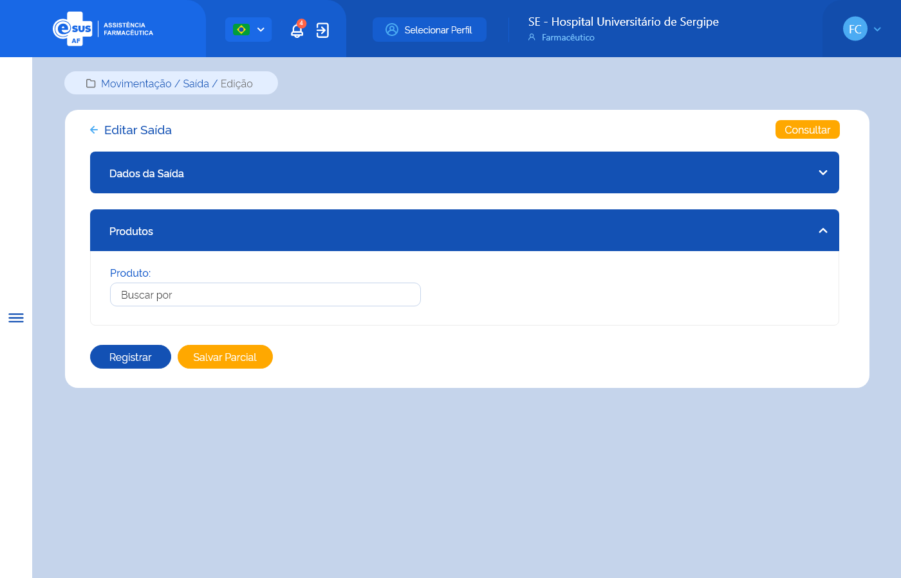

# ETE025 - Editar Saída

## Descrição (modelo história de usuário)
Como usuário quero editar uma saída diversa de produto(s) para retirá-lo(s) do estoque do estabelecimento de saúde logado. 

## Protótipo 001

### Elementos de Tela 
* Bread Crumb – “Movimentação / Saída Diversa / Edição” 
* Título da página – “Editar Saída Diversa” 
* “Seta” – M - retorna para a Tela de Consultar Saída Diversa  
* “Consultar” – BT 
* Nº da Saída Diversa* – N (11) – Desabilitado para edição 
* Tipo de Saída Diversa* – SU / AC 
* Data da Saída Diversa* – D (dd/mm/aaaa 
* Valor Total Saída Diversa* – N (13,9) (R$ 99999999999999,999999999) - Desabilitado para edição 
* Nº do Documento* – A (20) 
* Tipo de Documento* – SU / AC  
* Justificativa* – SU / AC 
* Detalhar Justificativa – A (4000) - contador regressivo 
* “Salvar” – BT 
* “Limpar” – BT 

**Legenda**  
TIPO: A = Alfanumérico, N = Numérico, D = Data, M = Imagem, BT = Botão, LK = Link, SU = Seleção Única, SM = Seleção Múltipla, AC = Autocomplete, * = Obrigatório.
 
### Critérios de Aceite 
1. O usuário somente pode acessar a funcionalidade caso tenha permissão; [RGN001](DocumentoDeRegrasv2.md#rgn001)
2. O acesso à funcionalidade é dado através do menu lateral no item “Movimentação”, subitem “Saída Diversa”, na tela “Consultar Saída Diversa” quando for acionada a opção “Editar Saída Diversa”; 
3. O sistema deve recuperar e apresentar os dados da saída diversa cadastrada previamente, permitindo a edição de todos os campos; 
4. No campo “Tipo de Saída Diversa” o sistema deve apresentar as opções: Ajuste de Estoque, Amostra, Exposição e Análise, Apreensão Sanitária, Empréstimo, Perda, Requisição, Roubo, Transferência, Usuário SUS, Validade Vencida. Exceto os tipos criados para saídas geradas automaticamente pelo sistema: “Saída por Estorno de Entrada”, “Saída por Dispensação” e “Saída por Estorno de Distribuição”; 
5. O campo “Data da Saída Diversa” dever ser preenchido automaticamente com a data atual e desabilitado para edição; 
6. O campo “Valor Total da Saída Diversa” deve ser desabilitado para edição, calculado automaticamente somando todos os valores totais dos produtos adicionados à saída diversa e apresentado em reais (R$) com até 2 dígitos após a virgula, realizando o arredondamento do valor se necessário; [RGN038](DocumentoDeRegrasv2.md#rgn038) [RGN028](DocumentoDeRegrasv2.md#rgn028)
7. No campo “Tipo de Documento” o sistema deve apresentar as opções: Aviso, Boletim, Carta, Certidão, Circular, Comprovante, Contrato, Convênio, Decreto, Despacho, Edital, Fax, Guia, Guia De Remessa, Instrução Normativa, Memorando, Mensagem, Nota Fiscal, Nota Fiscal Eletrônica, Ofício, Ordem De Serviço, Parecer, Portaria, Requerimento, Requisição, Resolução; 
8. No campo “Justificativa” o sistema deve apresentar as opções: Diferença de Estoque, Quebra do produto/medicamento, Recebimento maior que a demanda, Recebimento próximo da validade, Roubo, Sistema Inoperante, Outros; 
9. Quando o usuário acionar a opção de “Salvar”, o sistema deve verificar se: 
      * Existe uma saída diversa com o mesmo tipo de saída diversa, tipo e número de documento e justificativa de uma saída diversa registrada ou em preenchimento para o estabelecimento. Caso sim, o sistema deve apresentar uma mensagem de alerta ao usuário. [RGN044](DocumentoDeRegrasv2.md#rgn044) [MSG038](DocumentoDeMensagensv2.md#msg038)
      
      Atendendo a validações, o sistema mantém o registro da saída diversa com estado “Ativo”, a situação “Em preenchimento” e os campos habilitados para edição, permanece na tela de cadastro da saída diversa e apresenta ou carrega o campo “Produto(s)”; [MSG031](DocumentoDeMensagensv2.md#msg031) [RGN045](DocumentoDeRegrasv2.md#rgn045) [RGN005](DocumentoDeRegrasv2.md#rgn005) 

10. Quando o usuário acionar a opção “Limpar”, o sistema deve apresentar a mensagem de alerta ao usuário. Caso confirme a ação, limpar os campos preenchidos e permanecer na tela de cadastro da saída diversa. Caso a ação não seja confirmada, não limpar os dados informados e permanecer na tela de cadastro da saída diversa; MSG065 
11. Quando o usuário acionar a opção de “Voltar” ou “Consultar”, o sistema deve apresentar a mensagem de alerta ao usuário. Caso confirme a ação, retornar à tela de consulta as saídas diversas e não salvar as edições realizadas. Caso a ação não seja confirmada, permanece na tela de cadastro da saída diversa; [MSG006](DocumentoDeMensagensv2.md#msg006) 
12. O sistema deve gravar a data, hora e CPF e nome do usuário que a executou qualquer ação de alteração no estado do registro. [RGN005](DocumentoDeRegrasv2.md#rgn005)

## Protótipo 002

### Elementos de tela
* Título da sessão – “Produtos” 
* Produto* – A (500) / AC 

**Legenda**  
TIPO: A = Alfanumérico, N = Numérico, D = Data, M = Imagem, BT = Botão, LK = Link, SU = Seleção Única, SM = Seleção Múltipla, AC = Autocomplete, * = Obrigatório.

### Critérios de Aceite
1. No campo “Produto” quando o usuário informar: 
      * O Código de Barras do produto, o sistema deve: 
        * Recuperar o produto relacionado ao código de barras da base de dados de medicamentos; [RGN015](DocumentoDeRegrasv2.md#rgn015) 
        * Emitir um alerta ao usuário caso o sistema não encontre o produto na base de dados de medicamentos; [MSG022](DocumentoDeMensagensv2.md#msg022) 
        * Limpar o campo Produto, quando o dado de código de barras for apagado. 
      * O Princípio Ativo ou Nome Comercial de um Medicamento ou Descrição do Produto para Saúde, o sistema deve: 
        *  Emitir um alerta ao usuário caso o sistema não encontre o produto na base de dados de medicamentos ou produtos para saúde; [MSG022](DocumentoDeMensagensv2.md#msg022) 
        * Apresentar a lista de produtos ativos no sistema correspondestes ao valor informado no campo autocomplete a partir da indicação do 3º caractere; [RGN015](DocumentoDeRegrasv2.md#rgn015) 
2. O usuário deve selecionar o produto que deseja adicionar na lista produtos ativos no sistema; 
3. O sistema não deve permitir adicionar um produto já relacionado à saída diversa. [MSG034](DocumentoDeMensagensv2.md#msg034) 

## Protótipo 003

### Elementos de tela
* Lista de produtos da saída - desabilitados para edição: 
    * Código de Barras – N (13) 
    * Descrição do Produto – A (500) 
    * CATMAT – N (6) 
    * Forma Farmacêutica – A (20) 
    * Fabricante – A (80) (9999999) / (99.999.999/9999-99)-(Razão Social)
    * Qtd Estoque Atual – N  
    * Quantidade Total – N  
    * Valor Unitário – N (6,9) (R$ 999999,999999999) 
    * Valor Total – N (13,2) (R$ 99999999999999,99) 
    * “Excluir” – BT 
    * “Expandir/Retrair” – M 
    * Detalhe Produto 
        * Nº do Lote* – A (20) 
        * Data de Validade* – D (dd/mm/aaaa) 
        * Quantidade Estoque* – N - desabilitado para edição 
        * Quantidade Saída* – N   
        * Valor Unitário* – N (6,9) (R$ 999999,999999999)  
        * Programa de Saúde* – SU / AC / A 
        * “Incluir” – BT 
        * “Limpar” – BT 
        * Lista detalhe produto 
            * Nº do Lote 
            * Data de Validade 
            * Programa de Saúde 
            * Qtd Estoque 
            * Qtd Saída 
            * “Editar” – BT 
            * “Excluir” – BT 
            * “Detalhar – BT - direciona para tela com os dados do detalhe do produto 
* “Registrar” – BT 
* “Salvar Parcial” – BT 

**Legenda**  
TIPO: A = Alfanumérico, N = Numérico, D = Data, M = Imagem, BT = Botão, LK = Link, SU = Seleção Única, SM = Seleção Múltipla, AC = Autocomplete, * = Obrigatório.

### Critérios de Aceite
1. O sistema deve recuperar e apresentar os dados da saída diversa cadastrada previamente, permitindo a edição de todos os campos; 
2. Quando o usuário adicionar o produto, o sistema deve: 
      * Verificar se existe estoque para o produto informado no estabelecimento logado. Caso não, o sistema emite um alerta ao usuário e não permite adicioná-lo na lista dos produtos; [RGN042](DocumentoDeRegrasv2.md#rgn042) [MSG035](DocumentoDeMensagensv2.md#msg035) 
      * Verificar a opção informada no campo “Tipo de Saída”, se: 
      * “Validade Vencida”, o sistema verifica se existem lotes/validades do produto vencidos em estoque. Caso não exista, emite um alerta ao usuário e limpa os campos preenchidos; [RGN034](DocumentoDeRegrasv2.md#rgn034) [MSG033](DocumentoDeMensagensv2.md#msg033) 
      * “Ajuste de Estoque”, “Usuário SUS”, “Apreensão Sanitária”, “Empréstimo” ou “Transferência”, o sistema considera e/ou apresenta os lotes/validades que estejam válidos, com a data de validade igual ou superior a data atual; RGN034 
      * “Perda” ou “Roubo”, o sistema considera e/ou apresenta todos os lotes/validades independente da data de validade. [RGN034](DocumentoDeRegrasv2.md#rgn034) 
3. O sistema deve apresentar a lista de produtos adicionados à saída diversa por ordem alfabética. A lista será expansiva, permitindo o preenchimento dos campos de detalhamento do produto; [RGN023](DocumentoDeRegrasv2.md#rgn023) 
4. O(s) produto(s) adicionado(s) à saída diversa pode(m) ser excluído(s) desde que não tenha(m) detalhamento(s) vinculado(s) a ele; [RGN035](DocumentoDeRegrasv2.md#rgn035) 
5. O campo “Qtd Estoque Atual” deve ser desabilitado para edição e carregado automaticamente com o saldo do produto em estoque do estabelecimento logado, no momento, independente de lote, validade, fabricante e programa de saúde; [RGN036](DocumentoDeRegrasv2.md#rgn036) 
6. O campo “Quantidade Total” deve ser desabilitado para edição e o sistema deve: 
      * Recuperar automaticamente a quantidade informada no campo “Quantidade Saída” quando apenas um detalhamento do produto for adicionado; 
      * Calcular automaticamente somando todas as quantidades informadas nos detalhamentos adicionados ao produto; [RGN039](DocumentoDeRegrasv2.md#rgn039)
7. O campo “Valor Unitário” deve ser desabilitado para edição, calculado automaticamente através de uma média simples dos valores unitários informados na(s) entrada(s) deste produto, independente de lote, validade, fabricante e programa de saúde, e apresentado em reais (R$) com até 9 dígitos após a virgula; [RGN040](DocumentoDeRegrasv2.md#rgn040) 
8. O campo “Valor Total” deve ser desabilitado para edição, calculado automaticamente através da fórmula: Quantidade Total da Saída X Valor Unitário do produto e apresentado em reais (R$) com até 2 dígitos após a virgula, realizando o arredondamento do valor se necessário; [RGN041](DocumentoDeRegrasv2.md#rgn041) [RGN028](DocumentoDeRegrasv2.md#rgn028) 
9. Após adicionar o produto à saída diversa, no detalhamento deste, o sistema deve: 
      * Apresentar os campos “Nº do Lote” e “Programa de Saúde” habilitados para seleção e no campo “Quantidade Estoque” o valor “0” e desabilitado para edição; 
      * Quando existir apenas um lote/validade, recuperar e apresentar automaticamente os campos “Nº do Lote”, ‘Data de Validade”, “Programa de Saúde” e “Quantidade Estoque” do referido lote/validade e programa de saúde e desabilitar o campo para edição; 
      * Quando existir mais de um lote/validade, recuperar e apresentar a lista de lote(s)/validade(s) com respectivo(s) programa(s) de saúde para seleção; 
      * Quando o usuário selecionar um lote/validade: 
        * E existir apenas um programa de saúde vinculado a ele, o sistema recupera e apresenta automaticamente este programa com respectiva quantidade em estoque no estabelecimento logado e desabilita os campos para edição; 
        * E existir mais de um programa de saúde, o sistema recupera e apresenta a lista dos programas de saúde vinculados a ele para seleção e no campo “Quantidade Estoque” recupera e apresenta o saldo em estoque do referido produto, lote e validade no estabelecimento logado; 
        * Ao selecionar um programa de saúde, o sistema apresenta saldo em estoque do referido produto, lote/validade e programa de saúde no estabelecimento logado; 
10. Quando o usuário adicionar um detalhamento do produto à saída diversa, o sistema deve verificar se: 
    * Já existe um detalhamento com o mesmo Lote, Validade e Programa de Saúde adicionado ao produto. Caso sim, o sistema deve emitir um alerta ao usuário e não permitir adicioná-lo na lista de detalhamentos; [MSG036](DocumentoDeMensagensv2.md#msg036) 
    * A quantidade de saída informada é inferior a 1. Caso sim, o sistema deve emitir um alerta ao usuário e limpar o valor informado no campo; [MSG025](DocumentoDeMensagensv2.md#msg025) 
    * A quantidade de saída informada para o produto, lote, validade e programa de saúde é superior a quantidade disponível no estoque do estabelecimento, o sistema deve emitir um alerta ao usuário e limpar o valor informado no campo. [MSG037](DocumentoDeMensagensv2.md#msg037) [RGN043](DocumentoDeRegrasv2.md#rgn043) 
11. O sistema deve permitir adicionar mais de um detalhamento ao produto, permitindo a saída do mesmo produto com lotes, validades e programas de saúdes diferentes; 
12. O(s) detalhamento(s) vinculado(s) ao produto pode(m) ser excluído(s); 
13. Quando o usuário acionar a opção “Registrar”, o sistema deve verificar se: 
    * Existe ao menos um produto relacionado à saída diversa. Caso não, o sistema deve apresentar uma mensagem de alerta ao usuário; [MSG040](DocumentoDeMensagensv2.md#msg040) 
    * O detalhamento de todos os produtos da saída diversa foi incluído. Caso não, o sistema deve apresentar uma mensagem de alerta ao usuário; [MSG029](DocumentoDeMensagensv2.md#msg029)  
    
    Atendendo as validações, o sistema efetiva o cadastro da saída diversa, grava o estado do registro como “Ativo” e a situação como “Registrada”, debita os produtos do estoque do estabelecimento, considerando lote, validade e programa de saúde, apresenta a mensagem de sucesso e retorna à tela de consulta às saídas diversas apresentando este registro como o primeiro da relação das saídas diversas cadastradas para o estabelecimento; [MSG039](DocumentoDeMensagensv2.md#msg039) [RGN045](DocumentoDeRegrasv2.md#rgn045) [RGN005](DocumentoDeRegrasv2.md#rgn005) 

14. O sistema, identificando que uma saída diversa de produto(s) foi registrada, deve debitar a quantidade no saldo deste(s), considerando lote, validade e programa de saúde e atualizar a posição de estoque do estabelecimento que realizou a saída diversa; [RGN046](DocumentoDeRegrasv2.md#rgn046) 
15. Quando o usuário acionar a opção de “Salvar Parcial”, o sistema deve verificar se: 
    * Existe ao menos um produto relacionado à saída diversa. Caso não, o sistema deve apresentar uma mensagem de alerta ao usuário; [MSG040](DocumentoDeMensagensv2.md#msg040) 
    * Existe ao menos um detalhamento vinculado ao(s) produto(s) da saída diversa. Caso não, o sistema deve apresentar uma mensagem de alerta ao usuário; [MSG029](DocumentoDeMensagensv2.md#msg029)  
    
    Atendendo as validações, o sistema mantém o registro da saída diversa com estado “Ativo” e a situação “Em preenchimento” e permanece na tela de cadastro da saída diversa; [MSG031](DocumentoDeMensagensv2.md#msg031) [RGN045](DocumentoDeRegrasv2.md#rgn045) [RGN005](DocumentoDeRegrasv2.md#rgn005) 

16. Quando o usuário acionar a opção de “Voltar” ou “Consultar”, o sistema deve apresentar a mensagem de alerta ao usuário. Caso confirme a ação, retorna à tela de consulta às saídas diversas e não salva as edições realizadas. Caso a ação não seja confirmada, permanece na tela de cadastro da entrada; [MSG006](DocumentoDeMensagensv2.md#msg006) 
17. O sistema deve gravar a data, hora e CPF e nome do usuário que a executou qualquer ação de alteração no estado do registro. [RGN005](DocumentoDeRegrasv2.md#rgn005) 

## Protótipo 004

### Elementos de tela
* Título – “Detalhamento do Produto da Saída Diversa” 
* Código de Barras 
* Descrição do Produto 
* CATMAT 
* Forma Farmacêutica 
* Nº do Lote 
* Data de Validade 
* Qtd Estoque 
* Qtd Saída 
* Valor Unitário 
* Valor Total 
* Programa de Saúde 
* Fabricante – (9999999) / (99.999.999/9999-99)-(Razão Social)
* “Sair” – BT 

**Legenda**  
TIPO: A = Alfanumérico, N = Numérico, D = Data, M = Imagem, BT = Botão, LK = Link, SU = Seleção Única, SM = Seleção Múltipla, AC = Autocomplete, * = Obrigatório.

### Critérios de Aceite
1. O acesso aos dados de um detalhamento do produto da entrada é realizado quando o usuário acionar a opção “Detalhar” no cadastro da saída diversa; 
2. O sistema deve recuperar e apresentar os dados relacionados ao detalhamento do produto da saída diversa que o usuário deseja detalhar; 
3. Caso algum campo retornar vazio, o sistema deve apresentar a descrição “Sem informação”;  
4. Quando o usuário acionar a opção “Sair”, o sistema deve retornar à tela de “Cadastro da Saída Diversa”.  

