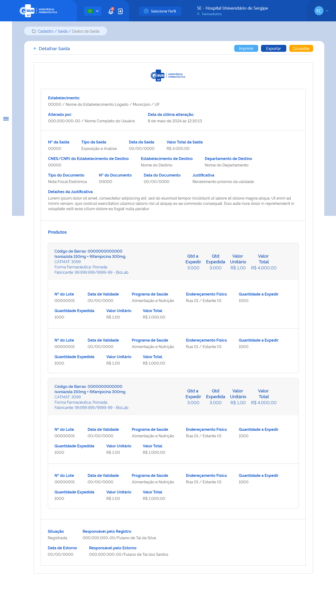

# ETE026 - Detalhar Saída

## Descrição (modelo história de usuário)
Como usuário quero detalhar os dados de uma saída diversa de produto.

## Protótipo 001

### Elementos de Tela 
* Bread Crumb – “Movimentação / Saída / Dados da Saída” 
* Título da página – “Detalhar Saída” 
* “Seta” – M - retorna para a Tela de Consultar Saída  
* “Imprimir” – BT 
* “Exportar” - BT 
* “Consultar” – BT - retorna para a Tela de Consultar Saída 
* Logotipo e-SUS AF - M 
* Cabeçalho:  
    * Estabelecimento: 
        * CNES / Nome do estabelecimento logado / Município / UF  
    * Alterado por:  
        * CPF / Nome completo do usuário que realizou a última ação no cadastro da entrada (anonimizar os dados)  
    * Data e Hora da última alteração: 
* Nº da Saída 
* Tipo de Saída  
* Data da Saída 
* Valor da Saída 
* CNES/CNPJ do Estabelecimento de Destino  
* Estabelecimento de Destino  
* Departamento de Destino  
* Tipo de Documento  
* Nº do Documento  
* Data do Documento  
* Justificativa 
* Detalhes da Justificativa 
* Produtos  
    * Código de Barras 
    * Princípio Ativo + Concentração ou Descrição CATMAT 
    * CATMAT 
    * Forma Farmacêutica: (se medicamento) 
    * Fabricante: CNPJ-Razão Social (se medicamento) 
    * Qtd a Expedir 
    * Qtd Expedida 
    * Valor Unitário  
    * Valor Total  
    * Detalhe Produto 
        * Nº do Lote 
        * Data de Validade 
        * Programa de Saúde 
        * Endereçamento Físico 
        * Quantidade a Expedir 
        * Quantidade Expedida 
        * Valor Unitário  
        * Valor Total  
        * Situação 
* Responsável pelo Registro  
    * CPF / Nome Completo  
* Data Estorno (se houver) 
    * DD/MM/AAAA 
* Responsável pelo Estorno (se houver) 
    * CPF / Nome Completo 

**Legenda**  
TIPO: A = Alfanumérico, N = Numérico, D = Data, M = Imagem, BT = Botão, LK = Link, SU = Seleção Única, SM = Seleção Múltipla, AC = Autocomplete, * = Obrigatório.
 
### Critérios de Aceite 
1. O usuário somente pode acessar a funcionalidade caso tenha permissão; [RGN001](DocumentoDeRegrasv2.md#rgn001)
2. O acesso à funcionalidade é dado através do menu lateral no item “Movimentação”, subitem “Saída Diversa”, na tela “Consultar Saída Diversa” quando for acionada a opção “Detalhar”; 
3. O sistema deve recuperar e apresentar os dados relacionados ao cadastro da saída diversa de produto(s) que o usuário deseja detalhar; 
4. Os dados do CNES, Nome, Município e UF, do cabeçalho (Emitido por:), devem ser recuperados do cadastro do estabelecimento do usuário logado. Já o Nome e CPF do usuário responsável pela última alteração no registro do cadastro e a data dessa ação devem ser recuperados do histórico do registro da funcionalidade em questão; [RGN014](DocumentoDeRegrasv2.md#rgn014)
5. Os produtos relacionados na saída diversa devem ser apresentados conforme o padrão do sistema; [RGN023](DocumentoDeRegrasv2.md#rgn023)
6. O campo “Responsável pelo Registro” somente é apresentado quando o registro da saída diversa estiver com a situação “Registrada” ou “Estornada”; 
7. Os campos “Data do Estorno” e “Responsável pelo Estorno” somente serão apresentados quando o registro da entrada estiver com a situação “Estornada”; 
8. Quando o usuário acionar a opção de “Imprimir”, o sistema deve permitir imprimir as informações da tela ou salvá-las em um arquivo no formato desejado (padrão Windows); 
9. Quando o usuário acionar a opção “Exportar”, o sistema deve exportar todas as informações da tela para arquivo em formato .CSV (apenas colunas e linhas); 
10. Quando o usuário acionar a opção de “Voltar” ou “Consultar”, o sistema finaliza o detalhamento e retorna à tela de consulta às saídas diversas de produtos. [ETE023](ETE023.md)