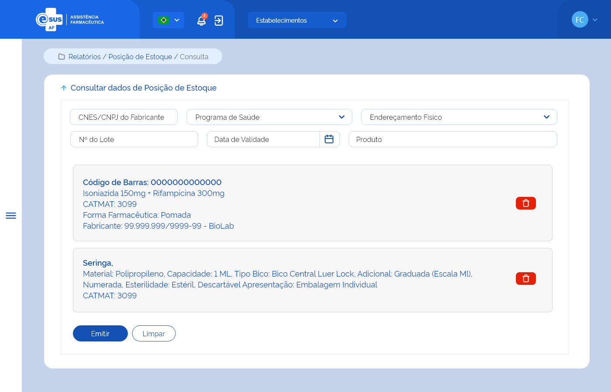

# ETE027 - Emitir Relatório de Posição de Estoque

## Descrição
Como usuário quero consultar os dados de posição de estoque dos produtos para emitir um relatório. 

## Protótipo 001

[Inserir imagem] <!--  -->

### Acesso 
Menu lateral > Relatórios > Posição do Estoque 

### Critérios de Aceite 
1. O usuário somente pode acessar a funcionalidade caso tenha permissão. [RGN001](DocumentoDeRegrasv2.md#rgn001); 
2. O acesso à funcionalidade é dado através do menu lateral no item “Relatórios”, subitem “Posição de Estoque”; 
3. No campo “CNES/CNPJ do Fabricante”, o sistema deve recuperar e apresentar o Fabricante do produto através do CNES, CNPJ ou nome a partir do 3º caractere, que deseja obter a posição de estoque. [RGN020](DocumentoDeRegrasv2.md#rgn020) [MSG045](DocumentoDeMensagensv2.md#msg045);<!-- No documento de origem diz: "Nada está funcionando!": --> 
4. No campo “Programa de Saúde”, o sistema deve recuperar e apresentar a relação dos programas de saúde ativos no sistema e permitir selecionar o que deseja obter a posição de estoque; 
5. No campo “Endereçamento Físico”, o sistema deve recuperar e apresentar a relação dos endereçamentos físicos cadastrados e ativos para o estabelecimento e permitir selecionar o que deseja obter a posição de estoque;  
6. No campo “Nº do Lote”, o sistema deve permitir informar o número do lote do produto que deseja obter a posição de estoque; 
7.  No campo “Data de Validade”, o sistema deve permitir informar data de validade do produto que deseja obter a posição de estoque; 
8.  Caso o usuário não informe nenhum filtro de pesquisa, o sistema deve considerar todas as opções ao gerar o relatório;   
9. Quando o usuário acionar a opção “Emitir”, o sistema deve: 
    * Apresentar a mensagem de alerta caso não encontre registros na base de dados para os filtros informados. [MSG041](DocumentoDeMensagensv2.md#msg041); 
    * Direcionar para a tela de visualização do relatório de posição de estoque de produtos, gerado conforme os filtros informados. [ETE028](ETE028.md);
10. Quando o usuário acionar a opção “Limpar”, o sistema deve limpar o(s) filtro(s) informado(s) e permanecer na tela de emitir relatório de posição de estoque; 
11. Quando o usuário acionar a opção “Voltar”, o sistema deve retornar para a tela inicial do sistema (dashboard). 