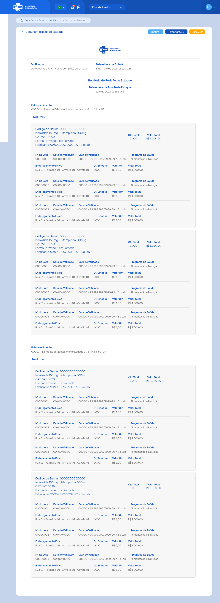

# ETE028 - Detalhar Relatório de Posição de Estoque 

## Descrição
Como usuário quero detalhar o relatório de posição de estoque de produtos no estabelecimento de saúde para visualizar as informações que serão apresentadas no relatório. 

## Protótipo 001

### Descrição resumida 
Detalhar posição de estoque – o detalhamento traz a posição do estoque do estabelecimento em tempo real. 

[Inserir imagem] <!--  -->

### Acesso 
Menu lateral > Relatórios > Posição do Estoque> Botão Emitir 

### Critérios de Aceite <!-- No documento de origem diz: "Não alterou, mas está em “Acesso”: 1. O acesso à funcionalidade é dado através do menu lateral no item “Relatórios”, subitem “Posição de Estoque”, na tela “Consultar Dados de Posição de Estoque” quando for acionada a opção “Emitir”;  -->
1. O sistema deve recuperar e apresentar o logotipo do sistema e-SUS AF, o nome e o número do CPF do usuário logado no sistema e data e hora de emissão do relatório; 
2. O sistema deve recuperar e apresentar os dados relacionados ao estoque de produtos por estabelecimento de saúde e desabilitados para edição, conforme a data da posição do estoque selecionada e os demais filtros informados, agrupados por estabelecimento e produto; 
3. Os produtos relacionados devem ser apresentados conforme o padrão do sistema; [RGN023](DocumentoDeRegrasv2.md#rgn023) 
4. O campo “Qtd Total” deve ser calculado automaticamente somando as quantidades em estoque no detalhamento de cada produto; [RGN060](DocumentoDeRegrasv2.md#rgn060) 
5. O campo “Valor Total” deve ser calculado automaticamente somando os valores totais do detalhamento de cada produto e apresentado em reais (R$) com até 2 dígitos após a virgula, realizando o arredondamento do valor se necessário; [RGN059](DocumentoDeRegrasv2.md#rgn059) [RGN028](DocumentoDeRegrasv2.md#rgn028)
6. No campo “Detalhe Produto”, o sistema deve recuperar e apresentar os dados do produto no estoque, considerando o Nº do Lote, Fabricante, Programa de Saúde e Endereçamento Físico; 
7. No campo “Qtd Estoque” o sistema deve recuperar e apresentar a quantidade do produto no estoque, relativa ao Nº do Lote, Fabricante, Programa de Saúde e Endereçamento Físico; 
8. No campo “Valor Unitário” o sistema deve calcular automaticamente através de uma média simples dos valores unitários informados na(s) entrada(s) deste produto, independente de Nº do Lote, Validade, Fabricante, Programa de Saúde e Endereçamento Físico e apresentado em reais (R$) com até 9 dígitos após a virgula; [RGN040](DocumentoDeRegrasv2.md#rgn040) 
9. No campo “Valor Total” o sistema deve calcular automaticamente através da fórmula: Qtd Estoque x Valor Unitário de cada detalhamento do produto e apresentado em reais (R$) com até 2 dígitos após a virgula, realizando o arredondamento do valor se necessário; [RGN061](DocumentoDeRegrasv2.md#rgn061) [RGN028](DocumentoDeRegrasv2.md#rgn028)  
10. Quando o usuário acionar a opção de “Imprimir”, o sistema deve permitir imprimir as informações da tela ou salvá-las em um arquivo no formato desejado; 
11. Quando o usuário acionar a opção “Exportar”, o sistema deve exportar todas as informações da tela para arquivo em formato .CSV (apenas colunas e linhas) com os dados ordenados por estabelecimento de saúde e produto; 
12. Quando o usuário acionar a opção de “Voltar” ou “Consultar”, o sistema finaliza o detalhamento e retorna à tela de consulta aos dados de posição de estoque.  