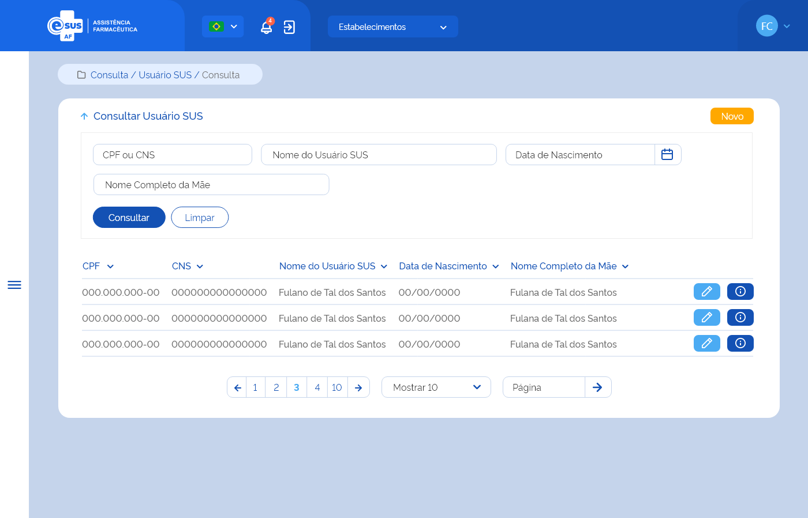

# ETE029 - Consultar Usuário SUS

## Descrição
Como usuário quero consultar o(s) usuário(s) SUS dentre os cadastrados para sua instância.

## Protótipo 001

### Descrição resumida 
Consultar usuário SUS – Permite a consulta, listando todos os usuários cadastrados no sistema. 

[Inserir imagem] <!--  -->

### Acesso
Menu lateral > Cadastro > Usuário SUS 

### Critérios de Aceite 
1. O usuário somente poderá acessar a funcionalidade caso tenha permissão. [RGN001](DocumentoDeRegrasv2.md#rgn001); 
2. Quando o usuário acessar a funcionalidade, o sistema lista previamente todos os usuários. Ao utilizar os filtros de pesquisa, apresenta a lista de resultado da consulta quando a opção “Consultar” for acionada;  
3. Quando o usuário acionar a opção “Consultar”, o sistema deve recuperar e apresentar o(s) registro(s) dos usuários SUS dentre os cadastrados para sua instância. Caso não seja informado nenhum filtro, o sistema deve recuperar e apresentar todo(s) o(s) registro(s) dos usuários SUS dentre os cadastrados para sua instancia. Caso algum campo retorne vazio, o sistema deve apresentar a descrição “Sem informação”. [RGN062](DocumentoDeRegrasv2.md#rgn062); 
4. O sistema, não encontrando o(s) usuário(s) SUS para os filtros informados, deve informar que o(s) registro(s) não foram encontrados. [MSG041](DocumentoDeMensagensv2.md#msg041); 
5. O sistema, encontrando o(s) usuário(s) SUS, deve apresentar os dados: nº do CNS, CPF, Nome e Data de Nascimento, Nome completo da mãe e as ações desejáveis para cada registro;  
6. Quando o usuário acionar a opção “Novo”, o sistema deve direcionar para a tela de cadastro de Usuário SUS. [ETE030](ETE030.md);
7. Quando o usuário acionar a opção “Limpar”, o sistema deve limpar o(s) filtro(s) informado(s) e o resultado da consulta e permanecer na tela de consultar Usuário SUS;  
8. Quando o usuário acionar a opção “Editar”, o sistema deve direcionar para a tela de edição do cadastro do Usuário SUS. [ETE031](ETE031.md);
9. Quando o usuário acionar a opção “Detalhar”, o sistema deve direcionar para a tela de detalhamento dos dados do cadastro do Usuário SUS. [ETE032](ETE032.md);
10. Quando o usuário acionar a opção “Voltar”, o sistema deve retornar para a tela inicial do sistema (dashboard). 