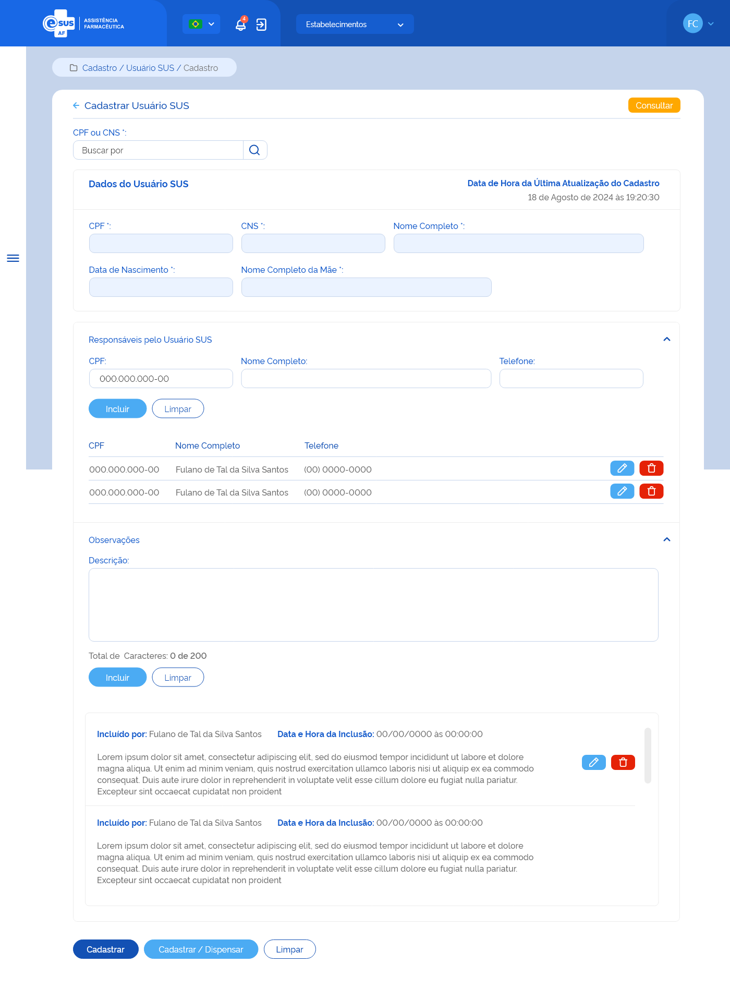

# ETE030 - Cadastrar Usuário SUS

## Descrição (modelo história de usuário)
Como usuário quero cadastrar um usuário SUS através da recuperação de dados do portal do CADSUS para minha instância. 

## Protótipo 001

### Elementos de Tela 
* Bread Crumb – “Cadastro / Usuário SUS / Cadastro” 
* Título da página – “Cadastrar Usuário SUS” 
* “Seta” – M - retorna para a Tela de Consultar Usuário SUS  
* “Consultar” – BT - retorna para a Tela de Consultar Usuário SUS 
* CPF / CNS – N (11/15) 
* Lupa – M 
* Título da sessão: Dados do Usuário (Campos recuperados do CADSUS e desabilitados para edição)  
    * Data e Hora da última atualização do Cadastro 
    * CPF 
    * CNS 
    * Nome Completo 
    * Data de Nascimento 
    * Nome da Mãe 
* Título da sessão: Responsáveis pelo usuário SUS 
    * “Expandir/Retrair” – M 
    * CPF – N (11) 
    * Nome Completo – A (50) 
    * Telefone – N (13) 
    * “Incluir” – BT 
    * “Limpar” – BT  
    * Relação Responsáveis pelo usuário SUS 
        * CPF 
        * Nome Completo 
        * Telefone 
        * “Editar” – BT 
        * “Excluir” – BT 
* Título da sessão: Observações  
* “Expandir/Retrair” – M 
* Descrição – A (200) / Contador regressivo 
* “Incluir” – BT 
* “Limpar” – BT  
* Relação das Observações  
    * Incluído por: 
        * Nome do usuário do sistema que incluiu a observação 
    * Data e hora da inclusão 
    * Informação da observação inserida 
    * “Editar” – BT 
    * “Excluir” – BT 
* “Cadastrar” – BT 
* “Cadastrar/Dispensar” – BT  
* “Limpar” – BT 

**Legenda**  
TIPO: A = Alfanumérico, N = Numérico, D = Data, M = Imagem, BT = Botão, LK = Link, SU = Seleção Única, SM = Seleção Múltipla, AC = Autocomplete, * = Obrigatório.
 
### Critérios de Aceite 
1. O usuário somente pode acessar a funcionalidade caso tenha permissão; [RGN001](DocumentoDeRegrasv2.md#rgn001)  
2. O acesso à funcionalidade é dado através do menu lateral no item “Cadastro”, subitem “Usuário SUS”, na tela “Consultar Usuários SUS” quando for acionada a opção “Novo”; 
3. Quando o usuário informar o CPF ou CNS e acionar a opção “Lupa”, o sistema deve: 
      * Verificar se existe um Usuário SUS cadastrado com o mesmo CPF e CNS na sua instância. Caso sim, o sistema apresenta uma mensagem de alerta ao usuário. Caso confirme a ação, o sistema atualiza a tela de cadastro com os dados do usuário SUS e permite a edição. Caso a ação não seja confirmada, o sistema limpa os campos “CPF” ou “CNS” e permanece na tela de cadastro do usuário SUS; [MSG091](DocumentoDeMensagensv2.md#msg091) [RGN063](DocumentoDeRegrasv2.md#rgn063) 
      * Recuperar e apresentar o nº do CPF, nº do Cartão Nacional do SUS (CNS), Nome Completo, Data de Nascimento, Nome da Mãe do usuário SUS. Através da integração com o portal do Cadastro Nacional de Usuários do Sistema Único de Saúde (CADSUS). Caso algum campo retornar vazio da consulta ao portal do CADSUS, este deve ser preenchido com a descrição “Sem informação”; 
      * Apresentar uma mensagem de alerta ao usuário caso a consulta não retorne um Usuário SUS válido; [MSG090](DocumentoDeMensagensv2.md#msg090) 
      * Apresentar uma mensagem de alerta ao usuário caso a consulta retorne um Usuário SUS com registro de óbito; [MSG094](DocumentoDeMensagensv2.md#msg094) 
4. O sistema deve permitir incluir um responsável pelo Usuário SUS, conforme: 
      * A inclusão de um responsável pelo Usuário SUS não é obrigatória; 
      * Pode ser incluído um ou mais responsáveis pelo Usuário SUS; 
      * O(s) responsável(is) incluído(s) pode(m) ser excluído(s); 
      * É necessário informar o nº do CPF, nome completo e nº do telefone do responsável. 
5. O sistema não deve permitir incluir um responsável com o mesmo nº de CPF de um já relacionado; 
6. Quando o usuário acionar a opção “incluir” o sistema deve: 
      * Incluí-lo na relação dos responsáveis pelo usuário SUS; 
      * Apresentar a relação dos responsáveis incluídos com as ações desejáveis para cada registro. 
7. Quando o usuário acionar a opção “Editar” em um registro de um responsável, o sistema carrega os dados informados anteriormente e permite alterar somente o número de telefone do responsável; 
8. Quando o usuário acionar a opção “Excluir”, em um registro de um responsável, o sistema deve excluí-lo da lista de responsáveis pelo usuário SUS; 
9. O sistema deve permitir incluir observações ao cadastro do Usuário SUS, conforme: 
      * A indicação de uma observação não é obrigatória; 
      * Pode ser incluída uma ou mais observações para o Usuário SUS; 
      * A(s) observação(ões) incluída(s) pode(m) ser excluída(s). 
10. Para a inclusão de uma ou mais observações ao cadastro do Usuário SUS, o usuário deve informar o detalhe da observação; 
11. Quando o usuário acionar a opção “incluir” o sistema deve: 
    *  Incluí-la na relação das observações; 
    * Apresentar o nome completo do usuário do sistema que a incluiu e a data e hora da inclusão.  
    * Apresentar a lista de observações em ordem cronológica decrescente (da última à primeira); 
12. As ações “Editar” e “Excluir” somente serão apresentadas para cada registro criado pelo usuário que incluiu a observação; 
13. Quando o usuário acionar a opção “Editar”, em um registro de uma observação, o sistema carrega os campos com os dados informados anteriormente e permite a edição; 
14. Quando o usuário acionar a opção “Excluir”, em um registro de uma observação, o sistema deve exclui-la da lista das observações do usuário SUS; 
15. Quando o usuário acionar a opção de “Cadastrar”, o sistema verifica se o preenchimento das informações atende às validações listadas, efetiva o cadastro do Usuário SUS, grava o estado como “Ativo” e a situação do registro como “Cadastrado”, apresenta a mensagem de sucesso e retorna à tela de consulta aos Usuários SUS apresentando este registro como o primeiro da relação dos Usuários SUS cadastrados para a instância. [MSG092](DocumentoDeMensagensv2.md#msg092) [RGN005](DocumentoDeRegrasv2.md#rgn005) 
16. Quando o usuário acionar a opção de “Cadastrar/Dispensar”, o sistema verifica se o preenchimento das informações atende às validações listadas, efetiva o cadastro do Usuário SUS, grava o estado como “Ativo” e a situação do registro como “Cadastrado”, apresenta a mensagem de sucesso e direciona para a tela de cadastrar dispensação carregando automaticamente os dados do Usuário SUS recém cadastrado; [MSG092](DocumentoDeMensagensv2.md#msg092) [RGN005](DocumentoDeRegrasv2.md#rgn005) [ETE034](ETE034.md)
17. Quando o usuário acionar a opção de “Voltar” ou “Consultar”, o sistema deve apresentar a mensagem de alerta ao usuário. Caso confirme a ação, retorna à tela de consulta aos Usuários SUS e não salva as edições realizadas. Caso a ação não seja confirmada, permanece na tela de cadastro de Usuário SUS; [MSG006](DocumentoDeMensagensv2.md#msg006) 
18. O sistema deve gravar a data, hora e CPF e nome do usuário que a executou qualquer ação de alteração no estado do registro. [RGN005](DocumentoDeRegrasv2.md#rgn005) 