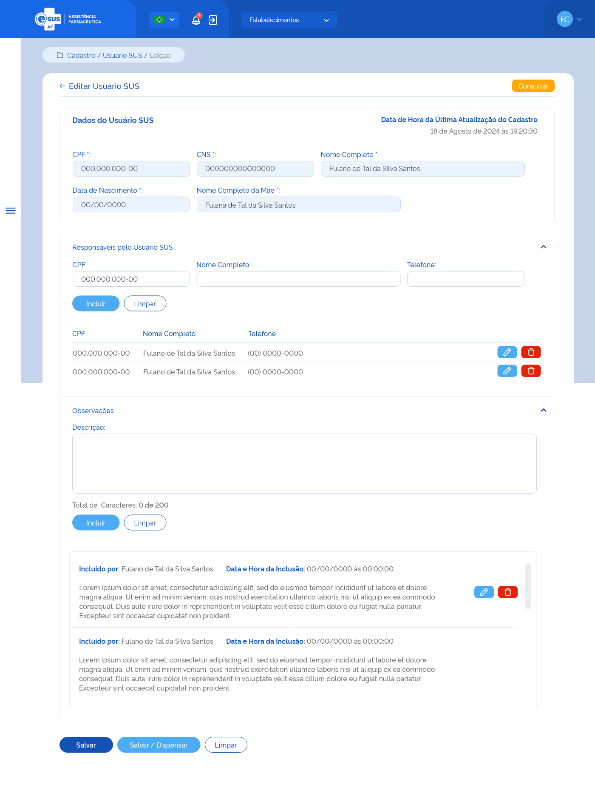

# ETE031 - Editar Usuário SUS

## Descrição 
Como usuário quero editar o cadastro de um usuário SUS através da recuperação de dados do portal do CADSUS para minha instância.

## Protótipo 001

### Descrição resumida 
Editar Usuário SUS – Permitir a edição de um usuário SUS previamente cadastrado no sistema. 

 <!-- Não sei se já foi alterada -->

### Acesso 
Menu lateral > Cadastro > Usuário SUS > Ação Editar 

### Critérios de Aceite <!-- Falta ajustar numeração -->
1. O usuário somente pode acessar a funcionalidade caso tenha permissão; [RGN001](DocumentoDeRegrasv2.md#rgn001) 
2. O sistema deve recuperar os dados do usuário SUS cadastrado previamente, permitindo somente a edição dos campos: e-mail, Endereço do paciente, Responsável pelo Usuário SUS e Observações;     
3.  Caso algum campo retornar vazio da consulta ao portal do CADSUS, este deve ser preenchido com a descrição “Sem informação”; <!-- No documento de origem diz: "(Não consegui testar)" -->
4. O sistema deve permitir incluir um responsável pelo Usuário SUS, conforme: 
      * A inclusão de um responsável pelo Usuário SUS não é obrigatória; 
      * Pode ser incluído um ou mais responsáveis pelo Usuário SUS; 
      * O(s) responsável(is) incluído(s) pode(m) ser excluído(s); 
      * É necessário informar o nº do CPF, nome completo e nº do telefone do responsável. <!-- No documento original diz: "Nenhuma informação é obrigatória. (?)" -->
5. O sistema não deve permitir incluir um responsável com o mesmo nº de CPF de um já relacionado;
6. Quando o usuário acionar a opção “incluir” o sistema deve: 
      * Incluí-lo na relação dos responsáveis pelo usuário SUS; 
      * Apresentar a relação dos responsáveis incluídos com as ações desejáveis para cada registro. 
7. Quando o usuário acionar a opção “Editar” em um registro de um responsável, o sistema carrega os dados informados anteriormente e permite alterar somente o número de telefone do responsável; <!-- No documento de origem diz: "(Não consegui testar)" --> 
8. Quando o usuário acionar a opção “Excluir”, em um registro de um responsável, o sistema deve excluí-lo da lista de responsáveis pelo usuário SUS; 
9. O sistema deve permitir incluir observações ao cadastro do Usuário SUS, conforme: 
    * A indicação de uma observação não é obrigatória; 
    * Pode ser incluída uma ou mais observações para o Usuário SUS; 
    * A(s) observação(ões) incluída(s) pode(m) ser excluída(s). 
10. Para a inclusão de uma ou mais observações ao cadastro do Usuário SUS, o usuário deve informar o detalhe da observação; <!-- No documento de origem diz: "(Não entendi)" -->
11. Quando o usuário acionar a opção “incluir” o sistema deve: 
    * Incluí-la na relação das observações; 
    * Apresentar a lista de observações em ordem cronológica decrescente (da última à primeira); 
12. As ações “Editar” e “Excluir” somente serão apresentadas para cada registro criado pelo usuário que incluiu a observação; 
13. Quando o usuário acionar a opção “Editar”, em um registro de uma observação, o sistema carrega os campos com os dados informados anteriormente e permite a edição; <!-- No documento de origem diz: "Não está deixando editar!" -->
14. Quando o usuário acionar a opção “Excluir”, em um registro de uma observação, o sistema deve exclui-la da lista das observações do usuário SUS; 
<!-- Está em vermelho, mas não diz se é para apagar: 16. Quando o usuário acionar a opção de “Salvar”, o sistema verifica se o preenchimento das informações atende às validações listadas, atualiza o cadastro do Usuário SUS, mantém o estado do registro como “Ativo” e a situação como “Cadastrado”, apresenta a mensagem de sucesso e retorna à tela de consulta aos Usuários SUS apresentando este registro como o primeiro da relação dos Usuários cadastrados para a instância; [MSG093](DocumentoDeMensagensv2.md#msg093) [RGN005](DocumentoDeRegrasv2.md#rgn005)  -->
<!-- Está em vermelho, mas não diz se é para apagar: 17.  Quando o usuário acionar a opção de “Salvar/Dispensar”, o sistema verifica se o preenchimento das informações atende às validações listadas, atualiza o cadastro do Usuário SUS, mantém o estado do registro como “Ativo” e a situação como “Cadastrado”, apresenta a mensagem de sucesso e direciona para a tela de cadastrar dispensação carregando automaticamente os dados do Usuário SUS recém cadastrado; [MSG093](DocumentoDeMensagensv2.md#msg093) [RGN005](DocumentoDeRegrasv2.md#rgn005) [ETE034](ETE034.md)-->
15. Quando o usuário acionar a opção de “Voltar” ou “Consultar”, o sistema retorna à tela de consulta aos Usuários SUS e não salva as edições realizadas.  
16. O sistema deve gravar a data, hora e CPF e nome do usuário que a executou qualquer ação de alteração no estado do registro. [RGN005](DocumentoDeRegrasv2.md#rgn005) 
