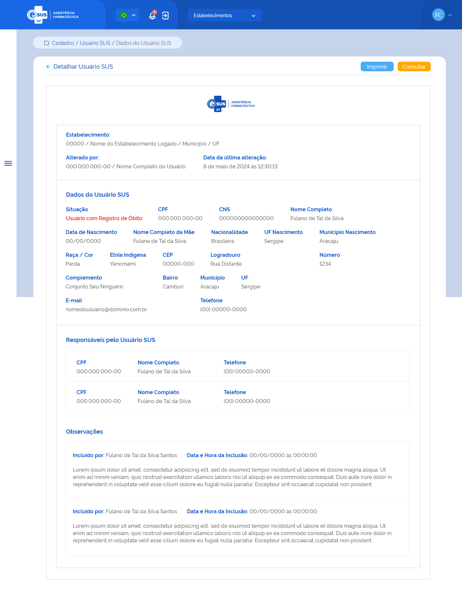

# ETE032 - Detalhar Usuário SUS

## Descrição
Como usuário quero detalhar o cadastro de um usuário SUS através da recuperação de dados do portal do CADSUS para minha instância. 

## Protótipo 001

### Descrição resumida 
Detalhar Usuário SUS – Exibir as informações referentes ao cadastro de um usuário SUS registrado no sistema. 

[Inserir imagem] <!--  -->

### Acesso 
Menu lateral > Cadastro > Usuário SUS > Ação Detalhar 

### Critérios de Aceite 
1. O usuário somente pode acessar a funcionalidade caso tenha permissão. [RGN001](DocumentoDeRegrasv2.md#rgn001); 
2. Acredito que seja para retirar: "Os dados do CNES, Nome, Município e UF, do cabeçalho (Emitido por:), devem ser recuperados do cadastro do estabelecimento do usuário logado. Já o Nome e CPF do usuário responsável pela última alteração no registro do cadastro e a data dessa ação devem ser recuperados do histórico do registro da funcionalidade em questão. [RGN014](DocumentoDeRegrasv2.md#rgn014);
3. Os campos CNS, CPF, Nome Completo, Data de Nascimento, Nome Completo da Mãe, Pais de origem, Estado de origem, Município de origem, Raça, Sexo, CEP, Endereço, Número, Complemento, Bairro, Município, UF, Telefone e E-mail devem ser recuperados do portal do Cadastro Nacional de Usuários do Sistema Único de Saúde (CADSUS); <!-- " -->
4. Quando o usuário acionar a opção de “Voltar” ou “Consultar”, o sistema finaliza o detalhamento e retorna à tela de consulta aos Usuários SUS; 
5. Os campos: Responsáveis pelo Usuário SUS e Observações, devem ser recuperados da base de dados da aplicação;
6. Quando o usuário acionar a opção de “Imprimir”, o sistema deve permitir imprimir as informações da tela ou salvá-las em um arquivo no formato desejado (padrão Windows);
7. Quando o usuário acionar a opção de “Voltar” ou “Consultar”, o sistema finaliza o detalhamento e retorna à tela de consulta aos Usuários SUS. 