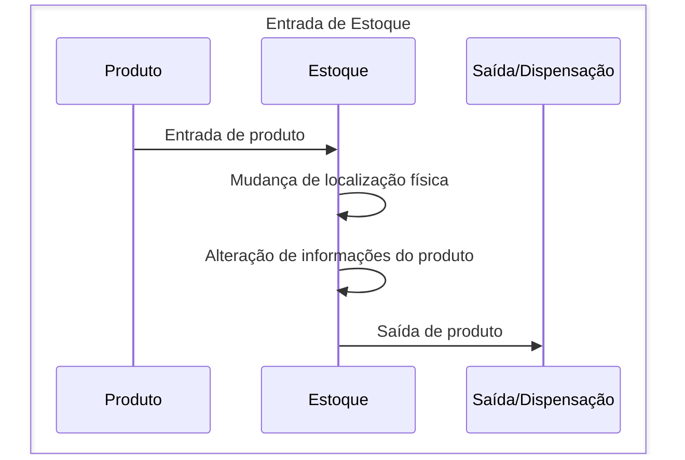
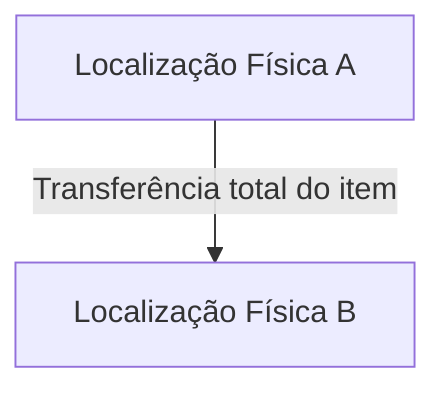
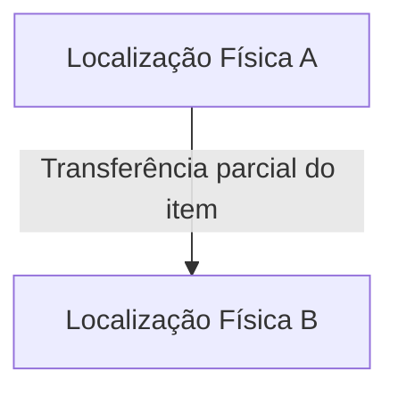
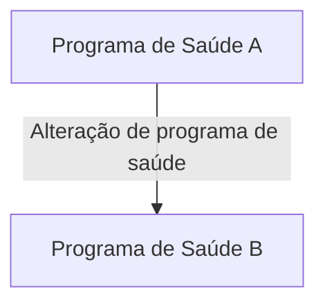
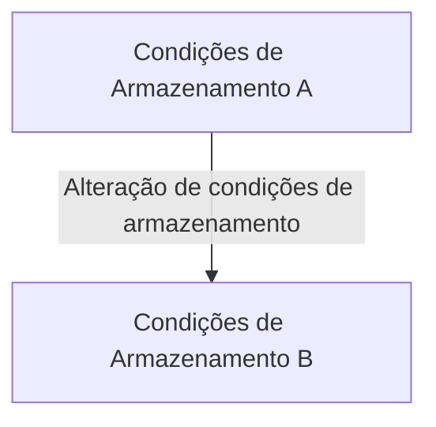
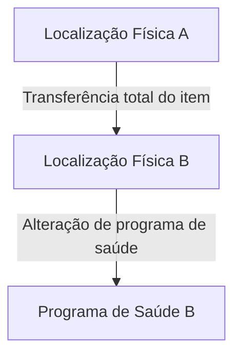
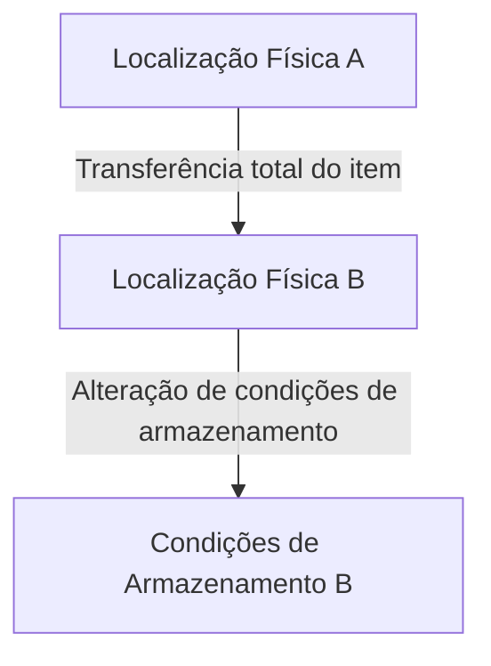
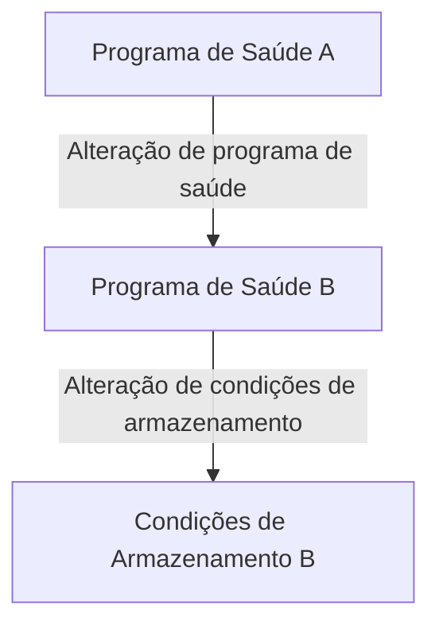
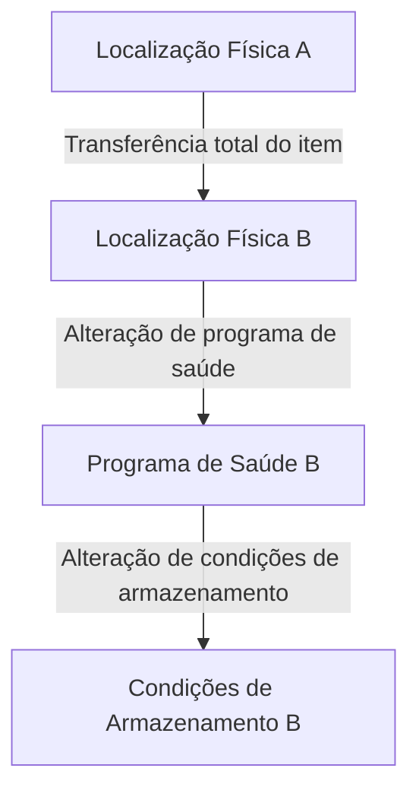

# ESPECIFICAÇÃO TÉCNICA 037: GESTÃO DE ESTOQUES

| **ETE:**     | 037                                        |
|--------------|--------------------------------------------|
| **Título:**  | Gestão de estoque                          |
| **Autor:**   | Jessé Azevêdo <jesse.azevedo@saude.gov.br> |
| **Revisor:** | -                                          |
| **Revisor:** | -                                          |
| **Status:**  | Em validação                               |
| **Versão:**  | 1.0                                        |

## Histórico de Revisões

| **Versão** | **Data**   | **Autor**     | **Descrição** |
| --- |------------|---------------|----------------------|
| 1.0 | 16/02/2025 | Jessé Azevêdo | Criação do documento |

## Resumo

Uma vez que um item é armazenado no estoque de um estabelecimento, é comum que, por necessidade de realocação, seja necessário movê-lo entre localizações físicas. Alterações como mudança de programa de saúde e condições de armazenamento também são comuns. Neste sentido, é necessário que o sistema de gestão de estoques possua mecanismos que permitam a movimentação de itens entre localizações, bem como a alteração de informações referentes ao item.

## Motivação

O e-SUS AF é um sistema de gestão logística e clínica que permite, entre outras coisas, o controle de entrada e saída de medicamentos e insumos. A movimentação de itens entre localizações físicas é uma operação comum em estabelecimentos de saúde, e a alteração de informações referentes ao item é necessária para manter a integridade dos dados e uma gestão eficiente do estoque físico e virtual.  
Atualmente, o e-SUS AF é incapaz de, uma vez realizada a entrada de um item no estoque, movê-lo entre localizações ou alterar informações referentes ao item, o que torna o sistema ineficiente e pouco aderente às necessidades dos estabelecimentos de saúde.  
O presente documento tem como objetivo detalhar os requisitos necessários para a implementação de funcionalidades que permitam a movimentação de itens entre localizações e a alteração de informações referentes ao item no e-SUS AF.
  
## Implementação

Para entender a melhor forma de implementar a movimentação de itens entre localizações e a alteração de informações referentes ao item no e-SUS AF, é necessário compreender o cilco de vida de um item de estoque.  

A princípio, um item é cadastrado no sistema por meio de uma entrada de estoque. Uma vez cadastrado, o item pode ser movido entre localizações físicas, alterando a quantidade disponível em cada localização. Além disso, é possível alterar informações referentes ao item, como programa de saúde e condições de armazenamento. Por fim, o item poderá ser distribuído ou dispensado, reduzindo a quantidade disponível em estoque.

Uma vez entendido o ciclo de vida de um item de estoque, é necessário detalhar cenários onde a movimentação de itens entre localizações e a alteração de informações referentes ao item são necessárias e como podem alterar o estoque. Abaixo o conjunto de cenários onde ocorrem estas alterações.

- Um item é movimentoado de uma posição A para uma posição B em estoque. Neste cenário, a única mudança que ocorre diz respeito a localização física do item, sem alteração de informações referentes ao mesmo.

- Um item é movimentoado de uma posição A para uma posição B em estoque, mas a quantidade movimentada é menor que a quantidade total do item. Neste cenário, a quantidade disponível em A é reduzida e a diferença, adicionada em B.

- O programa de saúde ao qual um item está vinculado é alterado. Neste cenário, a única mudança que ocorre diz respeito ao programa de saúde ao qual o item está vinculado.

- As condições de armazenamento de um item são alteradas. Neste cenário, a única mudança que ocorre diz respeito às condições de armazenamento do item.

- O item é movimentado de uma localização A para uma localização B e, simultaneamente, o programa de saúde ao qual o item está vinculado é alterado. Neste cenário, a quantidade disponível em A é reduzida e a diferença, adicionada em B, e o programa de saúde ao qual o item está vinculado é alterado.

- O item é movimentado de uma localização A para uma localização B e, simultaneamente, as condições de armazenamento do item são alteradas. Neste cenário, a quantidade disponível em A é reduzida e a diferença, adicionada em B, e as condições de armazenamento do item são alteradas.

- O programa de saúde ao qual um item está vinculado é alterado e, simultaneamente, as condições de armazenamento do item são alteradas. Neste cenário, o programa de saúde ao qual o item está vinculado é alterado e as condições de armazenamento do item são alteradas.

- O item é movimentado de uma localização A para uma localização B, o programa de saúde ao qual o item está vinculado é alterado e, simultaneamente, as condições de armazenamento do item são alteradas. Neste cenário, a quantidade disponível em A é reduzida e a diferença, adicionada em B, o programa de saúde ao qual o item está vinculado é alterado e as condições de armazenamento do item são alteradas.

## Critérios de Aceitação

- O sistema deve permitir a movimentação de itens entre localizações físicas.
- O sistema deve permitir a alteração de Programa de Saúde e Condições de Armazenamento de um item.
- A quantidade transferida não deve ser supeior a quantidade disponível em estoque.
- A quantidade disponível em uma localização não pode ser negativa.
- A mudanção de programa de saúde pode ocorrer para todos os itens em uma localização física ou apenas para uma parte.
- A mudança de condições de armazenamento pode ocorrer para todos os itens em uma localização física ou apenas para uma parte.
- è possível movimentar um item entre localizações, alterar o programa de saúde e as condições de armazenamento simultaneamente.

## Modelo de Dados

Por tratar-se apenas de operações de estoque, não se aplica.

## Elementos de Interface

Abaixo, o protótipo de tela para a transferência de itens em estoque.

<Aguardando prototipação>
