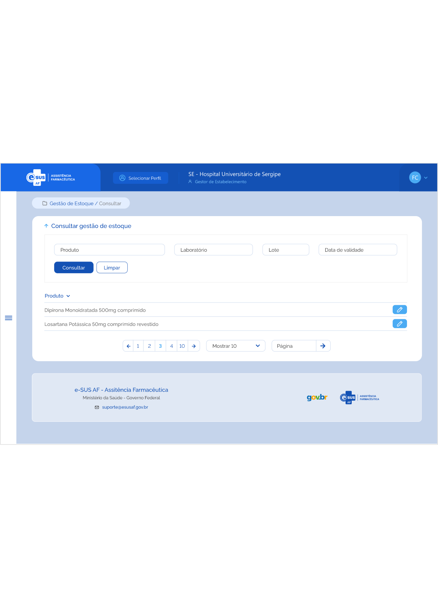
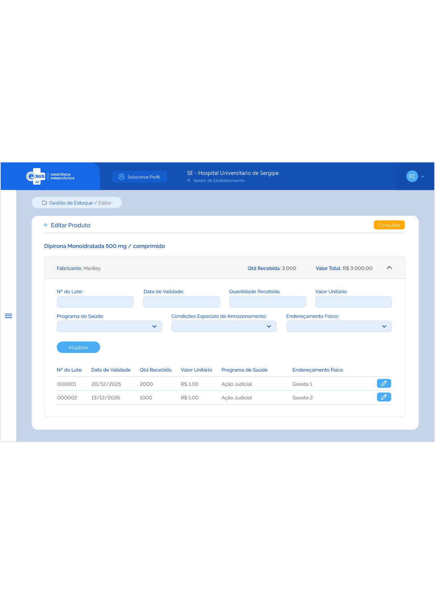

# ETE037 - Gestão de Estoques 
 
## Descrição da funcionalidade 
Como usuário, desejo realizar a alteração de informações referentes a um determinado produto. 

## Protótipo 001  

### Acesso: 
Menu lateral > Gestão de estoque > Consultar 

### Critérios de aceite: 
1. Quando o usuário acessar a funcionalidade, o sistema deve apresentar os filtros de pesquisa e quando a opção “Consultar” for acionada, trará o resultado da consulta. 
2. Se nenhum filtro for aplicado, o sistema irá reportar todos os produtos disponíveis no estoque. 
3. Quando o usuário acionar a opção “Limpar”, o sistema deve limpar o(s) filtro(s) informado(s), o resultado consulta e permanecer na tela de consulta. 
4. O sistema deve permitir editar todos os produtos em estoque. 
5. Quando o usuário acionar a opção “Editar”, o sistema deve direcionar para a tela de edição (Protótipo 002) 

## Protótipo 002 

### Acesso 
Menu lateral > Gestão de estoque > Consultar > Botão Editar 

### Critérios de Aceite 
1. Ao clicar no botão de ação editar na listagem de um produto, o sistema irá habilitar os campos Quantidade Recebida, Endereçamento Físico, Programa de Saúde e Condições Especiais de Armazenamento para edição. 
2. A quantidade recebida não pode ser superior a quantidade disponível em estoque. 
3. A quantidade disponível em uma localização não pode ser negativa. 
4. A mudança de Programa de saúde pode ocorrer para todos os itens em uma localização física ou apenas para uma parte. 
5. A mudança de Condições de armazenamento pode ocorrer para todos os itens em uma localização física ou apenas para uma parte. 
6. É possível movimentar um item entre localizações, alterar o programa de saúde e as condições de armazenamento simultaneamente. 
7. Ao clica em Atualizar, as informações serão atualizadas na listagem. 
8. As informações de Número de Lote, Data de validade e valor unitário são fixas, não podendo ser editadas. 
9. Quando o usuário acionar a opção “Voltar”, o sistema deve retornar para a tela de consulta. 

 