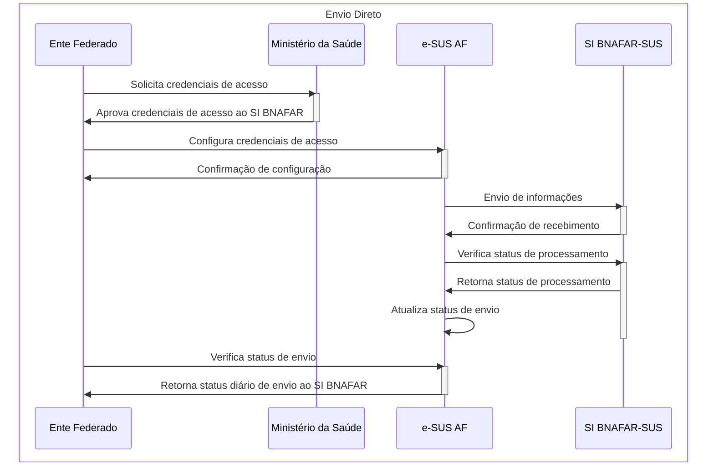
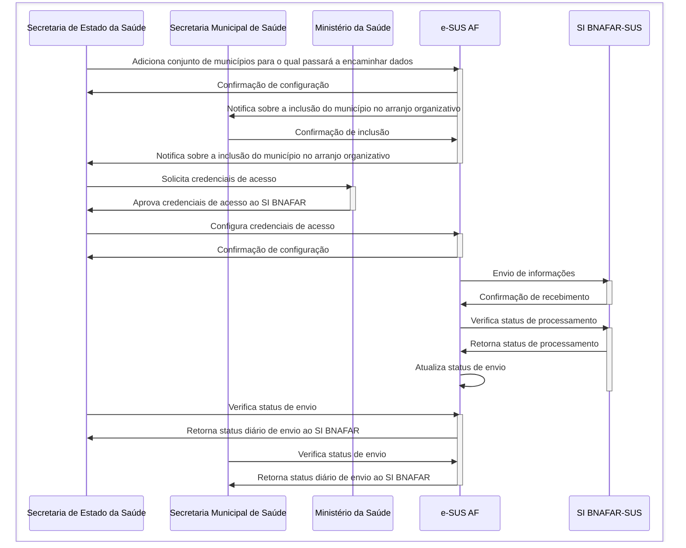
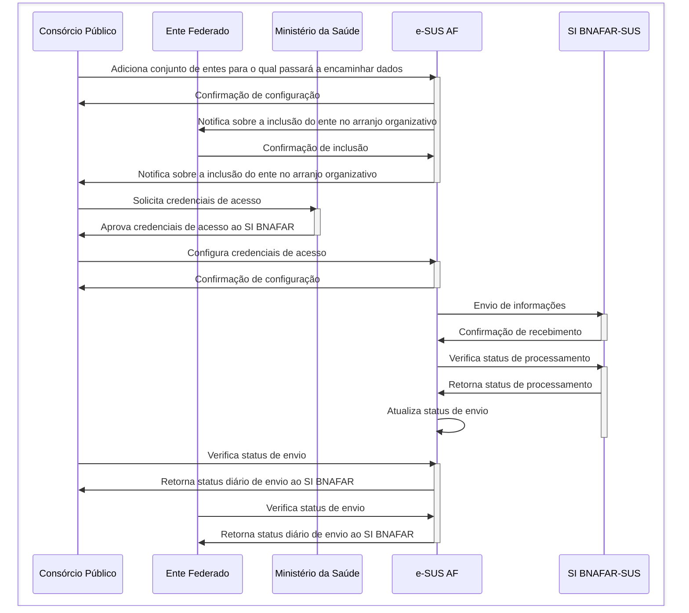
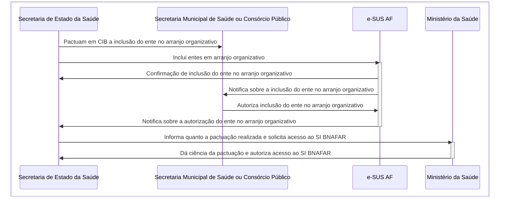
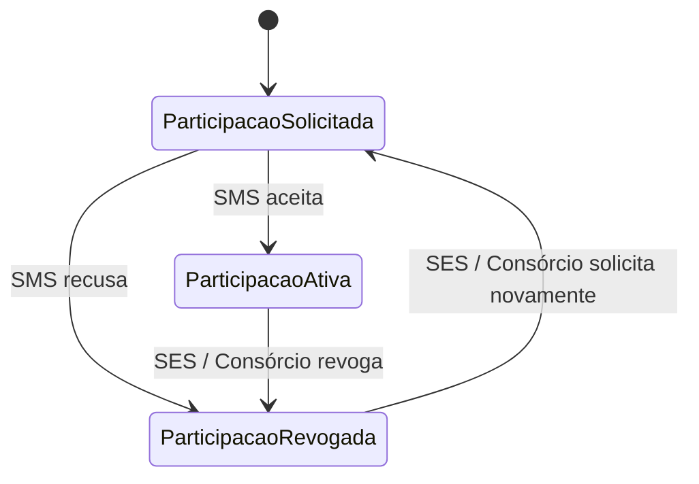
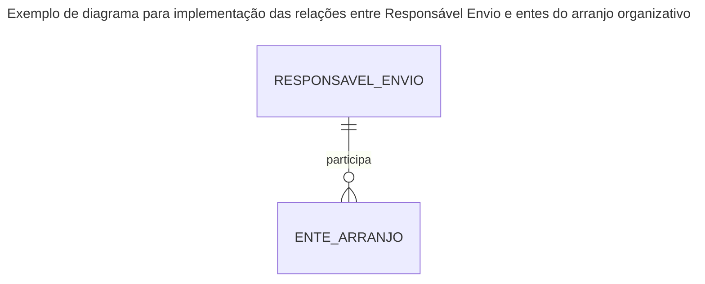

# ESPECIFICAÇÃO TÉCNICA 038: CONFIGURAÇÃO DE INTEGRAÇÃO SI BNAFAR

| **ETE:**     | 038                                        |
|--------------|--------------------------------------------|
| **Título:**  | Configuração de integração SI BNAFAR       |
| **Autor:**   | Jessé Azevêdo <jesse.azevedo@saude.gov.br> |
| **Revisor:** | -                                          |
| **Revisor:** | -                                          |
| **Status:**  | Em validação                               |
| **Versão:**  | 1.0                                        |

## Histórico de Revisões

| **Versão** | **Data**   | **Autor**     | **Descrição**        |
|------------|------------|---------------|----------------------|
| 1.0        | 23/02/2025 | Jessé Azevêdo | Criação do documento |

## Resumo

O SI BNAFAR é um serviço de interoperabilidade ofertado pelo Ministério da Saúde que possibilita a integração de sistemas de gestão da Assistência Farmacêutica com a Base Nacional de Dados de Ações e Serviços da Assistência Farmacêutica (BNAFAR). Este documento traz um conjunto de parâmetros que devem ser configurados no sistema de gestão da Assistência Farmacêutica para que a integração com o SI BNAFAR seja realizada com sucesso.

## Motivação

A publicação da [Portaria GM/MS Nº 5713 de 09 de Dezembra de 2024](https://www.conass.org.br/conass-informa-n-213-2024-publicada-a-portaria-gm-n-5713-que-altera-a-portaria-de-consolidacao-gm-ms-no-1-17-para-modificar-os-modelos-de-informacao-a-serem-adotados-pelos-entes-federados/#:~:text=Portaria%20GM%2FMS%20N%C2%BA%205.713%2C%20DE%209%20DE%20DEZEMBRO%20DE%202024&text=II%20%E2%80%93%20Registro%20Eletr%C3%B4nico%20de%20Sa%C3%ADda,validade%20e%20demais%20situa%C3%A7%C3%B5es%20adversas.) alterou os modelos de informação a serem adotados pelos entes federados, incluindo a obrigatoriedade de integração dos sistemas de gestão da Assistência Farmacêutica com a Base Nacional de Dados de Ações e Serviços da Assistência Farmacêutica (BNAFAR).  
Uma vez que a portaria em questão estabelece a obrigatoriedade de integração dos sistemas de gestão da Assistência Farmacêutica com a BNAFAR, é necessário que o sistema de gestão da Assistência Farmacêutica possua mecanismos que permitam a configuração dos parâmetros necessários para a integração com o SI BNAFAR.
Com este documento é possível detalhar os requisitos necessários para a implementação de funcionalidade que possibilita s gestão de credenciais ao SI BNAFAR nos termos dos parágrafos § 8º e § 9º do art. 391-D da Portaria GM/MS Nº 5713 de 09 de Dezembro de 2024, cujo texto se encontra na integra abaixo:

> Art. 391-D. É obrigatório o envio diário para a BNAFAR/SUS, pelos entes federativos, das informações de que trata o art. 391-A, as quais não poderão conter registros já transmitidos anteriormente.  
>> § 8º As Secretarias de Estado da Saúde, mediante pactuação na Comissão Intergestores Bipartite – CIB, poderão se responsabilizar pela transmissão das informações de que trata esta Portaria, da totalidade ou de parte das Secretarias Municipais de Saúde de seu território, a ser encaminhada ao Ministério da Saúde relacionando o conjunto de entes federados que irão compor o arranjo organizativo.  
>> § 9º As Secretarias de Saúde poderão realizar a transmissão das informações de que trata esta Portaria por meio de Consórcio Público, mediante pactuação na Comissão Intergestores Bipartite – CIB, que deverá ser encaminhada ao Ministério da Saúde relacionando o conjunto de entes federados que irão compor o arranjo organizativo.” (NR)

Com a finalidade de atender a legislação vigente, o e-SUS AF deverá possuir recursos para gerenciar as credenciais de acesso ao SI BNAFAR, atribuindo a responsabilidade do envio a uma credencial devidamente autorizada. Bem como um fluxo de aprovação deverá ser implementado para garantir a segurança dos entes representados por um consórcio público ou Estado. 

## Implementação

Para entender a melhor forma de implementar a configuração de integração com o SI BNAFAR, é necessário compreender o fluxo de envio de informações para a BNAFAR/SUS. Existe 3 fluxos possíveis para a gestão do envio de dados para a BNAFAR/SUS, são eles:  

1. O ente federado envia diretamente as informações para a BNAFAR/SUS.
2. O ente federado envia as informações para a BNAFAR/SUS por meio de uma Secretaria de Estado da Saúde.
3. O ente federado envia as informações para a BNAFAR/SUS por meio de um Consórcio Público.  

**Diagrama de sequência 01: Ente opta por cadastrar credenciais para a gestão de seu dado.**  

**Diagrama de sequência 02: Secretaria de Estado de Saúde envia conjunto de dados de seus municípios**

**Diagrama de sequência 03: Consórcio Público envia conjunto de dados de entes consorciados**

Entretanto é importante pontuar alguns pontos relevantes para a implementação da configuração de integração com o SI BNAFAR:

1. O "dono do dado" é o ente federativo que o produziu, assumiremos a premissa de que independente do fluxo de envio de dados, o ente federativo é responśavel pelo monitoramento do envio do dado e das possíveis inconsistẽncias que o mesmo venha a apresentar.
2. O ente cujas credenciais passarão a ser usadas para envio de dados é co-responsável pelo envio, e deverá atuar ativamente no monitoramento do envio dos dados.
3. O ente federativo é responsável por garantir que as credenciais de acesso ao SI BNAFAR sejam utilizadas de forma segura e que o envio de dados seja realizado em conformidade com a periodicidade definida em portaria.

Outro ponto de grande relevância é a necessidade de implementação de um fluxo de aprovação para a criação de um arranjo organizativo para envio de dados ao SI BNAFAR, de forma a garantir que o envio de dados seja realizado de forma segura e que o ente federativo seja devidamente autorizado a realizar o envio de dados. Abaixo um diagrama ilustra o fluxo.

**Diagrama de sequência 04: Fluxo de aprovação para criação de arranjo organizativo**

O fluxo de participação do ente num arranjo organizativo também obdece regras, e deve seguir o fluxo representado abaixo:

**Diagrama de sequência 05: Fluxo de participação do ente num arranjo organizativo**

## Critérios de Aceitação

- Deverá ser criado um novo perfil de nome "Gestor de Integrações" que poderá estar em escopo global ou restrito a um ente federativo.
- O Usuário com o papel "Gestor" terá o mesmo conjunto de recursos que o perfil "Gestor de Integrações" em relação a configuração de integração com o SI BNAFAR no contexto de um ente.
- O ator com perfil "Gestor de Integrações" deverá possuir permissão para gerenciar as credenciais de acesso ao SI BNAFAR.
- O ator com perfil "Gestor de Integrações" deverá possuir permissão para gerenciar os entes federativos que farão parte do arranjo organizativo.
- O ator com perfil "Gestor de Integrações" deverá possuir permissão para alterar a lista de entes federativos que farão parte do arranjo organizativo.
- É de responsabilidade do perfil "Gestor de Integrações" garantir que as credenciais de acesso ao SI BNAFAR sejam utilizadas de forma segura e que o envio de dados seja realizado em conformidade com a periodicidade definida em portaria.
- Embora o ator com o perfil "Gestor de Integrações" seja responsável pela configuração das credenciais de acesso ao SI BNAFAR, o ente federativo é co-responsável pelo monitoramento do envio do dado e das possíveis inconsistências que o mesmo venha a apresentar, tendo acesso aos status de envio de forma transparente.
- Um ente adicionado num arranjo organizativo poderá declinar da participação a qualquer momento.
- O ente que opte por responsabilizar-se por seus envios deverá configurar devidamente o seu acesso ao SI BNAFAR.
- Os dados de acesso ao SI BNAFAR deverão ser armazenados em banco de dados e deverão ser devidamente criptografados de forma a garantir a segurança das credenciais.
- Uma vez que o ente federativo tenha configurado as credenciais de acesso ao SI BNAFAR, o sistema deverá permitir o envio de informações para o SI BNAFAR.
- Deverá ser possível ao ente alterar a senha de acesso à SI BNAFAR ou mesmo desativar o envio de dados por meio da configuração realizada a qualquer momento.
- A configuração de envio de dados ao SI BNAFAR deverrá estar em estado inativo até que credenciais estejam cadastradas.
- O cadastro com CNPJ indica que o ente federativo é um consórcio público, e deverá ser possível adicionar entes federativos ao consórcio, só podendo ser alterado em escopo global.
- Se a configuração ocorrer no escopo de ente, poderá incluir entes federativos no arranjo organizativo apenas se o ente federativo for um Estado.

## Modelo de Dados

Conjunto de dados 1: Credenciais de acesso ao SI BNAFAR

| Nível | Atributo            | Descrição                                                        | Cardinalidade | Tipo de Dado | Tamanho | Formato           |
|:------|:--------------------|:-----------------------------------------------------------------|:--------------|:-------------|:--------|:------------------|
| 1     | CNPJ                | Cadastro do responsável pelo envio de dados se Consórcio Público | 0..1          | string       | 14      | xx.xxxxxx/xxxx-xx |
| 1     | Razão Social        | Razão Social do estabelecimento credenciado                      | 0..1          | string       | 100     |                   |
| 1     | Nome Fantasia       | Nome Fantasia do estabelecimento credenciado                     | 0..1          | string       | 100     |                   |
| 1     | UF                  | UF do responsável pelo envio de dados estado ou município        | 0..1          | number       | -       |                   |
| 1     | Município           | Município do responsável pelo envio de dados                     | 0..1          | number       | -       |                   |
| 1     | Nome do responsável | Nome do responsável pelo envio de dados                          | 1..1          | string       | 100     |                   |
| 1     | CPF                 | CPF do responsável pelo envio de dados                           | 1..1          | string       | 11      | xxx.xxx.xxx-xx    |
| 1     | E-mail              | E-mail do responsável pelo envio de dados                        | 1..1          | string       | 100     |                   |
| 1     | Telefone            | Telefone do responsável pelo envio de dados                      | 1..1          | string       | 15      | (xx) xxxx-xxxx    |
| 1     | Usuário SI BNAFAR   | Usuário de acesso ao SI BNAFAR criptografado                     | 0..1          | string       | 40      |                   |
| 1     | Senha SI BNAFAR     | Senha de acesso ao SI BNAFAR criptografado                       | 0..1          | string       | 40      |                   |
| 1     | Situação            | Campo enumerado com o estado da configuração                     | 1..1          | string       | 20      |                   |

Conjunto de dados 2: Entes federativos que farão parte do arranjo organizativo

| Nível | Atributo                                | Descrição                                                                                                                 | Cardinalidade | Tipo de Dado | Tamanho | Formato |
|:------|:----------------------------------------|:--------------------------------------------------------------------------------------------------------------------------|:--------------|:-------------|:--------|:--------|
| 1     | Identificador do responsável pelo envio | Identificador do responsável pelo envio dos dados                                                                         | 1..1          | number       | -       | -       |
| 1     | Identificador da ente no e-SUS AF       | Identificador do ente no e-SUS AF                                                                                         | 1..1          | number       | -       | -       |
|  1    | Situação                                | Campo enumerado com estado de participação do ente (Participação solicitada / Participação Recusada / Participação ativa) | 1..1          | string       | 20      |         |

## Elementos de Interface

<Aguardando prototipação>
