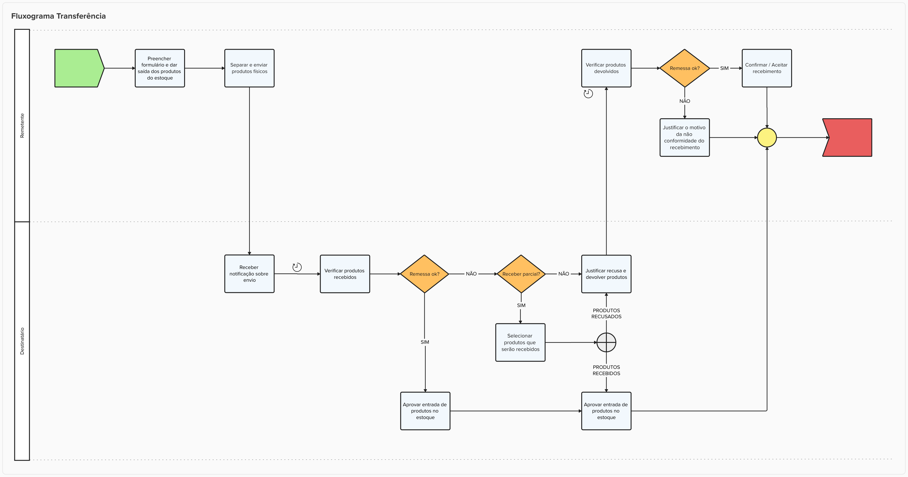

# Transferência de Produtos entre Estabelecimentos

<!-- Não sei se é para retirar, mas achei estranho estar aqui: ## História de Usuário

**Como** usuário do sistema de gestão farmacêutica,  
**Quero** realizar transferências de produtos entre estabelecimentos,  
**Para que** eu possa otimizar o uso de estoque, evitar desperdícios e garantir a disponibilidade de produtos onde houver maior necessidade.

---
-->
## Descrição
A funcionalidade de Transferência de Produtos entre Estabelecimentos permite que unidades de saúde vinculadas a um mesmo ente federativo (como municípios, estados ou entidades) realizem o remanejamento de medicamentos e insumos de forma controlada, rastreável e integrada. 

A funcionalidade tem como objetivo evitar o desperdício de medicamentos, melhorar a alocação de recursos e otimizar a gestão de estoques. O sistema controla todas as etapas da transferência garantindo integridade, validação de prazos de validade, controle de status, e registro de divergências. Além disso, promove a atualização automática de estoques somente após o aceite e armazenamento no destino, assegurando rastreabilidade e confiabilidade nas movimentações.

## Protótipo 001

### Descrição resumida 
Como usuário, desejo consultar as transferências realizadas, utilizando filtros de consulta por data, nº de transferência, produto e status e realizar novas transferências.  

[Inserir imagem]

### Acesso 
Menu lateral > Movimentação > Transferência 

## Regras de Negócio

1. Impedir o envio de produtos:
    - com validade vencida;
        - Emitir [alerta de validade vencida](DocumentoDeMensagensv2.md#msg096);
    - com prazo de validade inferior a 3 meses;
        - Emitir [alerta de validade próxima](DocumentoDeMensagensv2.md#msg097);
3. Fluxo de status para transferências do tipo `Distribuição sem Requisição` e `Transferência`:
    - `Aguardando envio`
        - Quando uma solicitação de movimentação é iniciada. Cada solicitação gera um ID.
    - `Enviado`
        - Medicamentos transferidos e em trânsito. Momento onde os itens saem do estoque da origem e passam a ser um estoque “em trânsito”.
    - `Recebido`
        - Medicamentos chegaram ao estabelecimento de destino. Estabelecimento confirma e ocorre a entrada automática no estoque do estabelecimento de destino.
    - `Recebido parcial`
        - Quando o estabelecimento destino identifica que algum item não deve ser recebido. Problemas de validade, quantidade, outros. A justificativa é obrigatória.
    - `Recusado`
        - Quando o estabelecimento destino identifica que todos os itens não estão em condições de serem recebidos. Problemas de validade, quantidade, outros. A justificativa é obrigatória.
4. Justificativas devem ser preenchidas caso haja divergências no envio / recebimento;
5. Envios / recebimentos sempre deverão gerar registros nos estabelecimentos envolvidos no processo;
6. Atualizar automaticamente o estoque após alteração do status da transferência para `Recebido`;
7. No caso de `Aceito parcial`, o sistema somente efetivará a atualização do estoque de maneira automática após a confirmação de todos os estabelecimentos envolvidos, conforme fluxograma da funcionalidade;

---
## Fluxograma

[Fluxo Transferência entre estabelecimentos](../imagens/ete041-fluxo-transferencia.png)

---
## Protótipo 001

*(inserir link do protótipo não funcional nabegável via adobe XD ou similares)*

---

## Critérios de Aceite

1. O usuário somente poderá acessar a funcionalidade caso tenha permissão; [RGN001](DocumentoDeRegrasv2.md#rgn001)
2. Acesso
    - Menu > Movimentações > Saídas > Novo
3. O sistema deve validar todos os campos obrigatórios antes do envio.
4. Estoques atualizados apenas após conferência e aceite pelo destino.
5. Apenas registros sem movimentações podem ser editados.
6. Alertas visíveis para destinatários com solicitações pendentes.

---

## Modelo de Dados

| Nível | Atributo | Descrição | Cardinalidade | Tipo de Dado | Tamanho | Formato / Observação |
|-------|----------|-----------|---------------|--------------|---------|----------------------|
|       |          |           |               |              |         |                      |

| Campo                       | Tipo             | Obrigatório | Observações                                              |
|-----------------------------|------------------|-------------|----------------------------------------------------------|
| ID Transferência            | UUID             | Sim         | Gerado automaticamente                                   |
| Estabelecimento Origem      | Referência       | Sim         | CNES e nome                                              |
| Estabelecimento Destino     | Referência       | Sim         | CNES e nome                                              |
| Produto                     | Referência       | Sim         | Código OBM ou EAN                                        |
| Lote                        | Texto            | Sim         |                                                          |
| Validade                    | Data             | Sim         | Alerta se < 3 meses. Rejeitar se vencido                 |
| Quantidade                  | Inteiro          | Sim         |                                                          |
| Motivo da Solicitação       | Texto            | Sim         |                                                          |
| Status                      | Enum             | Sim         | Aberto, Enviado, Finalizado, etc.                        |
| Justificativa               | Texto            | Condicional | Obrigatória para recusa, divergência ou devolução        |
| Usuário Solicitante         | Referência       | Sim         | Nome e ID do operador                                    |
| Data/Hora da Solicitação    | DateTime         | Sim         | Registro automático                                      |

---

## Cenários de testes (BDD)
### Cenário 001: 