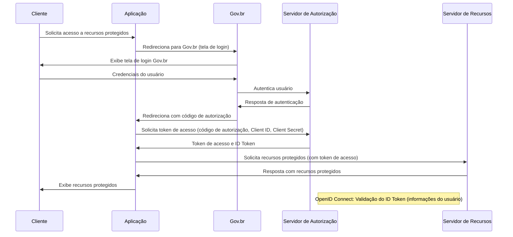

# ESPECIFICAÇÃO TÉCNICA 039: AUTENTICAÇÃO COM GOV.BR

| **ETE:**     | 039                                             |
|--------------|-------------------------------------------------|
| **Título:**  | Autenticação com GOV.BR                         |
| **Autor:**   | Jessé Azevêdo <jesse.azevedo@saude.gov.br>      |
| **Status:**  | Em validação                                    |
| **Versão:**  | 1.0                                             |

## Histórico de Revisões

| **Versão** | **Data**   | **Autor**     | **Descrição**        |
|------------|------------|---------------|----------------------|
| 1.0        | 22/03/2025 | Jessé Azevêdo | Criação do documento |

## Resumo

Este documento tem por objetivo descrever o fluxo de autenticação e autorização para acesso ao e-SUS AF utilizando o serviço de Login Único do GOV.BR, bem como os requisitos necessários para a implementação do mesmo.

## Motivação

O e-SUS AF é um sistema de informação que tem por objetivo apoiar a gestão da Assistência Farmacêutica no âmbito do Sistema Único de Saúde (SUS), permitindo o registro e a consulta de informações sobre a dispensação de medicamentos e insumos, bem como a gestão de estoques e a geração de relatórios gerenciais.  
Um dos requisitos do sistema é a autenticação e autorização de usuários, de forma a garantir a segurança e a privacidade das informações registradas no sistema. Entre os requisitos, está a integração com o serviço de Login Único do GOV.BR, que permite aos usuários acessarem o sistema utilizando as credenciais do GOV.BR.

## Implementação

O fluxo de autenticação e autorização para acesso ao e-SUS AF poderá ser realizado usando o protocolo OAuth 2.0 e OpenID Connect implementado por meio do serviço de Login Único do GOV.BR.

O processo de autorização envolve a interação entre um Cliente (aplicação) e o Servidor de Autorização (Gov.br), a interação pode ser resumida em 4 etapas:

1. **Solicitação de autorização:** O cliente solicita autorização ao usuário para acessar recursos protegidos.
2. **Redirecionamento para Gov.br:** O cliente redireciona o usuário para Gov.br para autenticação.
3. **Retorno de código de autorização:** Após a autenticação, Gov.br redireciona o usuário de volta para o cliente com um código de autorização.
4. **Solicitação de token de acesso:** O cliente solicita um token de acesso ao Servidor de Autorização, enviando o código de autorização e suas credenciais.

Abaixo, o diagrama de sequência ilustra o fluxo em questão.


A implementação do fluxo de autorização deverá especificar os recursos que precisarão ser armazenados no banco de dados da aplicação, estes recursos serão passados por meio da _query string_ **scope**. conforme tabela abaixo:

| **Escopo**            | **Descrição**                                  |
|-----------------------|------------------------------------------------|
| openid                | Obrigatório para autenticação                  |
| email                 | E-mail do usuário                              |
| profile               | Informações do usuário                         |
| govbr_confiabilidades | Nível de confiabilidade do usuário (selos)     |

A aplicação deverá implementar a validação do ID Token, conforme especificado no [OpenID Connect](https://openid.net/specs/openid-connect-core-1_0.html#IDTokenValidation). Ao autenticar-se, o Gov.Br retornará um ID Token e um Access Token, que deverá ser validado pela aplicação, garantindo a autenticidade do usuário. O ID Token conterá informações do usuário autenticado, como nome, e-mail, CPF, entre outros conforme abaixo:

Uma vez autenticado, a aplicação poderá solicitar recursos protegidos ao Servidor de Recursos, enviando o token de acesso no cabeçalho da requisição.  
Ao obter a autenticação

```json
{
        "sub": "(CPF do usuário autenticado.)",
        "amr": ["(Listagem dos fatores de autenticação do usuário com detalhamento. Verificar nas observações para os detalhamentos.)"],
        "picture": "(URL de acesso à foto do usuário cadastrada no Gov.br. A mesma é protegida e pode ser acessada passando o access token recebido.)",
        "name": "(Nome cadastrado no Gov.br do usuário autenticado.)",
        "social_name": "(Nome Social cadastrado no Gov.br do usuário autenticado.Aparecerá apenas se existir no cadastro)",
        "phone_number_verified": "(Confirma se o telefone foi validado no cadastro do Gov.br. Poderá ter o valor "true" ou "false")",
        "phone_number": "(Número de telefone cadastrado no Gov.br do usuário autenticado. Caso o atributo phone_number_verified do ID_TOKEN tiver o valor false, o atributo phone_number não virá no ID_TOKEN)",
        "email_verified": "(Confirma se o email foi validado no cadastro do Gov.br. Poderá ter o valor "true" ou "false")",
        "email": "(Endereço de e-mail cadastrado no Gov.br do usuário autenticado. Caso o atributo email_verified do ID_TOKEN tiver o valor false, o atributo email não virá no ID_TOKEN)",
        "cnpj": "(CNPJ vinculado ao usuário autenticado. Atributo será preenchido quando autenticação ocorrer por certificado digital de pessoal jurídica.)"
}
```

Uma vez autenticado, a aplicação deverá guardar os dados do usuário na tabela "TB_USUARIO", sendo necessário que a aplicação valide se o usuário já possui cadastro na aplicação, caso não possua, a aplicação deverá solicitar ao usuário que complete seu cadastro, informando os dados obrigatários a seguir:

| Nível | Atributo          | Descrição                                                             |
|:------|:------------------|:----------------------------------------------------------------------|
| 1     | CNS               | CNS do usuário                                                        |
| 1     | E-mail            | E-mail do usuário                                                     |
| 1     | Telefone          | Telefone do usuário                                                   |
| 1     | Telefone_mensagem | Telefone do usuário para mensagem instatânea                          |
| 1     | CEP               | CEP do endereço                                                       |
| 1     | Endereço          | Endereço do usuário                                                   |
| 1     | Complemento       | Complemento do endereço                                               |
| 1     | Bairro            | Bairro do endereço                                                    |
| 1     | UF                | Estado do endereço                                                    |
| 1     | Cidade            | Cidade do endereço                                                    |

Para recuperar os recursos relacionados a confiabilidade, a aplicação deverá solicitar ao Servidor de Recursos, enviando o token de acesso no cabeçalho da requisição. Como resposta, o Servidor de Recursos retornará os recursos solicitados. Esta chamada deverá ocorrer sempre que o usuário realizar uma autenticação na aplicação, muitos dos recursos da aplicação serão disponibilizados de acordo com o nível de confiabilidade do usuário. Abaixo retorno do Servidor de Recursos:

```json
[
        {
                "id": "1 (Bronze)",
                "dataAtualizacao": "(Mostra a data e hora que ocorreu atualização da categoria na conta do usuário. A mascará será YYYY-MM-DD HH:MM:SS)"
        },

        {
                "id": "2 (Prata)",
                "dataAtualizacao": "(Mostra a data e hora que ocorreu atualização da categoria na conta do usuário. A mascará será YYYY-MM-DD HH:MM:SS)"
        },

        {
                "id": "3 (Ouro)",
                "dataAtualizacao": "(Mostra a data e hora que ocorreu atualização da categoria na conta do usuário. A mascará será YYYY-MM-DD HH:MM:SS)"
        }
]
```
## Critérios de Aceitação

- A aplicação deverá implementar o fluxo de autorização utilizando OAuth 2.0 e OpenID Connect.
- A aplicação deverá implementar a validação do ID Token.
- A aplicação deverá persistir os recursos retornados pelo Servidor de Recursos.
- O Frontend da aplicação deverá possuir uma rota que recebe como parâmetro o access_token, o refresh_token e o id do usuário logado.
- Ao logar pela primeira vez, o usuário deverá complementar seu cadastro, informando dados adicionais conforme tabela com dados obrigatórios descrita no tópico _Implementação_.
- A aplicação deverá implementar a solicitação de recursos de confiabilidade ao Servidor de Recursos.
- A cada execução do fluxo de autenticação/autorização, a aplicação deverá verificar o retorno do nível de confiabilidade do usuário, a aplicação deverá reagir aos níveis de confiabilidade definidos e conjunto de permissões atribuidas ao usuário.

## Modelo de Dados

| Nível | Atributo          | Descrição                                                               | Cardinalidade | Tipo de Dado | Tamanho | Formato         |
|:------|:------------------|:------------------------------------------------------------------------|:--------------|:-------------|:--------|:----------------|
| 1     | Identificador     | Código sequencial que identifica univocamente um usuário                | (1, 1)        | number       | -       | -               |
| 1     | Nome              | Nome do usuário                                                         | (1, 1)        | string       | 100     | -               |
| 1     | CPF               | CPF do usuário                                                          | (1, 1)        | string       | 11      | CPF             |
| 1     | CNS               | CNS do usuário                                                          | (0, 1)        | string       | 15      | CNS             |
| 1     | Senha             | Senha do usuário (Obrigatório apenas para autenticação com JWT default) | (0, 1)        | string       | 120     | -               |
| 1     | E-mail            | E-mail do usuário                                                       | (0, 1)        | string       | 120     | e-mail          |
| 1     | Telefone          | Telefone do usuário                                                     | (0, 1)        | string       | 15      | (xx) xxxxx-xxxx |
| 1     | Telefone_mensagem | Telefone do usuário para mensagem instatânea                            | (0, 1)        | string       | 15      | (xx) xxxxx-xxxx |
| 1     | Objeto            | Identificador de objetos na tabela TB_OBJETOS                           | (0, 1)        | number       | -       | -               |
| 1     | CEP               | CEP do endereço                                                         | (0, 1)        | string       | 8       | -               |
| 1     | Endereço          | Endereço do usuário                                                     | (0, 1)        | string       | 256     | -               |
| 1     | Complemento       | Complemento do endereço                                                 | (0, 1)        | string       | 256     | -               |
| 1     | Bairro            | Bairro do endereço                                                      | (0, 1)        | string       | 120     | -               |
| 1     | UF                | Estado do endereço                                                      | (0, 1)        | number       | -       | -               |
| 1     | Cidade            | Cidade do endereço                                                      | (0, 1)        | number       | -       | -               |
