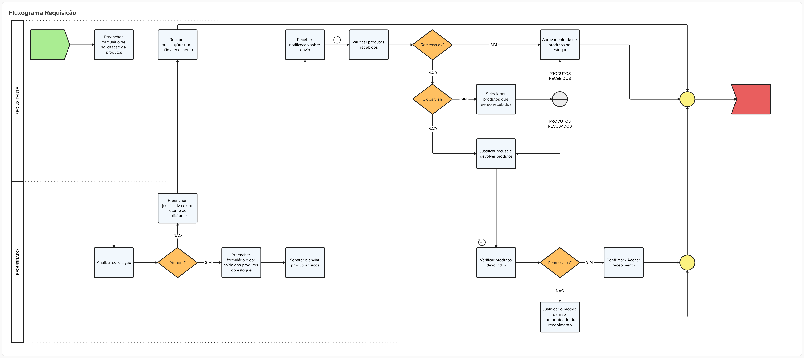

# Requisição de produtos para estabelecimentos

<!-- Não sei se é para retirar, mas achei estranho permanecer aqui: ## História de Usuário

**Como** usuário do sistema de gestão farmacêutica,  
**Quero** realizar requisições de produtos para estabelecimentos,  
**Para que** eu possa recompor meu estoque e garantir a disponibilidade de produtos para atender os usuários SUS.

---
-->
## Descrição

A  Requisição de Produtos permite que estabelecimentos de saúde vinculadas a um mesmo ente federativo (como municípios, estados ou entidades) realizem a movimentação de medicamentos e insumos de forma controlada, rastreável e integrada, de um estabelecimento para outro,  onde um estabelecimento faz uma solicitação para que outro estabelecimento atenda os produtos com itens do seu estoque, garantindo o controle eficiente, rastreamento detalhado e atualização automática dos estoques em ambos os estabelecimentos. A requisição ocorrerá por solicitação formalizada, podendo ser aceita ou não pelo estabelecimento requisitado. 

A funcionalidade tem como objetivo evitar o desperdício de medicamentos, melhorar a alocação de recursos e otimizar a gestão de estoques. O sistema controla todas as etapas da requisição — desde a criação da solicitação até o recebimento e conferência no destino — garantindo integridade, validação de prazos de validade, controle de status, e registro de divergências. Além disso, promove a atualização automática de estoques somente após o aceite e armazenamento no destino, assegurando rastreabilidade e confiabilidade nas movimentações 

---
## Regras de Negócio

1. Todas as etapas do processo de requisição deverão ser controladas
2. Permitir requisição para todos os estabeleciemntos pertencentes ao Ente do estabelecimento requerente;
3. Permitir consultar estoque de todos os estabelecimentos pertencentes ao Ente do estabelecimento requerente;
4. Permitir aceite ou recusa de atendimento da solicitação pelos estabelecimentos requisitados;
5. Emitir [alerta de requisição](DocumentoDeMensagensv2.md#msg098) para estabelecimentos que receberam solicitação de transferência;
6. Impedir o envio de produtos:
    - com validade vencida;
        - Emitir [alerta de validade vencida](DocumentoDeMensagensv2.md#msg096);
    - com prazo de validade inferior a 3 meses;
        - Emitir [alerta de validade próxima](DocumentoDeMensagensv2.md#msg097);
7. Fluxo de status:
    - `Aberto`
        - Quando uma solicitação de movimentação é iniciada. Cada solicitação gera um ID.
    - `Atendido`
        - Quando a solicitação de movimentação é atendida por um estabelecimento ou CAF.
    - `Cancelado`
        - Operação interrompida antes do envio. O cancelamento poderá ser realizado pelo estabelecimento de origem, apenas se estiver nos status “Aberto, Atendido”, e pelo estabelecimento de destino, se o status for “Aberto”.
    - `Enviado`
        - Medicamentos transferidos e em trânsito. Momento onde os itens saem do estoque da origem e passam a ser um estoque “em trânsito”.
    - `Aceito`
        - Medicamentos chegaram ao estabelecimento de destino. Estabelecimento confirma e ocorre a entrada automática no estoque do estabelecimento de destino.
    - `Aceito parcial`
        - Quando o estabelecimento destino identifica que algum item não deve ser recebido. Problemas de validade, quantidade, outros.
    - `Recusado`
        - Quando o estabelecimento destino identifica que todos os itens não estão em condições de serem recebidos. Problemas de validade, quantidade, outros.
8. Justificativas devem ser preenchidas caso haja divergências no envio / recebimento;
9. Envios / recebimentos sempre deverão gerar registros nos estabelecimentos envolvidos no processo;
10. Atualizar automaticamente o estoque após alteração do status da requisição para `Aceito`;
11. No caso de `Aceito parcial`, o sistema somente efetivará a atualização do estoque de maneira automática após a confirmação de todos os estabelecimentos envolvidos, conforme fluxograma da funcionalidade;

## Fluxograma

[Fluxo Requisição entre estabelecimentos](../imagens/ete041-fluxo-requisicao.png)

## Protótipo 001

### Descrição resumida 
Consultar requisição - Como usuário quero consultar as solicitações de requisição realizadas pelo meu estabelecimento, além de confirmar o recebimento dos produtos e armazená-los.  Ainda, consultar os atendimentos de requisições destinados ao meu estabelecimento, podendo atendê-los ou não, em conformidade ao meu estoque. 

[Inserir imagem]

### Acesso 
Menu lateral > Movimentação > Requisição 

### Critérios de Aceite

1. O usuário somente poderá acessar a funcionalidade caso tenha permissão; [RGN001](DocumentoDeRegrasv2.md#rgn001)
2. O sistema deve validar todos os campos obrigatórios antes do envio.
3. Transferências geram movimentações de saída/entrada automáticas ao terem status alterados para aceito.
4. Estoques atualizados apenas após conferência e aceite pelo destino.
5. Apenas registros sem movimentações podem ser editados.
6. Alertas visíveis para destinatários com solicitações pendentes.

## Modelo de Dados

| Nível | Atributo | Descrição | Cardinalidade | Tipo de Dado | Tamanho | Formato / Observação |
|-------|----------|-----------|---------------|--------------|---------|----------------------|
|       |          |           |               |              |         |                      |

| Campo                       | Tipo             | Obrigatório | Observações                                              |
|-----------------------------|------------------|-------------|----------------------------------------------------------|
| ID Transferência            | UUID             | Sim         | Gerado automaticamente                                   |
| Estabelecimento Origem      | Referência       | Sim         | CNES e nome                                              |
| Estabelecimento Destino     | Referência       | Sim         | CNES e nome                                              |
| Produto                     | Referência       | Sim         | Código OBM ou EAN                                        |
| Lote                        | Texto            | Sim         |                                                          |
| Validade                    | Data             | Sim         | Alerta se < 3 meses. Rejeitar se vencido                 |
| Quantidade                  | Inteiro          | Sim         |                                                          |
| Motivo da Solicitação       | Texto            | Sim         |                                                          |
| Status                      | Enum             | Sim         | Aberto, Enviado, Finalizado, etc.                        |
| Justificativa               | Texto            | Condicional | Obrigatória para recusa, divergência ou devolução        |
| Usuário Solicitante         | Referência       | Sim         | Nome e ID do operador                                    |
| Data/Hora da Solicitação    | DateTime         | Sim         | Registro automático                                      |

---

## Cenários de testes (BDD)
### Cenário 001: 