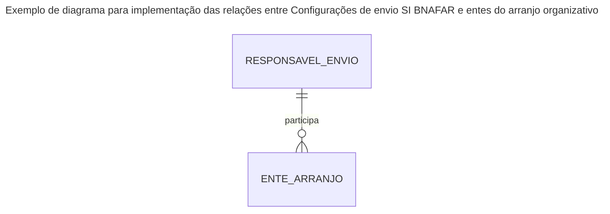

# ETE041 - Configurar transmissão SI Bnafar

| **ETE:**     | 041                                            |
|--------------|------------------------------------------------|
| **Título:**  | Configurar transmissão SI Bnafar               |
| **Autor:**   | Ricardo Ronsoni <ricardo.ronsoni@saude.gov.br> |
| **Revisor:** | Jessé Azevêdo <jesse.azevedo@saude.gov.br>     |
| **Revisor:** | -                                              |
| **Status:**  | Aprovado                                       |
| **Versão:**  | 1.0                                            |

## Histórico de Revisões

| **Versão** | **Data**   | **Autor**       | **Descrição**            |
|------------|------------|-----------------|--------------------------|
| 1.0        | 05/06/2025 | Ricardo Ronsoni | Criação do documento     |
| 1.1        | 14/06/2025 | Jessé Azevêdo   | Revisão do documento     |
| 1.2        | 18/06/2025 | Ricardo Ronsoni | Atualização do documento |

## História de Usuário

Como usuário quero configurar a transmissão de dados da minha instância do eSUS AF para o SI Bnafar.

## Critérios de Aceitação

1.	O usuário somente pode acessar a funcionalidade caso tenha permissão. [#RGN001](DocumentoDeRegrasv2.md).  
2.	O acesso à funcionalidade é dado através do menu lateral no item “Transmissão federal”, subitem “Configurar transmissão”, e selecionado o card “SI Bnafar”. O menu deve ser apresentado apenas para os usuários que possuem perfil de acesso a funcionalidade.  
3.	Credenciais SI Bnafar. Ver [#RGN068](DocumentoDeRegrasv2.md).  
4.	A senha para a transmissão dos dados deverá ser gravada de forma criptografada no banco. Contudo, o método de criptografia deverá permitir a descriptografia para posterior utilização nas transmissões. 
5.	Caso o campo “Ativo” seja selecionado com a opção “Sim”, todos os demais campos da tela tornam-se obrigatórios, exceto: “Cargo”, “E-mail” e “Telefone”. Não é obrigatório incluir um item no campo “Municípios excluídos” para salvar a configuração como ativa.  
6.	Caso o usuário tente salvar as configurações com o campo “Ativo” selecionado com a opção “Não”, deverá ser apresentada uma modal com:  
    + Mensagem: “A interrupção no envio de dados para o SI Bnafar pode ocasionar impactos financeiros para os municípios. Deseja continuar?”  
    + Botão “Confirmar”: Confirma o salvamento da tela com a opção “Não” selecionada  
    + Botão “Cancelar”: Fecha a modal, sem salvar os dados.
7.	No campo “Auditar transmissões” o usuário pode selecionar se as requisições e repostas do SI Bnafar serão persistidas para fins de auditoria. Se for selecionada a opção “Sim”, deve ser habilitado o campo obrigatório “Dias”. [#RGN070](DocumentoDeRegrasv2.md).  
8.	Caso o cadastro seja salvo com o campo “Auditar transmissões” selecionado com “Não”, o sistema deverá realizar a exclusão física das auditorias persistidas até então no banco de dados para a respectiva UF e todos os municípios da instância.
9.	O campo “Escopo” especifica quais medicamentos e produtos deverão ser transmitidos para o SI Bnafar. [#RGN069](DocumentoDeRegrasv2.md).  
10.	Caso o usuário selecione a opção “Sim” no campo “Configurações Avançadas”:
    + Deve ser apresentada uma modal com a seguinte mensagem “A alteração dos parâmetros pode gerar grande impacto na transmissão dos dados para o SI Bnafar.\n\n Faça a alteração apenas em caso de recomendação do Ministério da Saúde.” Adicionalmente, deverá ser exibido o botão “Fechar” para fechar a modal.
    + Deve ser habilitado o campo “Limite registros por lote”, onde o usuário pode definir a quantidade máxima de registros por lote de envio para o SI Bnafar.
    + Deve ser habilitado o campo “Timeout (ms)”, onde o usuário pode informar o tempo de timeout do cliente do SI Bnafar.
11.	Sistema deve apresentar duas listas (carrinho de compra) para seleção de quais municípios irão transmitir os dados para o SI Bnafar. Somente deverão ser exibidos os municípios que fazem parte da instância do sistema, e da mesma UF do usuário logado. Os municípios devem ser apresentados por default na lista de envio dos dados, em ordem alfabética. [#RGN071](DocumentoDeRegrasv2.md).  
12.	Ao clicar no botão “Salvar”, e caso não ocorra nenhum erro, o sistema deve apresentar a MSG xx6.

### Protótipo

[Protótipo não funcional navegável via Adobe XD](https://xd.adobe.com/view/b10875f3-b816-4ec6-9948-a3ef8df26a52-e45b/screen/518aadb2-7bd7-495a-8ff2-b5effc590a0f/)

## Modelo de Dados

Conjunto de dados 1: Configuração SI BNAFAR

| Nível | Atributo                     | Descrição                                                               | Cardinalidade | Tipo de Dado | Tamanho | Formato                                    |
|:------|:-----------------------------|:------------------------------------------------------------------------|:--------------|:-------------|:--------|:-------------------------------------------|
| 1     | Usuário                      | Credencial de envio para o SI BNAFAR                                    | 1..1          | string       | 60      | xx.xxxxxx/xxxx-xx                          |
| 1     | Senha                        | Senha para envio de dados ao SI BNAFAR                                  | 1..1          | string       | 100     |                                            |
| 1     | Nome do responsável          | Nome do responsável pela credencial                                     | 1..1          | string       | 100     |                                            |
| 1     | Cargo                        | Cargo do responsável pela credencial na organização                     | 1..1          | string       | 100     |                                            |
| 1     | E-mail                       | E-mail do responsável pelo envio de dados                               | 1..1          | string       | 100     |                                            |
| 1     | Telefone                     | Telefone do responsável pelo envio de dados                             | 1..1          | string       | 15      | (xx) xxxx-xxxx                             |
| 1     | Rol de Dados                 | Conjunto de dados a ser encaminhado ao SI BNAFAR                        | 1..1          | string       | 1       | A - Todo o rol de itens, R - Apenas Rename |
| 1     | Auditar Transmissão          | Indica se a aplicação reterá logs detalhados do envio de dados          | 1..1          | string       | 1       | S - Sim, N - Não                           |
| 1     | Dias                         | Indica o tempo para o qual a aplicação manterá logs de envio            | 0..1          | number       | -       |                                            |
| 1     | Status Configuração Avançada | Indica se serão aplicadas configurações avançadas para o envio de dados | 1..1          | string       | 1       | S - Sim, N - Não                           |
| 1     | Limite de Registros por Lote | Define número máximo de registros encaminhados em um lote               | 0..1          | number       | -       |                                            |
| 1     | Timeout                      | Configura tempo máximo de espera para envio de dados                    | 0..1          | number       | -       |                                            |

Conjunto de dados 2: Entes vinculados à credencial cadastrada

| Nível | Atributo                                | Descrição                                                | Cardinalidade | Tipo de Dado | Tamanho | Formato |
|:------|:----------------------------------------|:---------------------------------------------------------|:--------------|:-------------|:--------|:--------|
| 1     | Identificador da configuração SI BNAFAR | Identificador da tabela de configuração do SI BNAFAR     | 1..1          | number       | -       | -       |
| 1     | Identificado do ente                    | Identificador do ente no e-SUS AF                        | 1..1          | number       | -       | -       |

