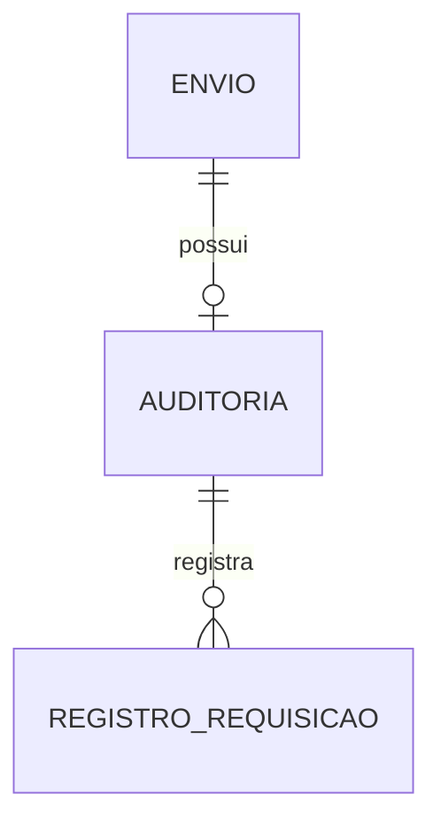

# ETE042 - Transmitir dados SI Bnafar

| **ETE:**     | 042                                            |
|--------------|------------------------------------------------|
| **Título:**  | Transmitir dados SI Bnafar                     |
| **Autor:**   | Ricardo Ronsoni <ricardo.ronsoni@saude.gov.br> |
| **Revisor:** | Jessé Azevêdo <jesse.azevedo@saude.gov.br>     |
| **Revisor:** | -                                              |
| **Status:**  | Aprovado                                       |
| **Versão:**  | 1.0                                            |

## Histórico de Revisões

| **Versão** | **Data**   | **Autor**       | **Descrição**            |
|------------|------------|-----------------|--------------------------|
| 1.0        | 05/06/2025 | Ricardo Ronsoni | Criação do documento     |
| 1.1        | 14/06/2025 | Jessé Azevêdo   | Revisão do documento     |
| 1.2        | 18/06/2025 | Ricardo Ronsoni | Atualização do documento |

## História de Usuário

Como usuário quero que o sistema envie os dados de saída e posição de estoque para o SI Bnafar, e consulte o processamento e as inconsistências no serviço federal.

## Critérios de Aceite

1. As configurações de credenciais e transmissão de dados para o SI Bnafar será realizada a nível estadual, e será aplicada para todos os entes vinculados a instância estadual. [#RGN001](DocumentoDeRegrasv2.md); 
2. A transmissão deve ocorrer conforme a configuração do SI Bnafar para a instância. [#RGN072](DocumentoDeRegrasv2.md);  
3. A persistência dos dados para auditoria deve ocorrer somente no caso do campo “Tempo guarda envios (dias)” da [ETE041](ETE041.md) estar preenchido com “Sim”. Somente deverão ser auditados as requisições referentes ao envio de dados (consultas não serão incluídas). [#RGN070](DocumentoDeRegrasv2.md);  
4. Para realizar a auditoria dos envios, o sistema deve persistir a requisição e resposta completa realizada para o SI Bnafar:
    - Para requisições com status 2xx, 4xx ou 5xx: Deverá ser persistido o header, body, URL, método, status HTTP, timestamp envio, timestamp resposta. Para status 2xx também deverá ser persistido o número de protocolo relativo ao envio;
    - Para os casos de insucesso devido a problemas de conexão (ex: API indisponível ou timeout): Deverá ser persistido somente os dados da requisição (header, body, URL, método, timestamp envio), e o motivo do erro. Se o motivo for timeout do serviço, deverá ser persistido o valor do timeout utilizado na transmissão.
5. O sistema deve possuir uma rotina para excluir os registros de auditoria com o tempo maior de persistência do que especificado no “Auditar transmissões” -> “Dias” no [#ETE041](ETE041.md). Exclusão deverá ser física. [#RGN070](DocumentoDeRegrasv2.md);  
6. A relação dos itens a serem transmitidos devem obedecer a configuração da integração. [#RGN069](DocumentoDeRegrasv2.md);  
7. Nem todos os tipos de saída deverão ser transmitidos para o SI Bnafar. Ver [#RGN073](DocumentoDeRegrasv2.md);  
8. Se o campo “Configurações Avançadas” da [#ETE041](ETE041.md) estiver preenchido com “Sim”, deverão ser observados os campos “Limite registros por lote” e “Timeout (ms)” para realizar as transmissões. Se o campo estiver preenchido com “Não”, deverá ser utilizado o timeout de 45000 ms e o limite de 1000 registros por lote;  
9. Municípios informados como excluídos na [#ETE041](ETE041.md) não deverão ter os seus dados de saída e estoque transmitidos para o SI Bnafar, para a referida instância e UF. [#RGN071](DocumentoDeRegrasv2.md);  
10. A transmissão para o SI Bnafar deverá ser realizada diariamente, a partir da 00h. A nível federal, cada UF terá uma rotina própria para envio e consulta dos dados;
11. Os envios devem iniciar com os dados da posição de estoque e posteriormente com as saídas;
12. Deverão ser utilizados os endpoints de envio em lote do SI Bnafar para realizar a transmissão das saídas e posição de estoque. Os lotes devem conter os dados de apenas um munícipio e de uma data, para que se tenha maior controle posterior;
13. Os envios e consultas ao SI Bnafar deverão seguir a documentação e o padrão do serviço, disponível no site do Ministério da Saúde (https://servicos-datasus.saude.gov.br/detalhe/DxRPsAn2mh);
14. Deverá ser observada a [#RGN074](DocumentoDeRegrasv2.md) para recuperar os registros de saída a serem transmitidos para o SI Bnafar;  
15. Deverá ser observada a [#RGN075](DocumentoDeRegrasv2.md) para obter os registros de posição de estoque a serem transmitidos para o SI Bnafar;  
16. Sistema deverá possuir tabelas próprias para controlar as transmissões para o SI Bnafar. Essas tabelas deverão persistir:  
    + Vínculo do sistema com os parâmetros retornados do SI Bnafar (protocolo* e código do registro**):  
        + Entre os IDs da saída;  
        + Entre a data da posição de estoque.  
    + Status de processamento do SI Bnafar;  
    + Inconsistências geradas;  
    + Auditoria das requisições;  
    + Tentativas de transmissão.  
    !!! note "Importante"  
        + O protocolo é gerado no momento da transmissão para o SI Bnafar.  
        + O código do registro é retornado pelo serviço na consulta do processamento do lote. Ele é gerado apenas caso o protocolo tenha sido processado, e o registro não contenha inconsistência.

17. As saídas com registro de estorno não deverão ser transmitidas para o SI Bnafar. [#RGN076](DocumentoDeRegrasv2.md);  
18. Deverá ser observado o prazo de registro de estorno do SI Bnafar. Ver [#RGN077](DocumentoDeRegrasv2.md);  
19. Caso um lote de posição de estoque tenha problema de transmissão em sua primeira tentativa, o sistema deverá gravar o mesmo em banco de dados para o envio posterior. Isso é necessário para que não seja calculado a posição de estoque retroativa para cada tentativa de reenvio. Após o sucesso no envio, o lote poderá ser excluído do banco;
20. Caso ocorra algum erro na transmissão por (ex: 5xx, timeout ou indisponibilidade do serviço), o sistema deve tentar realizar três reenvios em tempo de execução. Caso a transmissão não ocorra, novas tentativas posteriores serão realizadas (rotina segregada);
21. Além da transmissão dos dados, o sistema deverá possuir outra rotina com horários distintos para consultar o processamento e as inconsistências dos registros;
22. Para cada envio realizado o sistema deverá consultar o processamento do mesmo, utilizando o número do protocolo. A consulta do processamento deve ocorrer somente para os protocolos que não tiveram o seu processamento finalizado pelo SI Bnafar. Para cada protocolo o sistema deverá manter o status de processamento atualizado;
23. Para os protocolos que foram processados e que apresentaram inconsistências, o sistema deverá consultar as inconsistências e salvar em banco o código, mensagem, campo com erro e valor informado. O sistema deverá persistir as inconsistências vinculadas aos registros de origem no sistema;
24. A consulta das inconsistências deve ocorrer logo após a consulta do status de processamento do protocolo. A consulta da inconsistência deve ocorrer apenas para os protocolos com status “4” (processamento finalizado, com ao menos um registro inconsistente) no SI Bnafar;
25. O sistema deverá persistir para cada registro o número de tentativas de envio.
26. Além das rotinas de envio, o sistema deverá possuir os seguintes agendamentos:
    + Consultar processamento e inconsistência: 8h e 15h.
    + Retentiva envio de itens com erro: 11h e 20h.
27. Para gerar a autenticação no SI Bnafar devem ser utilizadas as credenciais informadas nos campos “Usuário” e “Senha” da [#ETE041](ETE041.md);
28. Para o envio da posição de estoque:
    + Transmissão deve abranger todos os lotes e programas de saúde por unidade de saúde (deve ser obedecido esse grão e os dados não devem ser consolidados). Ex: Um mesmo produto em um estabelecimento possui lotes diferentes e programas de saúde distintos -> Cada combinação deverá gerar um registro de envio;
    + Itens com valores zerados no estoque não deverão ser transmitidos;
    + Estoque de produtos vencidos deverão ser transmitidos.
29. Deve ser realizado um de/para entre os tipos de saída do sistema com as opções disponíveis no SI Bnafar, conforme abaixo:

| Tipo saída eSUS AF                | Código SI Bnafar  | Saída SI Bnafar                        |
|-----------------------------------|-------------------|----------------------------------------|
| Ajuste de Estoque                 | S-AE              | SAÍDA POR AJUSTE DE ESTOQUE            |
| Amostra                           | S-AEA             | SAÍDA POR AMOSTRA, EXPOSIÇÃO E ANÁLISE |
| Exposição e Análise               | S-AEA             | SAÍDA POR AMOSTRA, EXPOSIÇÃO E ANÁLISE |
| Apreensão Sanitária               | S-AS              | SAÍDA POR APREENSÃO SANITÁRIA          |
| Distribuição sem Requisição       | S-DD              | SAÍDA POR DISTRIBUIÇÃO                 |
| Empréstimo                        | S-E               | SAÍDA PARA EMPRÉSTIMO                  |
| Perda                             | S-PE              | SAÍDA POR PERDA                        |
| Requisição                        | S-SAC             | SAÍDA POR ATENDIMENTO DE REQUISIÇÃO    |
| Roubo                             | S-AE              | SAÍDA POR AJUSTE DE ESTOQUE            |
| Saída para Departamento           | S-DEPART          | SAÍDA PARA DEPARTAMENTO                |
| Transferência                     | S-T               | SAÍDA POR TRANSFERÊNCIA                |
| Usuário SUS não Identificado      | S-PA              | SAÍDA PARA USUÁRIO SUS                 |
| Validade Vencida                  | S-VV              | SAÍDA POR VALIDADE VENCIDA             |

### Protótipo

Não se aplica.

## Modelo de Dados

Conjunto de dados 1: Dados de envio SI BNAFAR

| Nível | Atributo                                | Descrição                                                               | Cardinalidade | Tipo de Dado | Tamanho | Formato                                              |
|:------|:----------------------------------------|:------------------------------------------------------------------------|:--------------|:-------------|:--------|:-----------------------------------------------------|
| 1     | Identificador da configuração SI BNAFAR | Identificador da tabela de configuração do SI BNAFAR                    | 1..1          | number       | -       | -                                                    |
| 1     | Identificador do ente no e-SUS AF       | Identificador do ente na tabela de entes do e-SUS AF                    | 1..1          | number       | -       | -                                                    |
| 1     | Número de protocolo                     | Número de protocolo retornado ao enviar o conjunto de dados             | 1..1          | string       | 60      |                                                      |
| 1     | Data conjunto de dados                  | Data do conjunto de dados                                               | 1..1          | date         | -       |                                                      |
| 1     | Data de envio                           | Data de envio do conjunto de dados                                      | 1..1          | date         | -       |                                                      |
| 1     | Data de processamento                   | Data de processamento do conjunto de dados                              | 0..1          | date         | -       |                                                      |
| 1     | Status Envio                            | Status de envio do conjunto de dados                                    | 1..1          | string       | 1       | S - Enviado com Sucesso, F - Falha ao realizar envio |
| 1     | Dado                                    | Conjunto de dados encaminhado                                           | 1..1          | JSON         | -       |                                                      |
| 1     | Total de Registros                      | Número de registros do protocolo                                        | 1..1          | number       | -       |                                                      |
| 1     | Status Protocolo                        | Campo enumerado conforme Domínio Status de protocolo                    | 1..1          | string       | 1       | Campo enumerado conforme Domínio Status de protocolo |
| 1     | Número de inconsistências               | Número de inconsistências no registro do protocolo                      | 1..1          | number       | -       |                                                      |

Conjunto de dados 2: Auditoria de envios SI BNAFAR

| Nível | Atributo                                     | Descrição                                             | Cardinalidade | Tipo de Dado | Tamanho | Formato |
|:------|:---------------------------------------------|:------------------------------------------------------|:--------------|:-------------|:--------|:--------|
| 1     | Identificador dos dados de envio SI BNAFAR   | Identificador da tabela de configuração do SI BNAFAR  | 1..1          | number       | -       | -       |
| 1     | Identificado do ente                         | Identificador do ente no e-SUS AF                     | 1..1          | number       | -       | -       |
| 1     | Número de tentativas de envio                | Contagem do total de tentativas de envio do protocolo | 1..1          | number       | -       | -       |
| 1     | Data da ultima consulta                      | Data da ultima consulta ao protocolo                  | 1..1          | date         | -       | -       |

Conjunto de dados 3: Registro de retorno de consultas

| Nível | Atributo                               | Descrição                                            | Cardinalidade | Tipo de Dado | Tamanho | Formato                                         |
|:------|:---------------------------------------|:-----------------------------------------------------|:--------------|:-------------|:--------|:------------------------------------------------|
| 1     | Identificador do registro de auditoria | Identificador da tabela de configuração do SI BNAFAR | 1..1          | number       | -       | -                                               |
| 1     | Data de interação com o SI BNAFAR      | Data da ultima interação com o SI BNAFAR             | 1..1          | Date         | -       | -                                               |
| 1     | Método HTTP                            | Método HTTP utilizado na requisição                  | 1..1          | string       | 255     | Método utilizado para interação com o SI BNAFAR |
| 1     | Status da Operação                     | Registro do status da operação                       | 1..1          | string       | 1       | Status HTTP da operação                         |
| 1     | Retorno da operação                    | Retorno da operaçãso realizada                       | 1..1          | JSON         | -       | -                                               |

*Domínio Status protocolo de processamento*

| Código | Descrição                                                                                                        |
|--------|------------------------------------------------------------------------------------------------------------------|
| 1      | Protocolo na fila de processamento aguardando o início do processamento                                          |
| 2      | Servidor iniciou o processamento do protocolo, mas ainda não finalizado                                          |
| 3      | Processamento finalizado, sem inconsistências                                                                    |
| 4      | Processamento finalizado, com ao menos um registro inconsistente                                                 |
| 5      | Erro interno do servidor ao processar o arquivo. O protocolo será enviado novamente para a fila de processamento |

