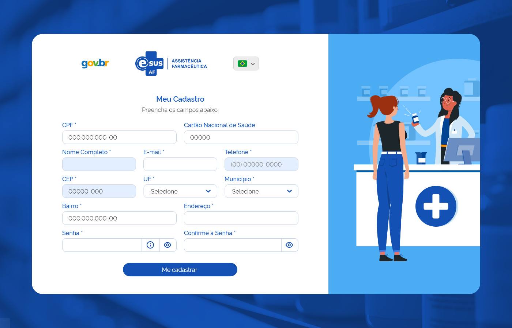
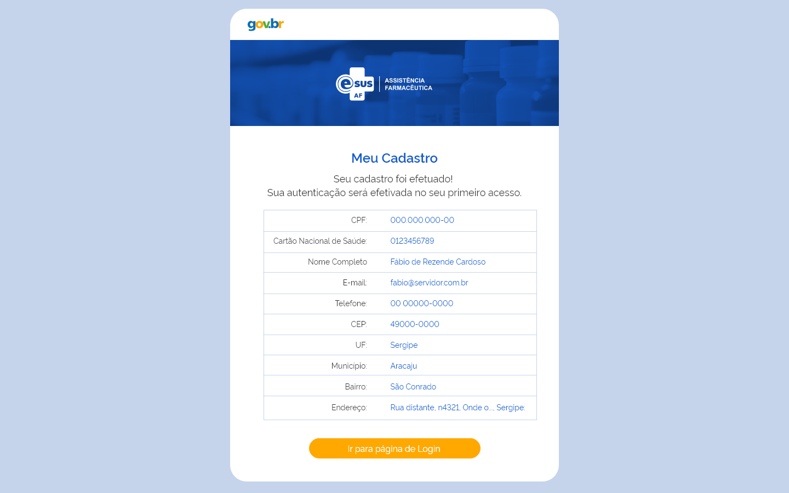
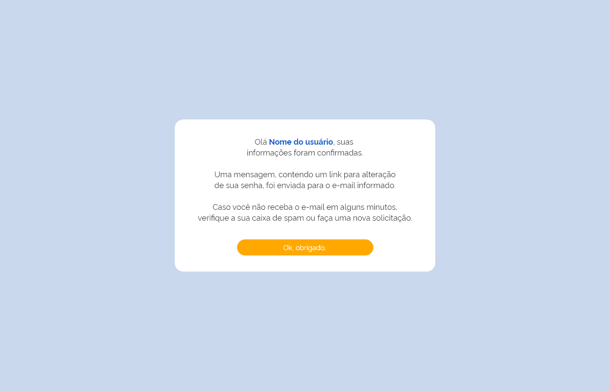
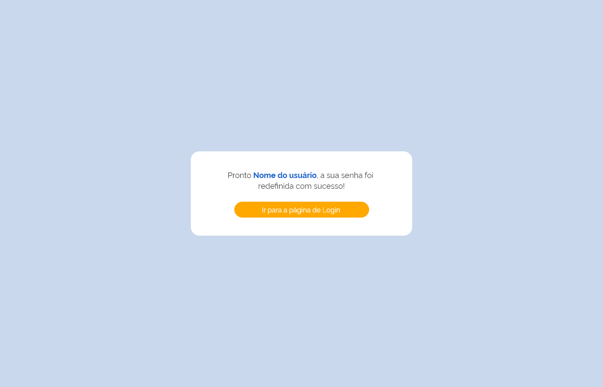

# HU016 - Consultar Entrada

## Descrição

Como usuário, desejo consultar as entradas de produtos, de modo a monitorar o estoque disponível nos estabelecimentos.

## Regras
- 

## Critérios de aceite

**Cenário: Realizar novo cadastro**  
**Dado** que o usuário esteja na tela de realizar novo cadastro  
**Quando** ele preencher o formulário de cadastro com seus dados  
**Então** enviar um e-mail de validação de cadastro para ele  

**Cenário: Tentativa de cadastro de usuário já existente**  
**Dado** que o usuário preencha o formulário na tela de realizar cadastro  
**Quando** ele clicar no botão de se cadastrar  
**E** o usuário já existir na base  
**Então** apresentar uma mensagem de erro

**Cenário: Realizar login com credenciais válidas**  
**Dado** que o usuário esteja na tela inicial  
**Quando** ele preencher os campos  
**E** suas credenciais forem válidas  
**Então** realizar login do usuário  

**Cenário: Realizar login com credenciais inválidas**  
**Dado** que o usuário esteja na tela inicial  
**Quando** ele preencher os campos  
**E** suas credenciais forem inválidas  
**Então** apresentar mensagem de erro de credenciais inválidas  

**Cenário: Redefinir senha de usuário existente**  
**Dado** que o usuário preencha o formulário de redefinir senha  
**E** esteja cadastrado na base  
**Quando** ele clicar no link de redefinir senha no e-mail enviado à ele  
**Então** apresentar formulário para criação de nova senha respeitando as regras de senha da aplicação  

**Cenário: Redefinir senha de usuário inexistente**  
**Dado** que o usuário esteja na tela de redefinir senha  
**Quando** ele preencher o formulário  
**E** o usuário não estiver cadastrado na base  
**Então** apresentar uma mensagem de usuario inexistente

## Definição de pronto
- A funcionalidade deve estar completa e funcional.  
- Todos os critérios de aceite devem ser atendidos.  
- A história deve ter sido testada e validada.  
- A documentação da história deve estar completa.  

## Modelo de dados

| Nível | Atributo | Descrição | Cardinalidade | Tipo de Dados | Tamanho | Formato | Obrigatoriedade |
| :---: | -------- | --------- | :-----------: | :-----------: | :-----: | :-----: | :-------------: | 
|       | Identificação do usuário |  | 1..1 |  |  |  | sim |
| 1 | Foto | Foto de usuário | 1..1 | | | | não |
| 1 | CNS | Número do cartão nacional de saúde do usuário | 1..1 | texto | 15 | XXXX XXXX XXXX XXX | não |
| 1 | CPF | Número do CPF do usuário | 1..1 | texto | 11 | XXX.XXX.XXX-XX | sim |
| 1 | Nome | Nome do usuário | 1..1 |  texto | 80 | | sim |
| 1 | E-mail | E-mail do usuário | 1..1 | texto | 80 | | sim |
| 1 | Celular | Número de celular do usuário | 1..1 | texto | 11 | (XX) XXXXX-XXXX| sim |
| 1 | Senha | Senha do usuário | 1..1 | Texto | 30 | | sim |
| | Endereço | | 1..N | | | | sim |
| 2 | Tipo de endereço | Tipo de endereço (Residencial, Comercial, Profissional, Outro) | 1..1 | texto | 15 | | sim |
| 2 | CEP | CEP do endereço do usuário | 1..1 | texto | 8 | XX.XXX-XXX| sim |
| 2 | UF | UF do usuário | 1..1 | texto | 2 | XX | sim |
| 2 | Município | Município do usuário | 1..1 | texto | 60 | | sim |
| 2 | Endereço/Logradouro | Endereço do usuário | 1..1 | texto | 250 | | sim |
| 2 | Bairro | Bairro do usuário | 1..1 | texto | 120 | | sim |
| 2 | Complemento | Complemento do endereço do usuário | 1..1 | texto | 120 | | sim |
| 2 | Número | Número do endereço do usuário | 1..1 | texto | 10 | | sim |

## Design Conceitual

