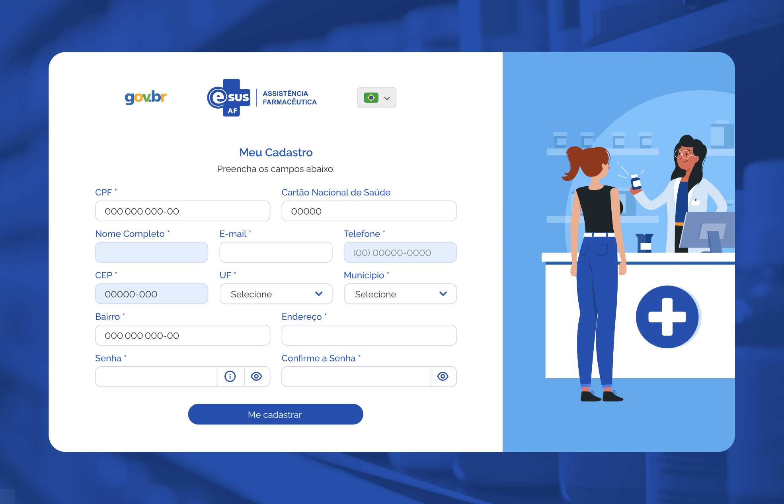
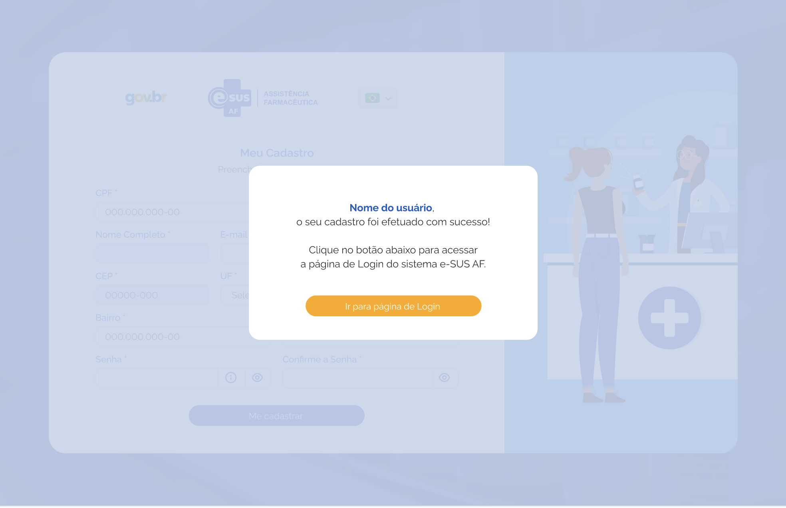

# Especificação Técnica 001 - Cadastro / Login

## Descrição

O usuário deseja criar uma conta para acessar o sistema e suas funcionalidades.

## Elementos de Tela:

- CPF
- Cartão Nacional do SUS (CNS)
- Nome Completo
- E-mail
- Celular
- CEP
- Endereço
- UF
- Município
- Senha
- Confirme a Senha
- Botão “Cadastrar”

## Critério de aceite 

- O sistema deve apresentar o campo CPF para preenchimento e verificar se existe um cadastro prévio,  
- Preencher os campos: 
    - Cartão Nacional do SUS (CNS)  
    - Nome Completo (Caso tenha cadastro prévio, o sistema deve preencher automaticamente o campo)  
    - E-mail  
    - Celular  
    - CEP (consulta API Correios)  
    - Endereço (carregar os dados retornado da API dos Correios)  
    - UF (carregar os dados retornado da API dos Correios)  
    - Município (carregar os dados retornado da API dos Correios)  
    - Senha  
    - Confirme a Senha  
- Ao inserir o CEP, o sistema deve preencher automaticamente os campos “Endereço”, “UF” e Município” com os dados retornados da consulta à API dos Correios; 
- Após finalizar o cadastro, o sistema deve enviar um e-mail de confirmação para o usuário; 
- O usuário, após confirmar o cadastro por e-mail, deve conseguir realizar login usando suas credenciais; 
- A senha do usuário deverá ter: 
    - Mínimo de 8 caracteres 
    - Máximo de 30 caracteres 
    - Letras maiúsculas: pelo menos uma 
    - Letras minúsculas: pelo menos uma 
    - Número: pelo menos um 
    - Caracteres especiais: pelo menos um 

## Proposta de design

### Tela Inicial

### Tela de cadastro

### Tela de confirmação de cadastro

