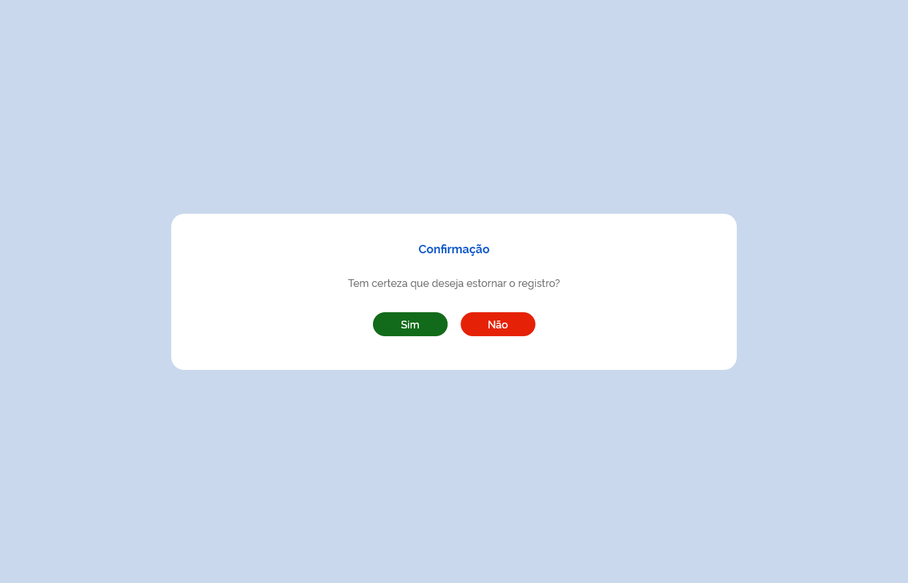

# HU016 - Cadastrar Entrada

## Descrição

Como usuário, desejo cadastrar as entradas de produtos, de modo a disponibilizar produtos no estoque para uso.

## Regras
- Ao selecionar "Saldo de Implantação” ou “Ajuste de Estoque” como Tipo de Movimentação, os campos a seguir não deverão ser considerados obrigatórios.
    - Modalidade de Licitação
    - Tipo de Documento
    - Número do Documento
    - Data do Documento
    - CNES/CNPJ (fornecedor)
    - Razão Social (fornecedor)
- Ao selecionar “Produção Própria”, os campos a seguir não deverão ser considerados obrigatórios.
    - Tipo de Documento
    - Número do Documento
    - Data do Documento
- Ao selecionar "Nota Fiscal Eletrônica” no campo “Tipo de documento”, apresentar o campo NFe (XML) para o usuário.
- Ao inserir o arquivo NFe (XML) no sistema, preencher os campos abaixo automaticamente, com dados extraídos do XML
    - Nº Documento
    - Data do documento
    - Valor do documento
    - Fornecedor
    - Produto com Fabricante
    - Lote
    - Validade
- Ao excluir o arquivo NFe (XML), apresentar uma mensagem de confirmação de exclusão e, caso seja confirmado, apagar os dados dos campos que foram preenchidos automaticamente.
- Em relação às datas:
    - Não permitir data anterior a 1 ano da data atual
    - Não permitir data posterior à data atual
- O campo "Valor do Documento" deverá ser calculado automaticamente com a somatória dos valores dos produtos adicionados à entrada, sendo apresentado da seguinte forma:
    - valor em reais (R$)
    - com duas casas decimais
    - seguindo a norma NBR 5891 da ABNT (que trata de arredondamento de números decimais)
- CNES e CNPJ deverão ser validados e:
    - se forem existentes, preencher o campo Razão Social do fornecedor
    - se forem inexistentes, apresentar mensagem de erro MSG0017
    - se o dados for inválido, apresentar mensagem de erro MSG0015
- O campo "Data do Recebimento" deverá ser preenchido 

## Critérios de aceite

**Cenário: Cadastrar nova entrada**  
**Dado** que o usuário que possui permissão esteja na tela de cadastrar entrada  
**Quando** ele preencher o formulário conforme obrigatoriedade dos campos  
**E** clicar no botão armazenar  
**Então** uma nova entrada será cadastrada

**Cenário: Salvar rascunho de uma nova entrada**  
**Dado** que o usuário que possui permissão esteja na tela de cadastrar entrada  
**Quando** ele preencher o formulário conforme obrigatoriedade dos campos  
**E** clicar no botão Salvar Parcial  
**Então** um rascunho da nova entrada será salvo

**Cenário: Excluir arquivo da Nota Fiscal Eletrônica (XML)**  
**Dado** que um arquivo NFe (XML) foi importado para o sistema  
**Quando** ele for excluído  
**Então** apresentar uma mensagem de confirmação de exclusão ao usuário

## Modelo de dados

| Nível | Atributo | Descrição | Cardinalidade | Tipo de Dados | Tamanho | Formato | Obrigatoriedade |
| :---: | -------- | --------- | :-----------: | :-----------: | :-----: | :-----: | :-------------: | 
|       |          |           |               |               |         |         |                 |
|       |          |           |               |               |         |         |                 |
|       |          |           |               |               |         |         |                 |
|       |          |           |               |               |         |         |                 |
|       |          |           |               |               |         |         |                 |
|       |          |           |               |               |         |         |                 |
|       |          |           |               |               |         |         |                 |
|       |          |           |               |               |         |         |                 |
|       |          |           |               |               |         |         |                 |
|       |          |           |               |               |         |         |                 |

## Design Conceitual

