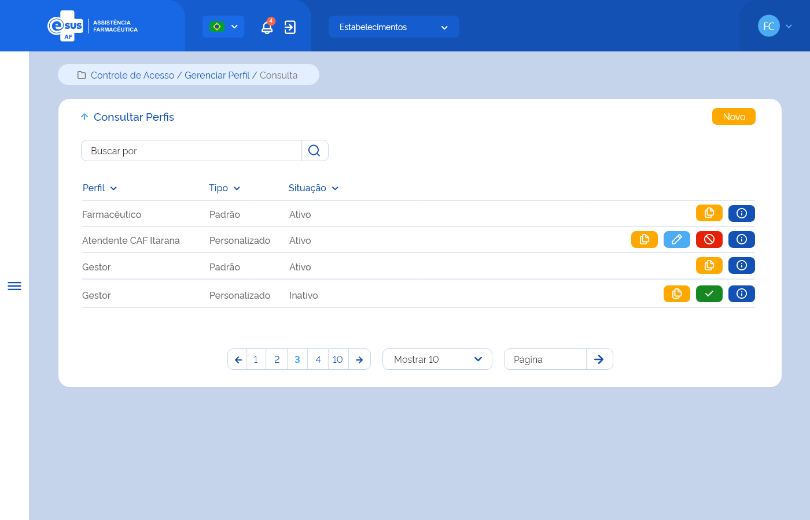

# Especificação Técnica - Gerenciar Perfil
## História de Usuário
Como Gestor, desejo realizar a gestão dos perfis do meu Ente, de modo que seja possível ter perfis com permissões que atendam as minhas necessidades.

## Regras de Negócio Transversais aos Protótipos
1. A funcionalidade somente poderá ser acessada caso o usuário tenha permissão; [RGN001](../EspecificacoesTecnicas/DocumentoDeRegrasv2.md#rgn001)
2. O sistema deve gravar a data, hora e CPF e nome do usuário que a executou qualquer ação de alteração no registro. [RGN005](../EspecificacoesTecnicas/DocumentoDeRegrasv2.md#rgn005)

## Protótipo 001 - Consulta

### Critérios de aceite
2. O acesso à funcionalidade é dado através do menu lateral no item “Controle de Acesso / Gerenciar Perfil”; 
3. Quando o usuário acionar a seta para cima ao lado do título da página, o sistema deve retornar à tela inicial do sistema (dashboard); 
4. Quando o usuário acionar a opção de “Novo”, o sistema deve direcionar ao [Protótipo 002](ETE-gerenciar-perfil.md#prototipo-002);
5. O sistema deve apresentar os perfis do sistema em uma tabela no modelo:
 
    | Perfil | Tipo | Situação | Ações |
    | --- | --- | --- | --- | 
    | Nome do Perfil| Padrão / Personalizado | Ativo / Inativo | Editar / Copiar / Ativar / Inativar / Detalhar |

6. Na coluna de ações, o sistema deverá apresentar as opções conforme:

    | Tipo | Situação | Ações |
    | --- | --- | --- |
    | Padrão | Ativo | Inativar, Copiar e Detalhar |
    | Padrão | Inativo | Ativar, Copiar e Detalhar |
    | Personalizado | Ativo | Editar, Inativar e Detalhar |
    | Personalizado | Inativo | Ativar e Detalhar |

7. Ação Editar:
    - não permitir edição de perfis do tipo “Padrão” e do tipo “Personalizado” que estão atribuídos ao cadastrado de ao menos um usuário do sistema; [RGN050](DocumentoDeRegrasv2.md#rgn050)
    - direcionar à tela “Cadastrar Perfil”, e permitir a edição das permissões de acesso às funcionalidades; [ETE011](ETE011.md)
8. Ação Inativar:
    - não permitir inativar perfis do tipo “Padrão” e do tipo “Personalizado” que estão atribuídos ao cadastrado de ao menos um usuário do sistema; [RGN050](DocumentoDeRegrasv2.md#rgn050)
    - Apresentar mensagem de confirmação para inativar o perfil; [MSG075](../EspecificacoesTecnicas/DocumentoDeMensagensv2.md#msg075)
    - Inativar o perfil caso confirmada a ação e apresentar mensagem de sucesso; [MSG070](../EspecificacoesTecnicas/DocumentoDeMensagensv2.md#msg070) [RGN016](../EspecificacoesTecnicas/DocumentoDeRegrasv2.md#rgn016) 
9. Ação Ativar:
    - Apresentar mensagem de confirmação para ativar o perfil; [MSG074](../EspecificacoesTecnicas/DocumentoDeMensagensv2.md#msg074)
    - Ativar o perfil caso confirmada a ação e apresentar mensagem de sucesso; [MSG076](../EspecificacoesTecnicas/DocumentoDeMensagensv2.md#msg076) [RGN016](../EspecificacoesTecnicas/DocumentoDeRegrasv2.md#rgn016)
10. Ação Detalhar:
    - direcionar o usuário à tela “Dados do Perfil”; [Protótipo 003](ETE-gerenciar-perfil.md#prototipo-003);

### Modelo de Dados

| coluna 1 | coluna 2 | coluna 3 | coluna 4 |
| --- | --- | --- | --- |
|  |  |  |  |

## Protótipo 002 - Cadastro
[Atualizar Protótipo para Etapas]

### Critérios de aceite
1. O acesso à funcionalidade é dado através de três formas, sendo elas:
    - 1.1 Menu lateral > Controle de Acesso > Gerenciar Perfil > Consultar Perfis > Novo;
    - 1.2 Menu lateral > Controle de Acesso > Gerenciar Perfil > Consultar Perfis > Ação "Editar";
    - 1.3 Menu lateral > Controle de Acesso > Gerenciar Perfil > Consultar Perfis > Ação "Copiar";
2. Acesso via 1.1 (Novo)
    - Quando o usuário acionar a opção “Salvar”, o sistema deve verificar se existe um perfil com a mesma descrição de um perfil já cadastrado para a instância. Caso sim, o sistema apresenta uma mensagem de alerta ao usuário e permanece na tela de cadastro do perfil; [RGN051](DocumentoDeRegrasv2.md#rgn051) [MSG077](DocumentoDeMensagensv2.md#msg077)
    Atendendo a validações, o sistema grava o registro do perfil com estado e situação “Ativo” e apresenta a relação das permissões por funcionalidades para seleção e os botões “Cadastrar” e “Limpar”; [MSG031](DocumentoDeMensagensv2.md#msg031) [RGN005](DocumentoDeRegrasv2.md#rgn005)
    - Quando o usuário acionar a opção de “Cadastrar”, o sistema deve verificar se o preenchimento das informações atende às validações listadas, efetivar o cadastro do perfil, gravar o estado e a situação do registro como “Ativo”, apresentar a mensagem de sucesso e retornar à tela de consulta aos perfis apresentando este registro como o primeiro da relação dos perfis cadastrados para a instância; [MSG078](DocumentoDeMensagensv2.md#msg078) [RGN005](DocumentoDeRegrasv2.md#rgn005)
    - Quando o usuário acionar a opção de “Limpar”, o sistema deve limpar os dados informados e permanece na tela de cadastro de perfil. 
    - Quando o usuário acionar a opção de “Voltar” ou “Consultar”, o sistema deve apresentar a mensagem de alerta ao usuário. Caso confirme a ação, retorna à tela de consulta aos perfis e não salva os dados incluídos. Caso a ação não seja confirmada, permanece na tela de cadastro de perfil; [MSG006](DocumentoDeMensagensv2.md#msg006)

3. Acesso via 1.2 (Ação "Editar")
    - O sistema deve recuperar e apresentar os dados informados no cadastro do perfil copiado e permitir a edição de todos os campos para cadastrar um novo perfil com características iguais ou similares, além dos botões “Salvar”, “Cadastrar” e “Limpar”;
    - Quando o usuário acionar a opção “Salvar”, o sistema deve verificar se existe um perfil com a mesma descrição de um perfil já cadastrado para a instância. Caso sim, o sistema apresenta uma mensagem de alerta ao usuário e permanece na tela de cadastro da entrada; [RGN051](DocumentoDeRegrasv2.md#rgn051) [MSG077](DocumentoDeMensagensv2.md#msg077)
    Atendendo a validações, o sistema grava o registro do perfil com estado e situação “Ativo”, herda a abrangência do escopo do perfil copiado, apresenta a relação das permissões por funcionalidades informadas no cadastro do perfil copiado e habilitada para edição.; [MSG031](DocumentoDeMensagensv2.md#msg031) [RGN005](DocumentoDeRegrasv2.md#rgn005)
    - Quando o usuário acionar a opção de “Cadastrar”, o sistema deve verificar se o preenchimento das informações atende às validações listadas, efetivar o cadastro do perfil, manter e gravar o estado e a situação do registro como “Ativo”, apresentar a mensagem de sucesso e retornar à tela de consulta aos perfis apresentando este registro como o primeiro da relação dos perfis cadastrados para a instância; [MSG078](DocumentoDeMensagensv2.md#msg078) [RGN005](DocumentoDeRegrasv2.md#rgn005)
    - Quando o usuário acionar a opção de “Limpar”, o sistema deve limpar os dados informados e permanece na tela de cadastro de perfil. 
    - Quando o usuário acionar a opção de “Voltar” ou “Consultar”, o sistema deve apresentar a mensagem de alerta ao usuário. Caso confirme a ação, retorna à tela de consulta aos perfis e não salva os dados incluídos. Caso a ação não seja confirmada, permanece na tela de cadastro de perfil; [MSG006](DocumentoDeMensagensv2.md#msg006)

4. Acesso via 1.3 (Ação "Copiar")
    - O sistema deve recuperar e apresentar os dados informados no cadastro do perfil, manter o campo “Perfil” inabilitado para edição e permitir a edição dos demais campos, além dos botões “Atualizar” e “Limpar”;  
    - Quando o usuário acionar a opção de “Atualizar”, o sistema deve verificar se o preenchimento das informações atende às validações listadas, atualizar o cadastro do perfil, manter e gravar o estado e a situação do registro como “Ativo”, apresentar a mensagem de sucesso e retornar à tela de consulta aos perfis apresentando este registro como o primeiro da relação dos perfis cadastrados para a instância; [MSG079](DocumentoDeMensagensv2.md#msg079) [RGN005](DocumentoDeRegrasv2.md#rgn005)
    - Quando o usuário acionar a opção de “Limpar”, o sistema deve limpar os dados informados e permanece na tela de cadastro de perfil. 
    - Quando o usuário acionar a opção de “Voltar” ou “Consultar”, o sistema deve apresentar a mensagem de alerta ao usuário. Caso confirme a ação, retorna à tela de consulta aos perfis e não salva os dados incluídos. Caso a ação não seja confirmada, permanece na tela de cadastro de perfil; [MSG006](DocumentoDeMensagensv2.md#msg006)

### Modelo de Dados

| coluna 1 | coluna 2 | coluna 3 | coluna 4 |
| --- | --- | --- | --- |
|  |  |  |  |

## Protótipo 003 - Detalhamento
[inserir protótipo]

### Critérios de aceite
1. O acesso à funcionalidade é dado através do menu lateral no item “Controle de Acesso”, subitem “Gerenciar Perfil”, na tela “Consultar Perfis” quando acionar a opção “Detalhar”;   
2. O sistema deve recuperar e apresentar os dados relacionados ao perfil ao qual deseja detalhar; 
3. Os dados do CNES, Nome, Município e UF, do cabeçalho (Emitido por:), devem ser recuperados do cadastro do estabelecimento do usuário logado. Já o Nome e CPF do usuário responsável pela última alteração no registro do cadastro e a data dessa ação devem ser recuperados do histórico do registro da funcionalidade em questão; [RGN014](DocumentoDeRegrasv2.md#rgn014)
4. Quando o usuário acionar a opção de “Imprimir”, o sistema deve permitir imprimir as informações da tela ou salvá-las em um arquivo no formato desejado (padrão Windows); 
5. Quando o usuário acionar a opção de “Voltar” ou “Consultar”, o sistema finaliza o detalhamento e retorna à tela “Consultar Perfis”. [ETE010](ETE010.md)

### Modelo de Dados

| coluna 1 | coluna 2 | coluna 3 | coluna 4 |
| --- | --- | --- | --- |
|  |  |  |  |