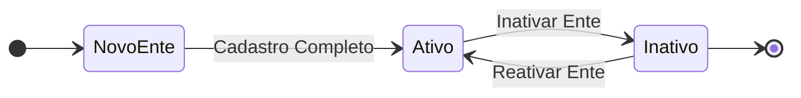

# ESPECIFICAÇÃO TÉCNICA 040: ADICIONAR UM ENTE/INSTITUIÇÃO AO E-SUS AF

| **ETE:**     | 040                                         |
|--------------|---------------------------------------------|
| **Título:**  | Adicionar um ente / instituição ao e-SUS AF |
| **Autor:**   | Jessé Azevêdo <jesse.azevedo@saude.gov.br>  |
| **Status:**  | Em validação                                |
| **Versão:**  | 1.0                                         |

## Histórico de Revisões

| **Versão** | **Data**   | **Autor**     | **Descrição**        |
|------------|------------|---------------|----------------------|
| 1.0        | 06/04/2025 | Jessé Azevêdo | Criação do documento |

## História de Usuário

Eu como Administrador de uma instância do e-SUS AF, desejo adicionar um ente/instituição ao sistema, para que o mesmo possa ser utilizado por essa instituição ou ente.

## Resumo

Este documento tem por objetivo descrever o conjunto de especificações para a adição de um novo ente ou instituição que deseje utilizar o sistema e-SUS AF para agestão da Assistência Farmacêutica.  
A aplicação deverá possuir recursos para inclusão de Consórcios, Unidades da Federeção, Gestão Federal e Entidades/Instituições que desejem utilizar o sistema.  

## Motivação

A aplicação deverá ser flexível o suficiente para atender a diferentes tipos de instituições, como consórcios, unidades da federação, gestão federal e entidades/instituições que desejem utilizar o sistema. Neste contexto, o administrador deverá ser capaz de adicionar a sua instância do e-SUS AF, entes de acordo com usa características.

## Implementação

Para que seja possível a utilização do e-SUS AF por quaisquer dos grupos citados anteriormente, a aplicação deverá possuir recursos que sejam capazes de incluir, inativar e reativar os entes/instituiçoes que por ventura venham a utilizar o sistema.

Primeiramente o recurso "Criar um novo ente/instituição" deverá ser acessado pelo menu de "Configuração > Cadastro de entes". O administrador deverá preencher os campos obrigatórios para a criação do novo ente/instituição, conforme modelo de dados disposto no módulo "Modelos de Dados".

Um vez cadastrado, um ente não poderá ser excluído, apenas inativado. A inativação de um ente/instituição não deverá excluir os dados já cadastrados no sistema, no entanto, uma vez inativado, o mesmo não deve estar visível nas funcionalidades "Solicitar Acesso" e "Moderar Acesso", além disso, nenhum usuário deve ser capaz de acessar os estabelecimentos vinculados a este ente e fazer movimentações.

Uma vez cadastrado, os dados de um ente não poderão ser editados, podendo apenas ser inativados ou reativados. O administrador deverá ser capaz de visualizar todos os entes cadastrados, com a possibilidade de filtrar por nome, CNPJ e status (Ativo/Inativo).

## Critérios de Aceitação

- Apenas um usuário com perfil de administrador poderá acessar a funcionalidade de "Cadastro de entes/instituições";
- O sistema deverá permitir a inclusão de novos entes/instituições, com os campos obrigatórios preenchidos;
- O sistema deverá permitir a inativação de entes/instituições, sem excluir os dados já cadastrados;
- O sistema deverá permitir a reativação de entes/instituições inativos;
- O sistema deverá permitir a visualização de todos os entes/instituições cadastrados, com a possibilidade de filtrar por nome, CNPJ e status (Ativo/Inativo);
- O sistema deverá garantir que os dados de um ente/instituição não possam ser editados após o cadastro, exceto para inativação ou reativação;
- O sistema deverá garantir que um ente/instituição inativo não esteja visível nas funcionalidades "Solicitar Acesso" e "Moderar Acesso";
- O sistema deverá garantir que nenhum usuário possa acessar os estabelecimentos vinculados a um ente/instituição inativo e fazer movimentações.
- A aplicação não deverá permitir a inclusão de um ente/instituição com o mesmo CNPJ já cadastrado no sistema, apresentando mensagem de erro ao usuário.
- A aplicação não deverá permitir a inclusão de um mesmo ente com a mesma esfera de gestão e código uf e código do município, apresentando mensagem de erro ao usuário.

## Modelo de Dados

| Nível | Atributo          | Descrição                                                                     | Cardinalidade | Tipo de Dado | Tamanho | Formato / Observação                                                  |
|:------|:------------------|:------------------------------------------------------------------------------|:--------------|:-------------|:--------|:----------------------------------------------------------------------|
| 1     | Identificador     | Código sequencial que identifica univocamente um ente/instituição no e-SUS AF | (1, 1)        | number       | -       | -                                                                     |
| 1     | Esfera de Gestão  | Campo enumerado contendo os valores da esfera de gestão                       | (1, 1)        | string       | 100     | M - Municipal, E - Estadual, F - Federal e I - Entidade / Instituição |
| 1     | Código da UF      | Código da Unidade de Federação conforme TB_UF                                 | (0, 1)        | number       | -       | Código da Unidade da Federação (Obrigatório Para Esfera E / M)        |
| 1     | Código Município  | Código do Município conforme TB_MUNICIPIO                                     | (0, 1)        | number       | -       | Código do município (Obrigatório Para Esfera M)                       |
| 1     | CNPJ              | Número do CNPJ da instituição que passará a usar o e-SUS AF                   | (0, 1)        | string       | 14      | Deve ser obrigatório para Entidades/Instituições                      |
| 1     | Nome Fantasia     | Nome Fantasia da entidade/instituição                                         | (0, 1)        | string       | 120     | Deve ser obrigatório para Entidades/Instituições                      |
